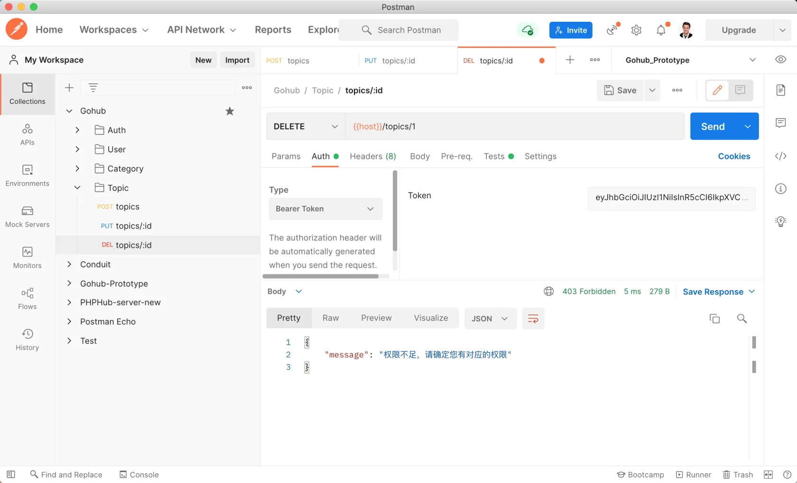
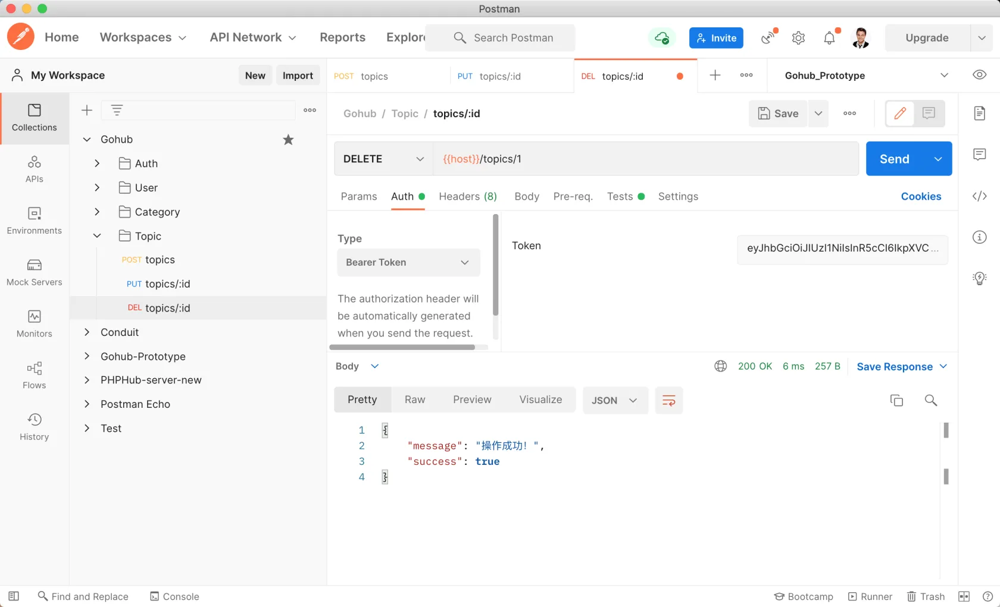
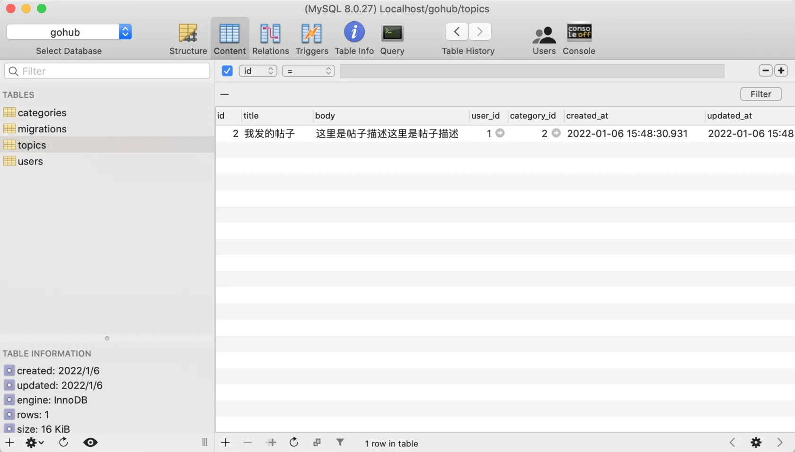

# 16.6. 删除话题

原文链接：https://learnku.com/courses/go-api/1.19/delete-topic/13578

## 说明

本节开发『删除话题』接口。

## 1. 控制器

app/http/controllers/api/v1/topics_controller.go

```
.
.
.
func (ctrl *TopicsController) Delete(c *gin.Context) {

topicModel := topic.Get(c.Param("id"))
if topicModel.ID == 0 {
response.Abort404(c)
return
}

if ok := policies.CanModifyTopic(c, topicModel); !ok {
response.Abort403(c)
return
}

rowsAffected := topicModel.Delete()
if rowsAffected > 0 {
response.Success(c)
return
}

response.Abort500(c, "删除失败，请稍后尝试~")
}
```

注意话题删除里面，我们也需要验证归属性 `policies.CanModifyTopic` 。

## 2. 注册路由

routes/api.go

```
.
.
.
tpcGroup.PUT("/:id", middlewares.AuthJWT(), tpc.Update)
tpcGroup.DELETE("/:id", middlewares.AuthJWT(), tpc.Delete)
}
}
}
```

## 3. 测试

Postman 创建一条请求，请求 url 为：`{{host}}/topics/1` ，这个 1 是我们之前创建的话题 ID。

请求的方法为 `DELETE`，记得加上 Auth Token：



这是正确的，因为上节课我们为了测试『授权策略』功能，把话题 1 的 user_id 改了。打开数据库工具，将 user_id 改为 1。

再次发起请求：



查看数据库，ID 为 1 的话题已被删除：



符合预期。

## 代码版本

本节功能开发完毕。开始下一节之前，先来为代码做下版本标记：

```
$ git add .
$ git commit -m "删除话题"
```
