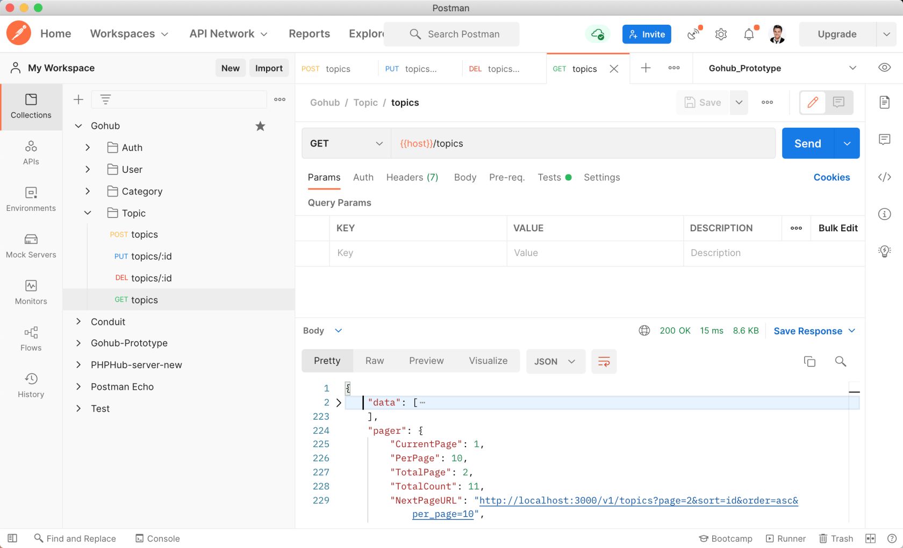

# 16.7. 话题列表

原文链接：https://learnku.com/courses/go-api/1.19/topic-list/13579

## 说明

这节课我们来开发『话题列表』接口。

## 1. 创建话题工厂

首先我们来填充一些数据，方便测试分页。

先来创建话题工厂：

```
$ go run main.go make factory topic
[database/factories/topic_factory.go] created.
```

修改内容如下；

database/factories/topic_factory.go

```
.
.
.
func MakeTopics(count int) []topic.Topic {

var objs []topic.Topic

for i := 0; i < count; i++ {
topicModel := topic.Topic{
Title:      faker.Sentence(),
Body:       faker.Paragraph(),
CategoryID: "3",
UserID:     "1",
}
objs = append(objs, topicModel)
}

return objs
}
```

## 2. Seeder

接下来创建 Seeder：

```
$ go run main.go make seeder topic
[database/seeders/topics_seeder.go] created.
```

topics_seeder.go 里的代码不用修改，可以自行查看其代码。

## 3. 填充数据

我们只需要填充 SeedTopicsTable 即可：

```
$ go run main.go seed SeedTopicsTable
Table [topics] 10 rows seeded
```

## 4. 控制器方法

app/http/controllers/api/v1/topics_controller.go

```
.
.
.

func (ctrl *TopicsController) Index(c *gin.Context) {
request := requests.PaginationRequest{}
if ok := requests.Validate(c, &request, requests.Pagination); !ok {
return
}

data, pager := topic.Paginate(c, 10)
response.JSON(c, gin.H{
"data":  data,
"pager": pager,
})
}
```

分页方法 `topic.Paginate()`生成模型文件的时候已经为我们准备好，直接调用即可。

## 5. 注册路由

routes/api.go

```
.
.
.
tpcGroup := v1.Group("/topics")
{
tpcGroup.GET("", tpc.Index)
tpcGroup.POST("", middlewares.AuthJWT(), tpc.Store)
tpcGroup.PUT("/:id", middlewares.AuthJWT(), tpc.Update)
tpcGroup.DELETE("/:id", middlewares.AuthJWT(), tpc.Delete)
}
}
}
```

## 6. 测试

Postman 里创建一条 GET `topics` 的请求，不需要认证，也不需要 JSON 请求内容：



符合预期。

## 代码版本

本节功能开发完毕。开始下一节之前，先来为代码做下版本标记：

```
$ git add .
$ git commit -m "话题列表"
```
