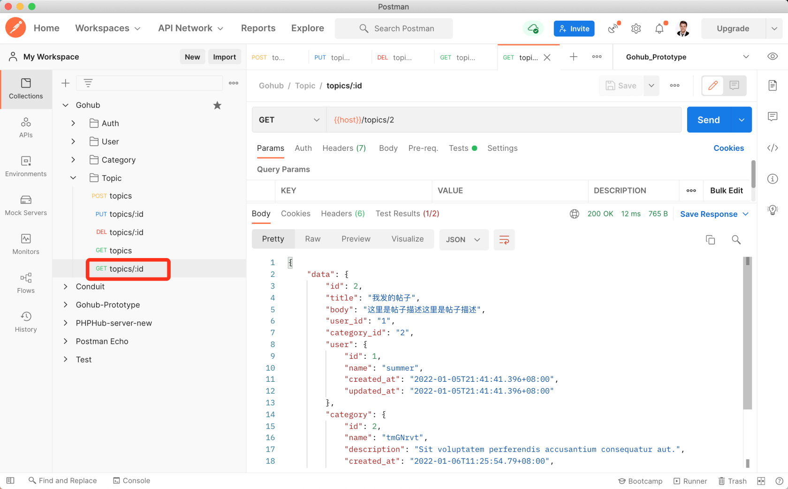

# 16.8. 显示话题

原文链接：https://learnku.com/courses/go-api/1.19/show-topics/13580

## 说明

这节课来开发 『显示话题』接口。

## 1. 加载关联

我们希望返回的内容里附带 user 和 category 关联信息，需要修改下 topic.Get 方法。

打开 app/models/topic/topic_util.go 将 Get 方法修改如下:

```
func Get(idstr string) (topic Topic) {
database.DB.Preload(clause.Associations).Where("id", idstr).First(&topic)
return
}
```

## 2. 控制器方法

app/http/controllers/api/v1/topics_controller.go

```
.
.
.
func (ctrl *TopicsController) Show(c *gin.Context) {
topicModel := topic.Get(c.Param("id"))
if topicModel.ID == 0 {
response.Abort404(c)
return
}
response.Data(c, topicModel)
}
```

## 3. 注册路由

routes/api.go

```
.
.
.
tpcGroup.DELETE("/:id", middlewares.AuthJWT(), tpc.Delete)
tpcGroup.GET("/:id", tpc.Show)
}
}
}
```

## 4. 测试

Postman 里创建请求 GET `{{host}}/topics/2`，不需要认证，也不需要 JSON 请求内容：



可以看到关联信息也能成功返回，符合预期。

## 代码版本

本节功能开发完毕。开始下一节之前，先来为代码做下版本标记：

```
$ git add .
$ git commit -m "显示话题"
```
