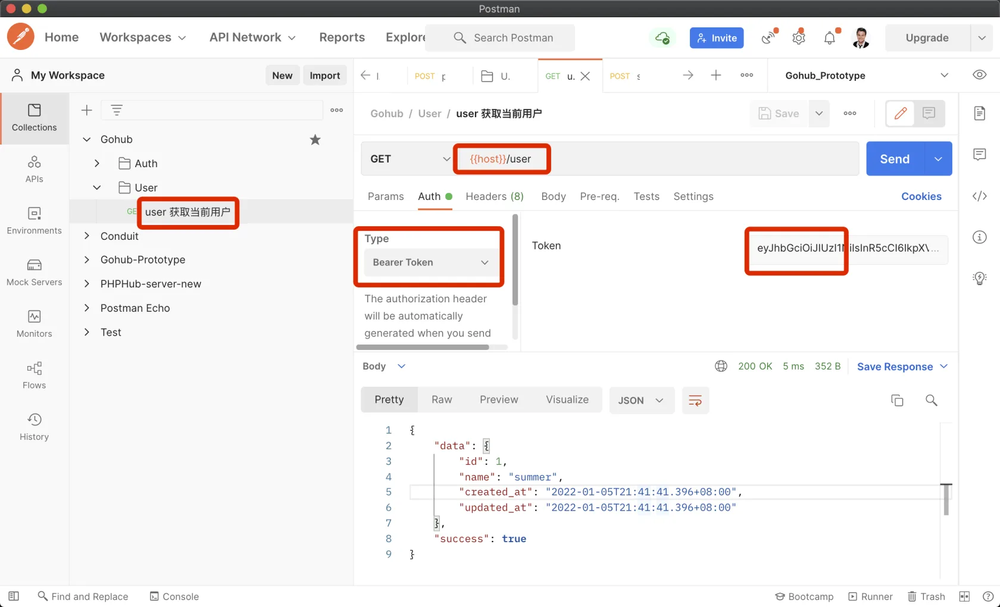

# 14.1. 当前用户接口

原文链接：https://learnku.com/courses/go-api/1.19/get-current-user/13555

## 说明

这节课我们来开发获取当前用户的接口 —— `user`

## 1. 创建控制器

执行命令：

```
$ go run main.go make apicontroller v1/users
```

控制器内容修改如下：

app/http/controllers/api/v1/users_controller.go

```
package v1

import (
"gohub/pkg/auth"
"gohub/pkg/response"

"github.com/gin-gonic/gin"
)

type UsersController struct {
BaseAPIController
}

// CurrentUser 当前登录用户信息
func (ctrl *UsersController) CurrentUser(c *gin.Context) {
userModel := auth.CurrentUser(c)
response.Data(c, userModel)
}
```

`auth.CurrentUser()` 之前开发 auth 中间件的时候已经实现过，可以自行去看下源码。

## 2. 注册路由

routes/api.go

```
.
.
.
import (
controllers "gohub/app/http/controllers/api/v1"
.
.
.
)

// RegisterAPIRoutes 注册 API 相关路由
func RegisterAPIRoutes(r *gin.Engine) {
.
.
.

uc := new(controllers.UsersController)

// 获取当前用户
v1.GET("/user", middlewares.AuthJWT(), uc.CurrentUser)
}
}
```

获取当前用户需要 Token 认证，所以使用 `AuthJWT()`  中间件。

## 3. 测试

开发数据库迁移功能时候，我们的 users 表里的数据已置空，所以测试前，请自行调用注册接口注册新用户，并复制 token 。

Postman 创建一个新目录 User ，目录下新建请求 `user 获取当前用户`：



符合预期。

## 代码版本

本节功能开发完毕。开始下一节之前，先来为代码做下版本标记：

```
$ git add .
$ git commit -m "当前用户接口"
```
