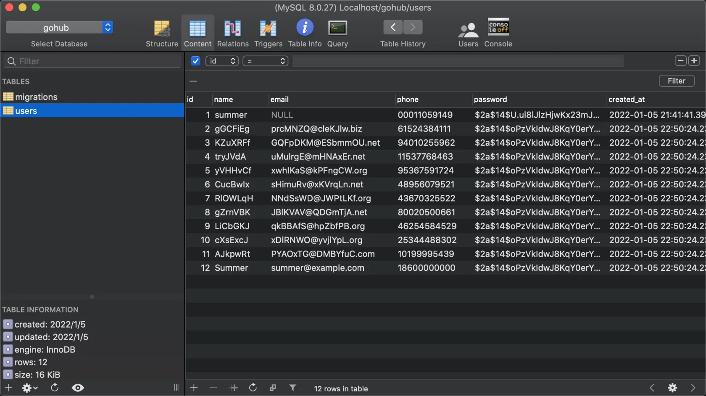

# 14.4. seed 命令

原文链接：https://learnku.com/courses/go-api/1.19/seed-command/13558

## 说明

现在我们已经开发了 UserFactory 和 UserSeeder，这节课来开发 seed 命令。

## 1. 添加 seeder 方法

添加 seeder 方法以供  seed 命令调用：

pkg/seed/seeder.go

```go
.
.
.
// GetSeeder 通过名称来获取 Seeder 对象
func GetSeeder(name string) Seeder {
	for _, sdr := range seeders {
		if name == sdr.Name {
			return sdr
		}
	}
	return Seeder{}
}

// RunAll 运行所有 Seeder
func RunAll() {

	// 先运行 ordered 的
	executed := make(map[string]string)
	for _, name := range orderedSeederNames {
		sdr := GetSeeder(name)
		if len(sdr.Name) > 0 {
			console.Warning("Running Odered Seeder: " + sdr.Name)
			sdr.Func(database.DB)
			executed[name] = name

		}
	}

	// 再运行剩下的
	for _, sdr := range seeders {
		// 过滤已运行
		if _, ok := executed[sdr.Name]; !ok {
			console.Warning("Running Seeder: " + sdr.Name)
			sdr.Func(database.DB)
		}
	}
}

// RunSeeder 运行单个 Seeder
func RunSeeder(name string) {
	for _, sdr := range seeders {
		if name == sdr.Name {
			sdr.Func(database.DB)
			break
		}
	}
}
```

## 2. 创建 seed 命令

app/cmd/seed.go

```go
package cmd

import (
	"gohub/database/seeders"
	"gohub/pkg/console"
	"gohub/pkg/seed"

	"github.com/spf13/cobra"
)

var CmdDBSeed = &cobra.Command{
	Use:   "seed",
	Short: "Insert fake data to the database",
	Run:   runSeeders,
	Args:  cobra.MaximumNArgs(1), // 只允许 1 个参数
}

func runSeeders(cmd *cobra.Command, args []string) {
	seeders.Initialize()
	if len(args) > 0 {
		// 有传参数的情况
		name := args[0]
		seeder := seed.GetSeeder(name)
		if len(seeder.Name) > 0 {
			seed.RunSeeder(name)
		} else {
			console.Error("Seeder not found: " + name)
		}
	} else {
		// 默认运行全部迁移
		seed.RunAll()
		console.Success("Done seeding.")
	}
}
```

## 3. 注册命令

main.go

```
.
.
.
// 注册子命令
rootCmd.AddCommand(
.
.
.
cmd.CmdDBSeed,
)
.
.
.
```

## 4. 测试

运行所有 seeder：

```bash
$ go run main.go seed
Running Odered Seeder: SeedUsersTable
Table [users] 11 rows seeded
Done seeding.
```

查看数据库：



运行单条不存在的 Seeder:

```bash
$ go run main.go seed not_exisit
Seeder not found: not_exisit
```

运行单条存在的 Seeder:

```bash
$  go run main.go seed SeedUsersTable
Table [users] 11 rows seeded
```

符合预期。

## 代码版本

本节功能开发完毕。开始下一节之前，先来为代码做下版本标记：

```bash
$ git add .
$ git commit -m "seed 命令"
```
