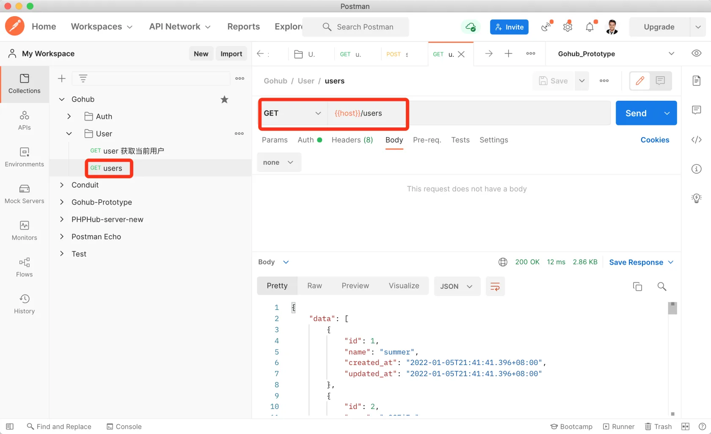

# 14.7. 用户列表

原文链接：https://learnku.com/courses/go-api/1.19/user-list/13561

## 说明

现在我们的 users 表里已经有很多用户数据，这节课来开发用户列表接口 —— `GET users`。

## 1. 控制器方法

app/http/controllers/api/v1/users_controller.go

```go
.
.
.
import {
    "gohub/app/models/user"
    .
    .
    .
    // Index 所有用户
    func (ctrl *UsersController) Index(c *gin.Context) {
        data := user.All()
        response.Data(c, data)
    }
```

## 2. `user.All()`

app/models/user/user_util.go

```go
.
.
.
// All 获取所有用户数据
func All() (users []User) {
	database.DB.Find(&users)
	return
}
```

## 3. 注册路由

routes/api.go

```go
.
.
.
v1.GET("/user", middlewares.AuthJWT(), uc.CurrentUser)
usersGroup := v1.Group("/users")
{
    usersGroup.GET("", uc.Index)
}
}
}
```

## 测试

创建新请求 users ：



符合预期。

## 代码版本

本节功能开发完毕。开始下一节之前，先来为代码做下版本标记：

```bash
$ git add .
$ git commit -m "用户列表"
```
