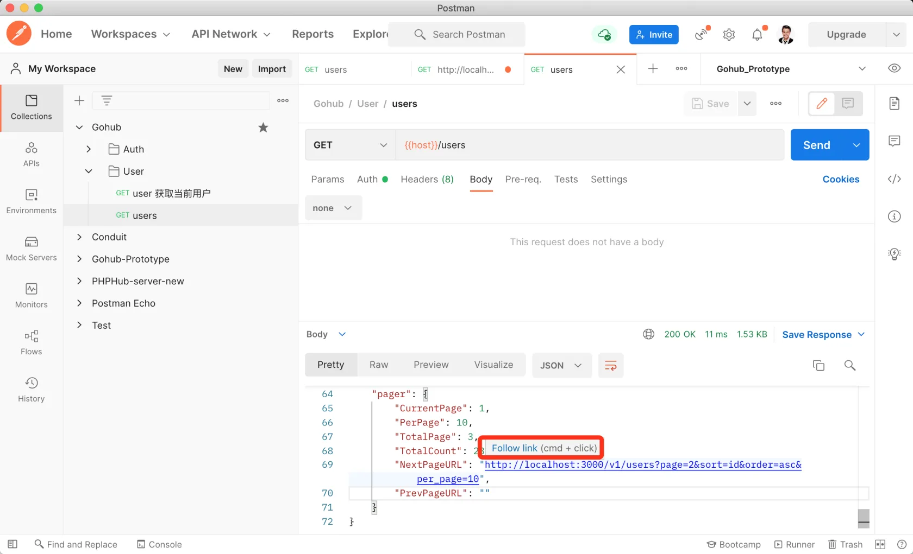

# 14.9. 用户列表分页

原文链接：https://learnku.com/courses/go-api/1.19/user-list-paging/13563

## 说明

这节课我们来将分页功能集成到『用户列表』中。

## 1. 模型方法 Paginate

app/models/user/user_util.go

```
.
.
.
// Paginate 分页内容
func Paginate(c *gin.Context, perPage int) (users []User, paging paginator.Paging) {
paging = paginator.Paginate(
c,
database.DB.Model(User{}),
&users,
app.V1URL(database.TableName(&User{})),
perPage,
)
return
}
```

## 2. database.TableName 方法

database.TableName 方法方便我们获取表名称，这里我们用来拼接 Restfull URL:

pkg/database/database.go

```
.
.
.
func TableName(obj interface{}) string {
stmt := &gorm.Statement{DB: DB}
stmt.Parse(obj)
return stmt.Schema.Table
}
```

## 3. `app.V1URL` 方法

URL 不应该写死在业务逻辑中，且程序的其他地方也有可能会用到，所以我们抽象到方法中，方便后续其他地方调用：

pkg/app/app.go

```
.
.
.
// URL 传参 path 拼接站点的 URL
func URL(path string) string {
return config.Get("app.url") + path
}

// V1URL 拼接带 v1 标示 URL
func V1URL(path string) string {
return URL("/v1/" + path)
}
```

## 4. 控制器方法修改

将  app/http/controllers/api/v1/users_controller.go 里的 Index 方法修改如下：

```
// Index 所有用户
func (ctrl *UsersController) Index(c *gin.Context) {
data, pager := user.Paginate(c, 10)
response.JSON(c, gin.H{
"data":  data,
"pager": pager,
})
}
```

## 测试

Postman 重新发起 GET users 接口请求：



返回的数据里拉到最下面就可以看到我们的 `pager` 分页数据。按住 cmd 或 ctrl 点击链接，可以对分页链接发起请求，请自行点击，测试下最后一页返回的分页数据。

## 代码版本

本节功能开发完毕。开始下一节之前，先来为代码做下版本标记：

```
$ git add .
$ git commit -m "用户列表分页"
```
