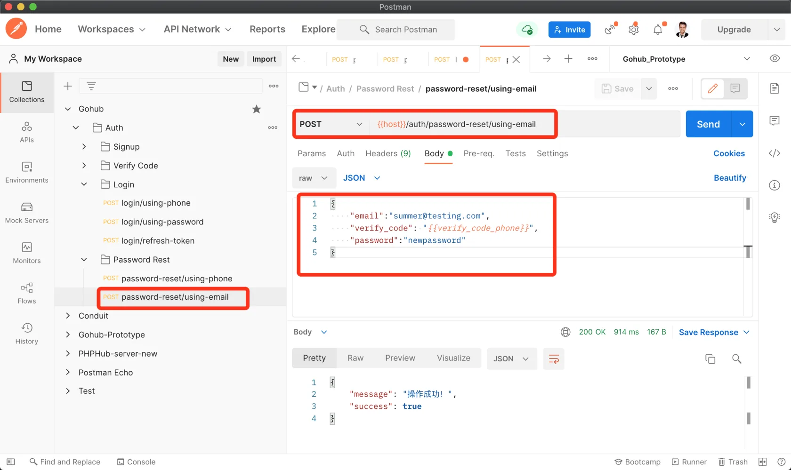
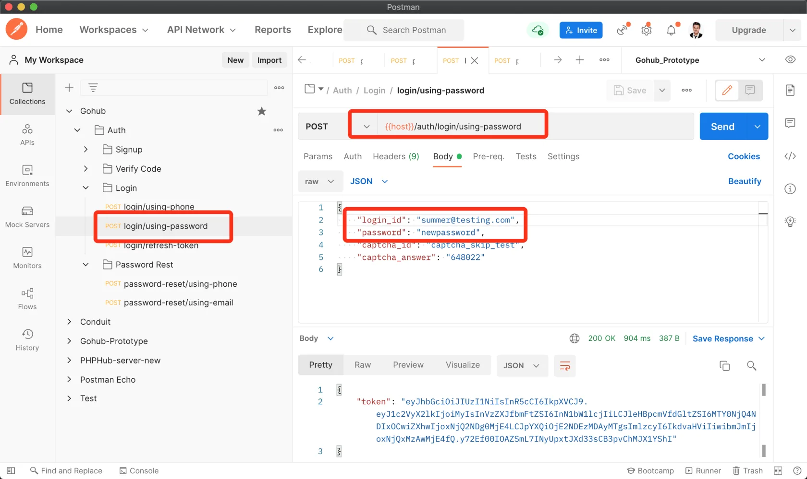

# 10.2. 通过邮箱找回密码

原文链接：https://learnku.com/courses/go-api/1.19/retrieve-password-via-email/13530

## 说明

开始之前，请重温下 [身份验证接口设计](https://learnku.com/courses/go-api/1.17/authentication-interface-design#2bfe61)  文章里的『重置密码流程』。

重置密码会调用三个 API ：

1. 调用 `verify-codes/captcha` 获取图片验证码，验证后才有发『数字验证码』的权限；

2. 调用 `verify-codes/email` 发送邮件验证码;

3. 调用 `password-reset/using-email` 重置密码。

前两个 API 我们已经开发完成，这节课我们来开发 `password-reset/using-email`。

## 1. 验证请求

app/requests/password_request.go

```
.
.
.
type ResetByEmailRequest struct {
Email      string `json:"email,omitempty" valid:"email"`
VerifyCode string `json:"verify_code,omitempty" valid:"verify_code"`
Password   string `valid:"password" json:"password,omitempty"`
}

// ResetByEmail 验证表单，返回长度等于零即通过
func ResetByEmail(data interface{}, c *gin.Context) map[string][]string {

rules := govalidator.MapData{
"email":       []string{"required", "min:4", "max:30", "email"},
"verify_code": []string{"required", "digits:6"},
"password":    []string{"required", "min:6"},
}
messages := govalidator.MapData{
"email": []string{
"required:Email 为必填项",
"min:Email 长度需大于 4",
"max:Email 长度需小于 30",
"email:Email 格式不正确，请提供有效的邮箱地址",
},
"verify_code": []string{
"required:验证码答案必填",
"digits:验证码长度必须为 6 位的数字",
},
"password": []string{
"required:密码为必填项",
"min:密码长度需大于 6",
},
}

errs := validate(data, rules, messages)

// 检查验证码
_data := data.(*ResetByEmailRequest)
errs = validators.ValidateVerifyCode(_data.Email, _data.VerifyCode, errs)

return errs
}
```

## 2. 控制器

app/http/controllers/api/v1/auth/password_controller.go

```
.
.
.

// ResetByEmail 使用 Email 和验证码重置密码
func (pc *PasswordController) ResetByEmail(c *gin.Context) {
// 1. 验证表单
request := requests.ResetByEmailRequest{}
if ok := requests.Validate(c, &request, requests.ResetByEmail); !ok {
return
}

// 2. 更新密码
userModel := user.GetByEmail(request.Email)
if userModel.ID == 0 {
response.Abort404(c)
} else {
userModel.Password = request.Password
userModel.Save()
response.Success(c)
}
}
```

## 3. `user.GetByEmail()`

app/models/user/user_util.go

```
.
.
.
// GetByEmail 通过 Email 来获取用户
func GetByEmail(email string) (userModel User) {
database.DB.Where("email = ?", email).First(&userModel)
return
}
```

## 4. 注册路由

routes/api.go

```
.
.
.
authGroup.POST("/password-reset/using-phone", pwc.ResetByPhone)
authGroup.POST("/password-reset/using-email", pwc.ResetByEmail)
}
}
}
```

## 测试

Postman 创建请求 `password-reset/using-email` ，参数如下：

```
{
"email":"summer@testing.com",
"verify_code": "{{verify_code_phone}}",
"password":"newpassword"
}
```

请将 Email 修改为你注册用户使用的手机号。

发起请求：



使用刚刚修改的新密码登录：



符合预期。

## 代码版本

本节功能开发完毕。开始下一节之前，先来为代码做下版本标记：

```
$ git add .
$ git commit -m "通过邮箱找回密码"
```
