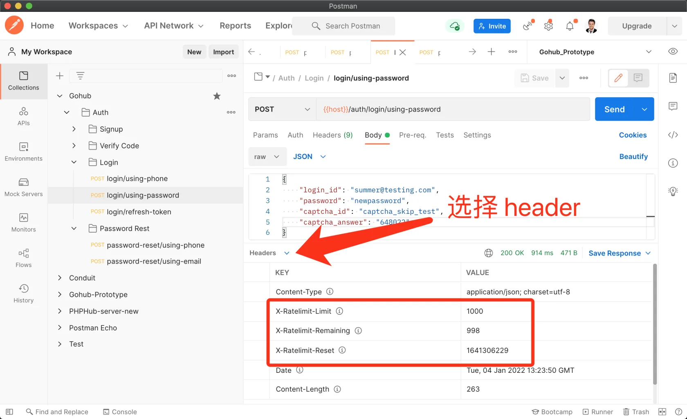

# 10.3. 限流中间件

原文链接：https://learnku.com/courses/go-api/1.19/current-limiting-middleware/13531

## 说明

对于 API 来讲，限流非常重要。

限流就是控制用户访问接口的频率，例如未授权的接口 Github API 每小时最多 60 个请求（根据 IP），而授权以后的接口限流可以到 1000 个请求。

限流不仅可以保护我们的服务器资源不被黑客滥用，在例如说登录接口或者发送验证码接口上，还可以做到防止黑客暴力破解的作用。

本节我们将一起来开发 Gohub 项目的限流中间件。

## 1. ulule/limiter

限流是很常用的功能，我们无需重新发明轮子，使用这个开源的限流器 [github.com/ulule/limiter](https://github.com/ulule/limiter) 即可。

首先安装：

```
$ go get github.com/ulule/limiter/v3
```

## 2. 自建 limiter 包

自建的 limiter 包对 ulule/limiter 包进行封装：

pkg/limiter/limiter.go

```
// Package limiter 处理限流逻辑
package limiter

import (
"gohub/pkg/config"
"gohub/pkg/logger"
"gohub/pkg/redis"
"strings"

"github.com/gin-gonic/gin"
limiterlib "github.com/ulule/limiter/v3"
sredis "github.com/ulule/limiter/v3/drivers/store/redis"
)

// GetKeyIP 获取 Limitor 的 Key，IP
func GetKeyIP(c *gin.Context) string {
return c.ClientIP()
}

// GetKeyRouteWithIP Limitor 的 Key，路由+IP，针对单个路由做限流
func GetKeyRouteWithIP(c *gin.Context) string {
return routeToKeyString(c.FullPath()) + c.ClientIP()
}

// CheckRate 检测请求是否超额
func CheckRate(c *gin.Context, key string, formatted string) (limiterlib.Context, error) {

// 实例化依赖的 limiter 包的 limiter.Rate 对象
var context limiterlib.Context
rate, err := limiterlib.NewRateFromFormatted(formatted)
if err != nil {
logger.LogIf(err)
return context, err
}

// 初始化存储，使用我们程序里共用的 redis.Redis 对象
store, err := sredis.NewStoreWithOptions(redis.Redis.Client, limiterlib.StoreOptions{
// 为 limiter 设置前缀，保持 redis 里数据的整洁
Prefix: config.GetString("app.name") + ":limiter",
})
if err != nil {
logger.LogIf(err)
return context, err
}

// 使用上面的初始化的 limiter.Rate 对象和存储对象
limiterObj := limiterlib.New(store, rate)

// 获取限流的结果
if c.GetBool("limiter-once") {
// Peek() 取结果，不增加访问次数
return limiterObj.Peek(c, key)
} else {

// 确保多个路由组里调用 LimitIP 进行限流时，只增加一次访问次数。
c.Set("limiter-once", true)

// Get() 取结果且增加访问次数
return limiterObj.Get(c, key)
}
}

// routeToKeyString 辅助方法，将 URL 中的 / 格式为 -
func routeToKeyString(routeName string) string {
routeName = strings.ReplaceAll(routeName, "/", "-")
routeName = strings.ReplaceAll(routeName, ":", "_")
return routeName
}
```

## 3. limit 中间件

app/http/middlewares/limit.go

```
package middlewares

import (
"gohub/pkg/app"
"gohub/pkg/limiter"
"gohub/pkg/logger"
"gohub/pkg/response"
"net/http"

"github.com/gin-gonic/gin"
"github.com/spf13/cast"
)

// LimitIP 全局限流中间件，针对 IP 进行限流
// limit 为格式化字符串，如 "5-S" ，示例:
//
// * 5 reqs/second: "5-S"
// * 10 reqs/minute: "10-M"
// * 1000 reqs/hour: "1000-H"
// * 2000 reqs/day: "2000-D"
//
func LimitIP(limit string) gin.HandlerFunc {
if app.IsTesting() {
limit = "1000000-H"
}

return func(c *gin.Context) {
// 针对 IP 限流
key := limiter.GetKeyIP(c)
if ok := limitHandler(c, key, limit); !ok {
return
}
c.Next()
}
}

// LimitPerRoute 限流中间件，用在单独的路由中
func LimitPerRoute(limit string) gin.HandlerFunc {
if app.IsTesting() {
limit = "1000000-H"
}
return func(c *gin.Context) {

// 针对单个路由，增加访问次数
c.Set("limiter-once", false)

// 针对 IP + 路由进行限流
key := limiter.GetKeyRouteWithIP(c)
if ok := limitHandler(c, key, limit); !ok {
return
}
c.Next()
}
}

func limitHandler(c *gin.Context, key string, limit string) bool {

// 获取超额的情况
rate, err := limiter.CheckRate(c, key, limit)
if err != nil {
logger.LogIf(err)
response.Abort500(c)
return false
}

// ---- 设置标头信息-----
// X-RateLimit-Limit :10000 最大访问次数
// X-RateLimit-Remaining :9993 剩余的访问次数
// X-RateLimit-Reset :1513784506 到该时间点，访问次数会重置为 X-RateLimit-Limit
c.Header("X-RateLimit-Limit", cast.ToString(rate.Limit))
c.Header("X-RateLimit-Remaining", cast.ToString(rate.Remaining))
c.Header("X-RateLimit-Reset", cast.ToString(rate.Reset))

// 超额
if rate.Reached {
// 提示用户超额了
c.AbortWithStatusJSON(http.StatusTooManyRequests, gin.H{
"message": "接口请求太频繁",
})
return false
}

return true
}
```

这里我们创建了两个中间：

- LimitIP 是针对 IP 进行限流

- LimitPerRoute 是针对某个路由进行单独限流

## 4. 使用中间件

routes/api.go

```
// Package routes 注册路由
package routes

import (
"gohub/app/http/controllers/api/v1/auth"
"gohub/app/http/middlewares"

"github.com/gin-gonic/gin"
)

// RegisterAPIRoutes 注册 API 相关路由
func RegisterAPIRoutes(r *gin.Engine) {

// 测试一个 v1 的路由组，我们所有的 v1 版本的路由都将存放到这里
v1 := r.Group("/v1")

// 全局限流中间件：每小时限流。这里是所有 API （根据 IP）请求加起来。
// 作为参考 Github API 每小时最多 60 个请求（根据 IP）。
// 测试时，可以调高一点。
v1.Use(middlewares.LimitIP("200-H"))

{
authGroup := v1.Group("/auth")
// 限流中间件：每小时限流，作为参考 Github API 每小时最多 60 个请求（根据 IP）
// 测试时，可以调高一点
authGroup.Use(middlewares.LimitIP("1000-H"))
{
// 登录
lgc := new(auth.LoginController)
authGroup.POST("/login/using-phone", middlewares.GuestJWT(), lgc.LoginByPhone)
authGroup.POST("/login/using-password", middlewares.GuestJWT(), lgc.LoginByPassword)
authGroup.POST("/login/refresh-token", middlewares.AuthJWT(), lgc.RefreshToken)

// 重置密码
pwc := new(auth.PasswordController)
authGroup.POST("/password-reset/using-email", middlewares.GuestJWT(), pwc.ResetByEmail)
authGroup.POST("/password-reset/using-phone", middlewares.GuestJWT(), pwc.ResetByPhone)

// 注册用户
suc := new(auth.SignupController)
authGroup.POST("/signup/using-phone", middlewares.GuestJWT(), suc.SignupUsingPhone)
authGroup.POST("/signup/using-email", middlewares.GuestJWT(), suc.SignupUsingEmail)
authGroup.POST("/signup/phone/exist", middlewares.GuestJWT(), middlewares.LimitPerRoute("60-H"), suc.IsPhoneExist)
authGroup.POST("/signup/email/exist", middlewares.GuestJWT(), middlewares.LimitPerRoute("60-H"), suc.IsEmailExist)

// 发送验证码
vcc := new(auth.VerifyCodeController)
authGroup.POST("/verify-codes/phone", middlewares.LimitPerRoute("20-H"), vcc.SendUsingPhone)
authGroup.POST("/verify-codes/email", middlewares.LimitPerRoute("20-H"), vcc.SendUsingEmail)
// 图片验证码
authGroup.POST("/verify-codes/captcha", middlewares.LimitPerRoute("50-H"), vcc.ShowCaptcha)
}
}
}
```

全局中间我们使用 LimitIP。针对特定的路由，使用 LimitPerRoute。

现在我们的身份认证接口已经开发完毕，所以上面的路由中，我们顺便加入了 AuthJWT 和  GuestJWT 的限制。

验证码相关的接口不加权限限制，因为这些接口应该是用户和游客都能使用的。（后面登录的用户在修改密码时也需要发送数字验证码）

## 测试

访问任意接口，选择查看 Header，可以看到我们的限流信息：



符合预期。

## go mod tidy

上面加载了第三方库，现在使用 mod tidy 命令来整理一下 go.mod 文件：

```
$ go mod tidy
```

## 代码版本

本节功能开发完毕。开始下一节之前，先来为代码做下版本标记：

```
$ git add .
$ git commit -m "限流中间件"
```
