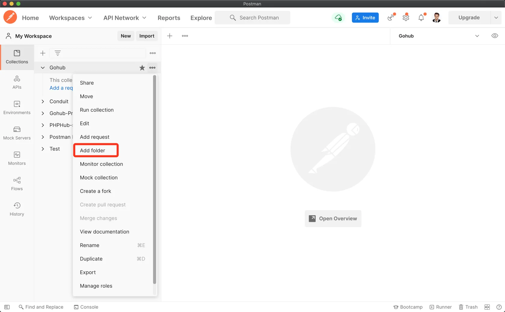
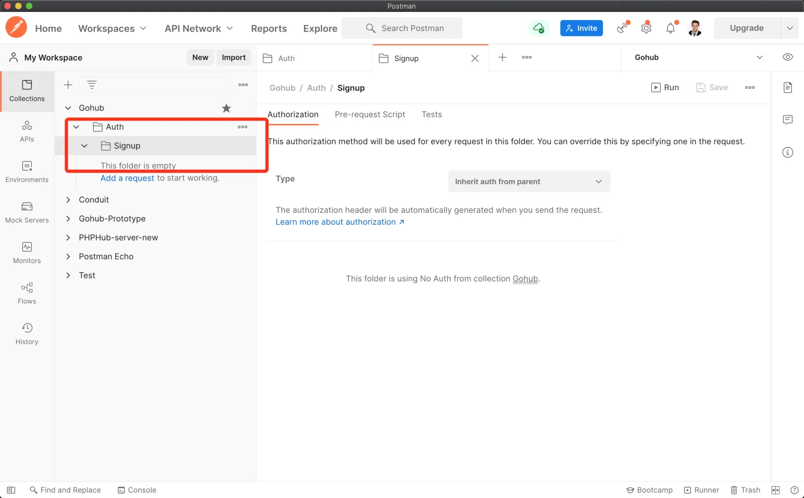
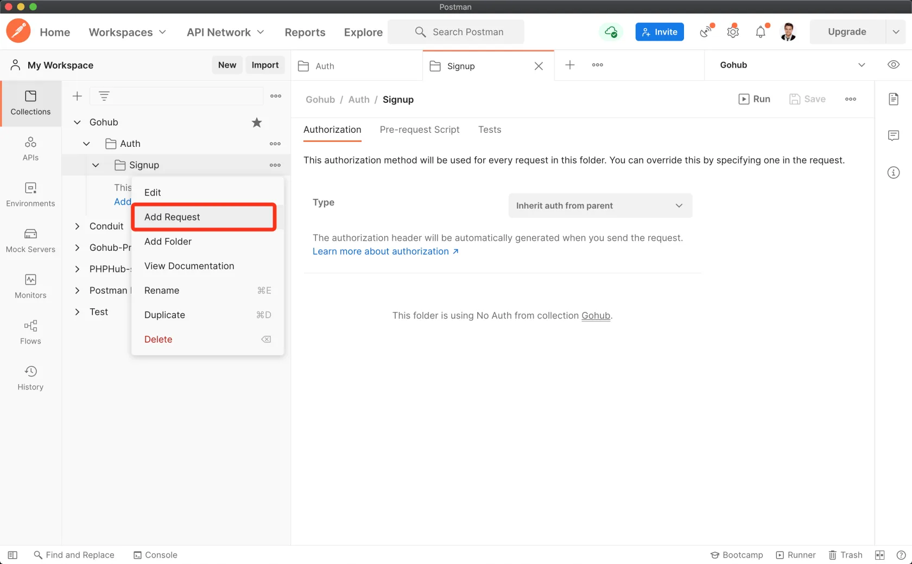
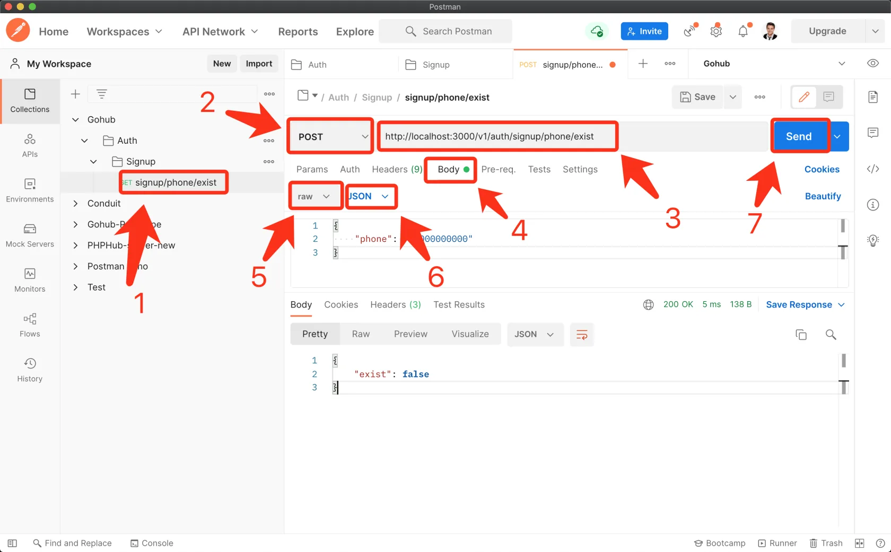
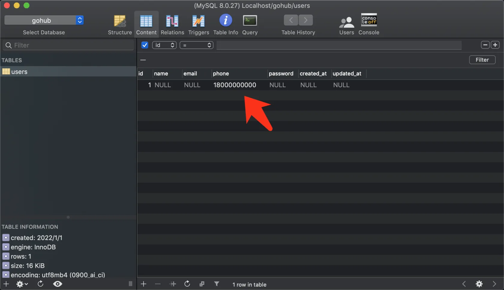
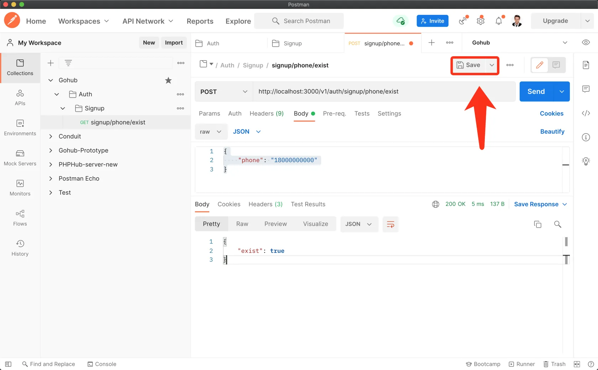

# 4.4. 手机是否注册接口

原文链接：https://learnku.com/courses/go-api/1.19/whether-the-mobile-phone-registers-the-interface/13491

## 说明

这节课我们来开发 `/signup/phone/exist` 接口。

## 1. 控制器

先创建 API  基础控制器, v1 版本的控制器都继承自此控制器。当前我们还没有逻辑代码可以写入这里面，不过有了基础控制器，后面一些 v1 通用的处理操作，都可以在这里面写。

app/http/controllers/api/v1/base_api_controller.go

```go
// Package v1 处理业务逻辑, GoHub 控制器 v1
package v1

// BaseAPIController 基础控制器
type BaseAPIController struct {
}
```

创建注册控制器：

app/http/controllers/api/v1/auth/signup_controller.go

```go
// Package auth 处理用户身份认证相关逻辑
package auth

import (
	"fmt"
	v1 "gohub/app/http/controllers/api/v1"
	"gohub/app/models/user"
	"net/http"

	"github.com/gin-gonic/gin"
)

// SignupController 注册控制器
type SignupController struct {
	v1.BaseAPIController
}

// IsPhoneExist 检测手机号是否被注册
func (sc *SignupController) IsPhoneExist(c *gin.Context) {

	// 请求对象
	type PhoneExistRequest struct {
		Phone string `json:"phone"`
	}
	request := PhoneExistRequest{}

	// 解析 JSON 请求
	if err := c.ShouldBindJSON(&request); err != nil {
		// 解析失败，返回 422 状态码和错误信息
		c.AbortWithStatusJSON(http.StatusUnprocessableEntity, gin.H{
			"error": err.Error(),
		})
		// 打印错误信息
		fmt.Println(err.Error())
		// 出错了，中断请求
		return
	}

	// 检查数据库并返回响应
	c.JSON(http.StatusOK, gin.H{
		"exist": user.IsPhoneExist(request.Phone),
	})
}
```

## 2. 注册路由

打开 api.go ，修改如下：

routes/api.go

```go
// Package routes 注册路由
package routes

import (
	"gohub/app/http/controllers/api/v1/auth"

	"github.com/gin-gonic/gin"
)

// RegisterAPIRoutes 注册网页相关路由
func RegisterAPIRoutes(r *gin.Engine) {

	// 测试一个 v1 的路由组，我们所有的 v1 版本的路由都将存放到这里
	v1 := r.Group("/v1")
	{
		authGroup := v1.Group("/auth")
		{
			suc := new(auth.SignupController)
			// 判断手机是否已注册
			authGroup.POST("/signup/phone/exist", suc.IsPhoneExist)
		}
	}
}
```

## 3. 数据库迁移

目前我们还未创建数据库和用户表结构。

### 1). 创建数据库

使用命令行或者其他数据库工具皆可：

```bash
$ mysql -u root -p
```

输入密码后：

```
mysql> create database gohub;
Query OK, 1 row affected (0.03 sec)
```

### 2). 自动迁移

Gorm 支持自动迁移功能，使用非常简单：

bootstrap/database.go

```
.
.
.
database.DB.AutoMigrate(&user.User{})
}
```

>

注意：这一步很容易出错，请确保顶部 import 的是 `"gohub/app/models/user"` 而不是 `"os/user"` 。

AutoMigrate 会创建表，缺少的外键，约束，列和索引，并且会更改现有列的类型（如果其大小、精度、是否为空可更改）。但 不会 删除未使用的列，以保护您的数据。

数据库命令检查一下为我们创建的表：

```
mysql> use gohub;
Reading table information for completion of table and column names
You can turn off this feature to get a quicker startup with -A

Database changed
mysql> show tables;
+-----------------+
| Tables_in_gohub |
+-----------------+
| users           |
+-----------------+
1 row in set (0.00 sec)

mysql> show create table users;
+-------+--------------+
| Table | Create Table |
+-------+--------------+
| users | CREATE TABLE `users` (
`id` bigint unsigned NOT NULL AUTO_INCREMENT,
`name` longtext,
`email` varchar(191) DEFAULT NULL,
`phone` varchar(191) DEFAULT NULL,
`password` longtext,
`created_at` datetime(3) DEFAULT NULL,
`updated_at` datetime(3) DEFAULT NULL,
PRIMARY KEY (`id`),
KEY `idx_users_created_at` (`created_at`),
KEY `idx_users_updated_at` (`updated_at`)
) ENGINE=InnoDB DEFAULT CHARSET=utf8mb4 COLLATE=utf8mb4_0900_ai_ci |
+-------+--------------+
1 row in set (0.01 sec)

mysql>
```

## 4. 测试一下

Postman 里新建目录：



创建 Auth 目录，Auth 目录下再创建 Signup 目录：



### 1). 发送请求

创建请求：



将请求命名为 `signup/phone/exist` ，请求方法选择 POST ，使用以下 JSON 数据：

```json
{
    "phone": "18000000000"
}
```

图例：



返回的是 false ，现在 users 表里没有数据，是正确的。

### 2). 弄点假数据

现在我们弄点假数据，使用 SQL 图形工具，填入一条数据，phone 字段为 `18000000000`：



### 3). 测试存在

再次发送请求，返回数据符合预期：



最后记得按照上图指示保持接口请求。

## 代码版本

开始下一节之前，我们先来为代码做下版本标记：

```bash
$ git add .
$ git commit -m "手机是否注册接口"
```
