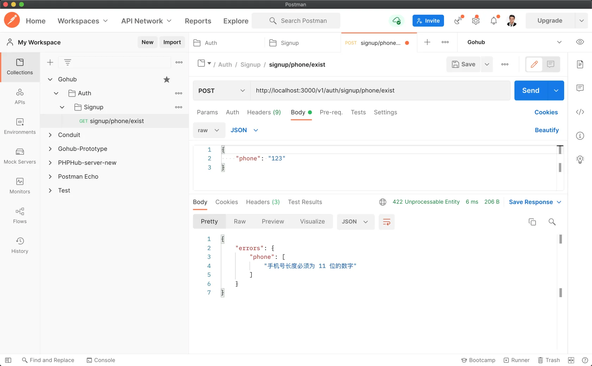

# 4.5. 验证请求

原文链接：https://learnku.com/courses/go-api/1.19/validate-user-request/13492

## 说明

任何时候都不能相信用户发送过来的请求。

这个 Web 开发的黄金法则。

上一节课中，我们开发的`/signup/phone/exist` 存在很大缺陷，就是没有验证用户发送过来的请求。这节课我们来做优化。

## 1. Govalidator

验证规则纷繁复杂，没必要去从零开始写一个验证器。Go 社区已经有很多现成的方案可供选择。

Gohub 项目将选用 [github.com/thedevsaddam/govalidato...](https://github.com/thedevsaddam/govalidator) 来作为请求验证的基础包。它除了拥有丰富的验证规则外，还支持自定义规则和自定义错误消息，满足我们的需求。

## 2. 安装 Govalidator

```
$ go get github.com/thedevsaddam/govalidator
```

## 3. 创建验证器

app/requests/signup_request.go

```
// Package requests 处理请求数据和表单验证
package requests

import (
"github.com/gin-gonic/gin"
"github.com/thedevsaddam/govalidator"
)

type SignupPhoneExistRequest struct {
Phone string `json:"phone,omitempty" valid:"phone"`
}

func ValidateSignupPhoneExist(data interface{}, c *gin.Context) map[string][]string {

// 自定义验证规则
rules := govalidator.MapData{
"phone": []string{"required", "digits:11"},
}

// 自定义验证出错时的提示
messages := govalidator.MapData{
"phone": []string{
"required:手机号为必填项，参数名称 phone",
"digits:手机号长度必须为 11 位的数字",
},
}

// 配置初始化
opts := govalidator.Options{
Data:          data,
Rules:         rules,
TagIdentifier: "valid", // 模型中的 Struct 标签标识符
Messages:      messages,
}

// 开始验证
return govalidator.New(opts).ValidateStruct()
}
```

## 4. 控制器调用

app/http/controllers/api/v1/auth/signup_controller.go

```
// Package auth 处理用户身份认证相关逻辑
package auth

import (
"fmt"
v1 "gohub/app/http/controllers/api/v1"
"gohub/app/models/user"
"gohub/app/requests"
"net/http"

"github.com/gin-gonic/gin"
)

// SignupController 注册控制器
type SignupController struct {
v1.BaseAPIController
}

// IsPhoneExist 检测手机号是否被注册
func (sc *SignupController) IsPhoneExist(c *gin.Context) {

// 初始化请求对象
request := requests.SignupPhoneExistRequest{}

// 解析 JSON 请求
if err := c.ShouldBindJSON(&request); err != nil {
// 解析失败，返回 422 状态码和错误信息
c.AbortWithStatusJSON(http.StatusUnprocessableEntity, gin.H{
"error": err.Error(),
})
// 打印错误信息
fmt.Println(err.Error())
// 出错了，中断请求
return
}

// 表单验证
errs := requests.ValidateSignupPhoneExist(&request, c)
// errs 返回长度等于零即通过，大于 0 即有错误发生
if len(errs) > 0 {
// 验证失败，返回 422 状态码和错误信息
c.AbortWithStatusJSON(http.StatusUnprocessableEntity, gin.H{
"errors": errs,
})
return
}

//  检查数据库并返回响应
c.JSON(http.StatusOK, gin.H{
"exist": user.IsPhoneExist(request.Phone),
})
}
```

## 5. 测试一下

Postman 里，将 JSON 请求数据改为：

```
{
"phone": "123"
}
```

点击发送请求如下，可以看到验证错误的消息提示：



## go mod tidy

上面加载了第三方库，现在使用 mod tidy 命令来整理一下 go.mod 文件：

```
$ go mod tidy
```

## 代码版本

开始下一节之前，我们先来为代码做下版本标记：

```
$ git add .
$ git commit -m "验证请求"
```
