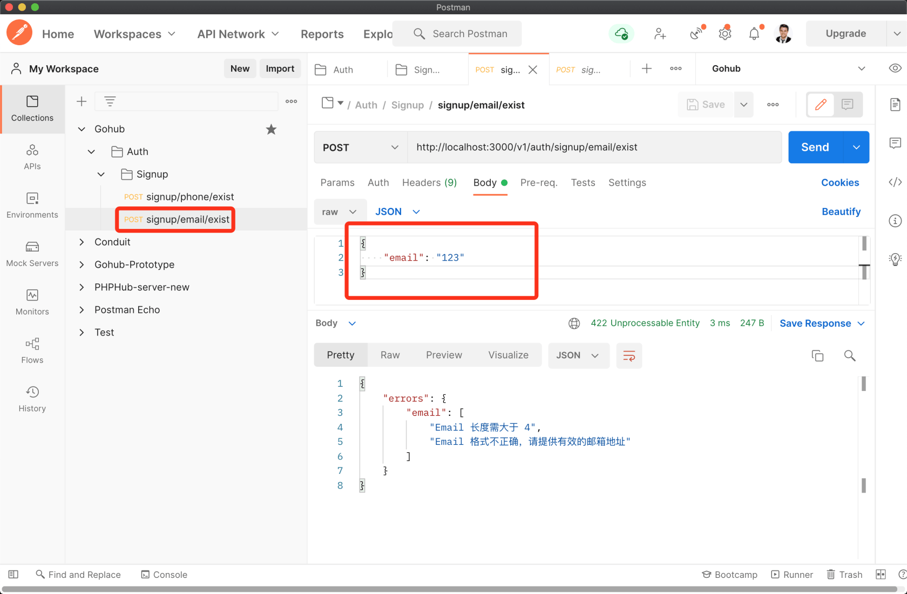
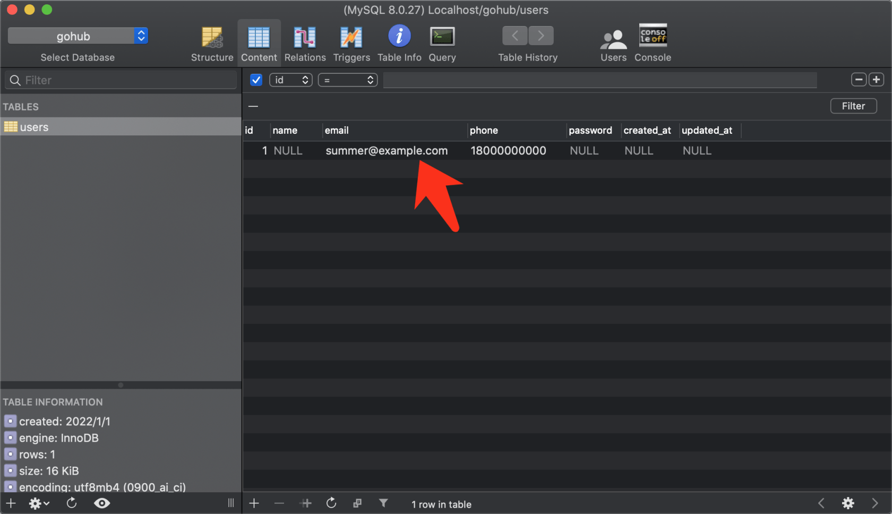
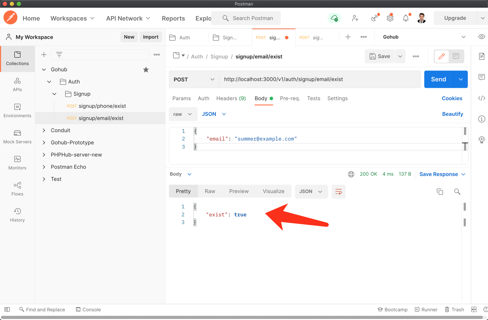

# 4.6. Email 是否已注册

原文链接：https://learnku.com/courses/go-api/1.19/is-email-registered/13493

## 说明

这节课我们来开发 `signup/email/exist` 接口。

## 1. 创建验证器

app/requests/signup_request.go

```
.
.
.
type SignupEmailExistRequest struct {
Email string `json:"email,omitempty" valid:"email"`
}

func ValidateSignupEmailExist(data interface{}, c *gin.Context) map[string][]string {

// 自定义验证规则
rules := govalidator.MapData{
"email": []string{"required", "min:4", "max:30", "email"},
}

// 自定义验证出错时的提示
messages := govalidator.MapData{
"email": []string{
"required:Email 为必填项",
"min:Email 长度需大于 4",
"max:Email 长度需小于 30",
"email:Email 格式不正确，请提供有效的邮箱地址",
},
}

// 配置初始化
opts := govalidator.Options{
Data:          data,
Rules:         rules,
TagIdentifier: "valid", // 模型中的 Struct 标签标识符
Messages:      messages,
}

// 开始验证
return govalidator.New(opts).ValidateStruct()
}
```

## 2. 控制器方法

app/http/controllers/api/v1/auth/signup_controller.go

```
.
.
.
// IsEmailExist 检测邮箱是否已注册
func (sc *SignupController) IsEmailExist(c *gin.Context) {

// 初始化请求对象
request := requests.SignupEmailExistRequest{}

// 解析 JSON 请求
if err := c.ShouldBindJSON(&request); err != nil {
// 解析失败，返回 422 状态码和错误信息
c.AbortWithStatusJSON(http.StatusUnprocessableEntity, gin.H{
"error": err.Error(),
})
// 打印错误信息
fmt.Println(err.Error())
// 出错了，中断请求
return
}

// 表单验证
errs := requests.ValidateSignupEmailExist(&request, c)
// errs 返回长度等于零即通过，大于 0 即有错误发生
if len(errs) > 0 {
// 验证失败，返回 422 状态码和错误信息
c.AbortWithStatusJSON(http.StatusUnprocessableEntity, gin.H{
"errors": errs,
})
return
}

//  检查数据库并返回响应
c.JSON(http.StatusOK, gin.H{
"exist": user.IsEmailExist(request.Email),
})
}
```

## 3. 注册路由

routes/api.go

```
.
.
.
// 判断手机是否已注册
authGroup.POST("/signup/phone/exist", suc.IsPhoneExist)
// 判断 Email 是否已注册
authGroup.POST("/signup/email/exist", suc.IsEmailExist)
}
}
}
```

## 4. 测试一下

创建一个新的接口请求 `signup/email/exist`，请求数据为：

```
{
"email": "123"
}
```

发送请求：



请求数据修改为：

```
{
"email": "summer@example.com"
}
```

前往数据库中添加 Email  `[summer@example.com](mailto:summer@example.com)`：



发起请求：



结果符合预期。

## 代码版本

开始下一节之前，我们先来为代码做下版本标记：

```
$ git add .
$ git commit -m "Email 是否已注册接口"
```
