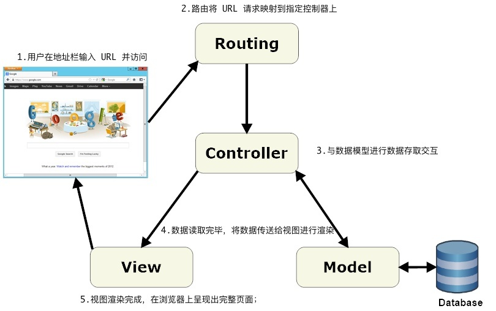

# 7.1. 代码结构

原文链接：https://learnku.com/courses/go-basic/1.22/architecture/16506

## 说明

目前我们的所有 Go 代码都写在 main.go 中，已有五百多行，严格来讲，目前我们的项目的可维护性极差。不信你试试，需要花多长时间才能找到处理删除文章部分的代码？

## 代码组织的重要性

为什么我们需要考虑代码结构？

首先，需要明白一个道理：

>

所有的代码写在一个巨大的 main.go 文件里，Go 编译器也是可以正常执行的。

假如一个项目里有万行的 Go 代码，这些代码其实放到同一个文件里，机器都是可以执行的。但是来了个新人，一看这万行代码的文件，得多崩溃，定位某个功能的代码，都需要花费大量的时间。

优秀的代码组织结构，是为了方便我们快速定位代码，以此来提高开发效率。

需时刻谨记：

>

“Any fool can write code that a computer can understand. Good programmers write code that humans can understand.” — Martin Fowler

任何人都能写机器能识别的代码，而优秀的工程师能写傻瓜都能看懂的代码。

### 为什么不从一开始就做好代码结构？

主要是为了演示单文件程序的代码布置，同时也让初学者体验到，大量代码放置于同一个文件中，阅读体验与可维护性得有多差。

### Go Web 项目都有哪些组织方式？

一般根据项目体积，Go Web 程序的代码组织常见有以下几种方式：

1. 单文件 —— 也称为反模式，我们目前的形式，适用于 500 行代码以内小而美的程序

2. 多文件 —— 也称为扁平模式，在根目录展开，将处理业务逻辑的代码移到单独的文件中，例如 articles_handler/user_handler 等，适合小型应用或者简单的 API 程序

3. 目录归类 —— 也称为分层模式，利用目录进行归类，具备层级关系，适用于代码量多，业务逻辑复杂的场景

因为 goblog 是个全栈的 Web 项目，随着开发的推进，项目会变得很复杂，所以接下来我们将会使用 目录归类 的方式来组织项目。

## 如何组织

先来看看当下我们的 main.go 里有什么内容：

1. 应用初始化 —— 数据库连接初始化、路由初始化、配置加载等…

2. 路由 —— 配置 URI 与控制器的对应关系

3. 控制器 —— 处理业务逻辑的 aboutHandler、homeHandler、articlesShowHandler 等

4. 数据库操作 —— 创建表、查询等

5. 数据模型 —— Article

6. 表单验证

7. 辅助函数 —— Int64ToString、RouteName2URL

8. 中间件

9. 错误处理等

可见目前的 goblog 麻雀虽小五脏俱全。

我们将参考知名框架 Laravel 的文件组织结构，以 MVC 为核心来构建我们的 goblog 程序。

选择 Laravel 的原因，除了其目录命名合理以外，其兼顾 Web 、API 、命令行三个入口的设计，也很值得我们借鉴。

### 为什么选用 MVC ?

选用 MVC 是因其普遍性，这是 Web 开发中最常见的程序组织模式。另外这个模式也有简单易学的特点。

### 什么是 MVC ？

MVC 模式是一种流行的 Web 应用架构技术，它被命名为模型-视图-控制器(Model-View-Controller)。在分离应用程序内部的关注点方面，MVC是一种强大而简洁的方式，尤其适合应用在 Web 应用程序中。

MVC 将应用程序的用户界面分为三个主要部分：

1. 模型：描述了要处理的数据以及修改和操作数据的业务规则，负责数据存储和读取；

2. 视图：定义应用程序用户界面的显示方式，一般由 HTML 混合动态语法，负责数据展现；

3. 控制器：用于处理来自用户、整个应用程序流以及模型和视图间的衔接。

## 图解一个用户请求

当用户在请求一个网页时，一个完整的访问过程如下：

1. 打开浏览器在地址栏输入 URL 并访问；

2. 程序 路由器 将 URL 请求映射到指定控制器上；

3. 控制器 收到请求，开始进行处理。如果视图需要动态数据进行渲染，则控制器会开始从模型中读取数据；

4. 数据读取完毕，将数据传送给视图进行渲染；

5. 视图渲染完成，在浏览器上呈现出完整页面；

如下图：

## 底层代码存放目录 pkg

一个项目中 MVC 是指的是业务逻辑的代码，而除了支撑业务逻辑代码以外，还有底层的辅助代码。例如路由加载、数据库初始化等。拿知名的 Laravel 框架来举例，业务逻辑的代码是 [github.com/laravel/laravel](https://github.com/laravel/laravel) ，而底层代码是以 Illuminate 为命名空间的包 [github.com/laravel/framework/tree/...](https://github.com/laravel/framework/tree/8.x/src/Illuminate) 。

在我们的项目中，遵循 Go 社区的惯例，这些底层代码我们会归类为各自的包，并放置于 pkg 目录下。

pkg 目录下的包，我们会尽量保持其独立性，这样方便在其他项目中复用。但是最重要的，当前还是以服务 goblog 项目为主。

## 结语

相较于其他 Web 开发语言例如说 PHP ，Go 还是比较年轻的。

PHP 有 Laravel 框架，框架为我们设计好了一切，包括底层的功能代码，以及合理的目录结构，Go 语言目前来讲并没有一个类似于 Laravel 一样优秀的，可以一统江湖的 Web 全栈开发框架。

所以整个 Go 开源社区在做 Web 项目时都是选用开发者自己喜爱的结构。在早期的学习中，建议 Go 初学者多看知名项目的源码，揣摩他们的项目组织结构。

在实际 Go 项目开发中，要灵活运用，不需要太纠结于某个目录应该怎么设计。以项目的大小、业务的复杂度、个人及团队专业技能认知的广度和深度、时间的紧迫度为准。不一定要选最好的，而是要选择最适用的方案。

另外 Go 社区里也推荐阅读下这个项目 ——  [golang-standards/project-layout](https://github.com/golang-standards/project-layout/blob/master/README_zh.md)。虽然此项目并非为 Web 开发量身定做，目前来讲也不算标准，但也算是 Go 社区的一次尝试，值得一读。
