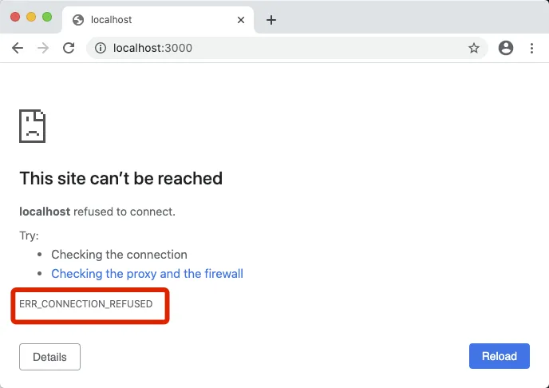
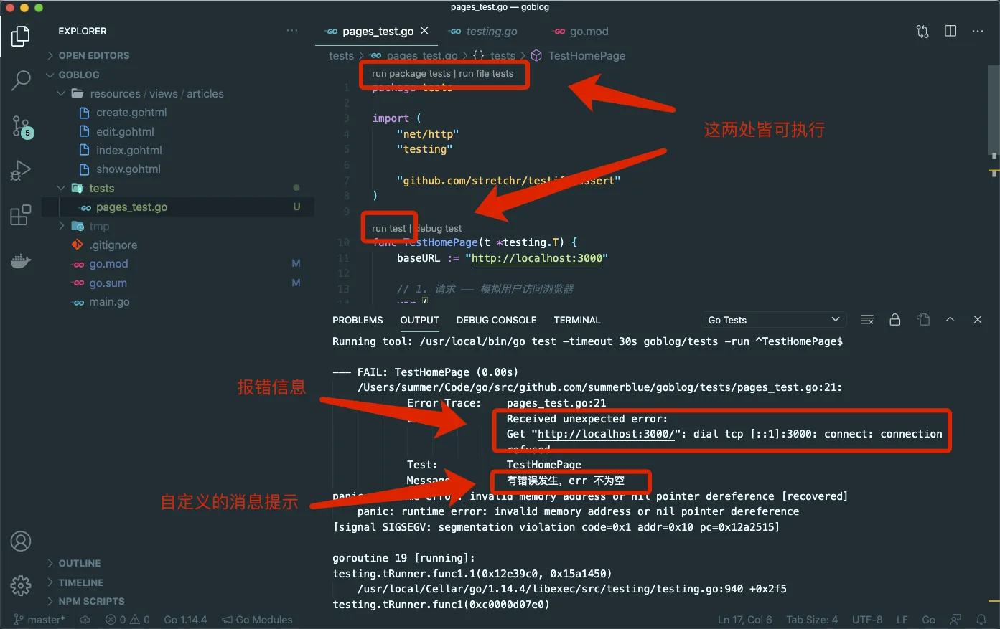
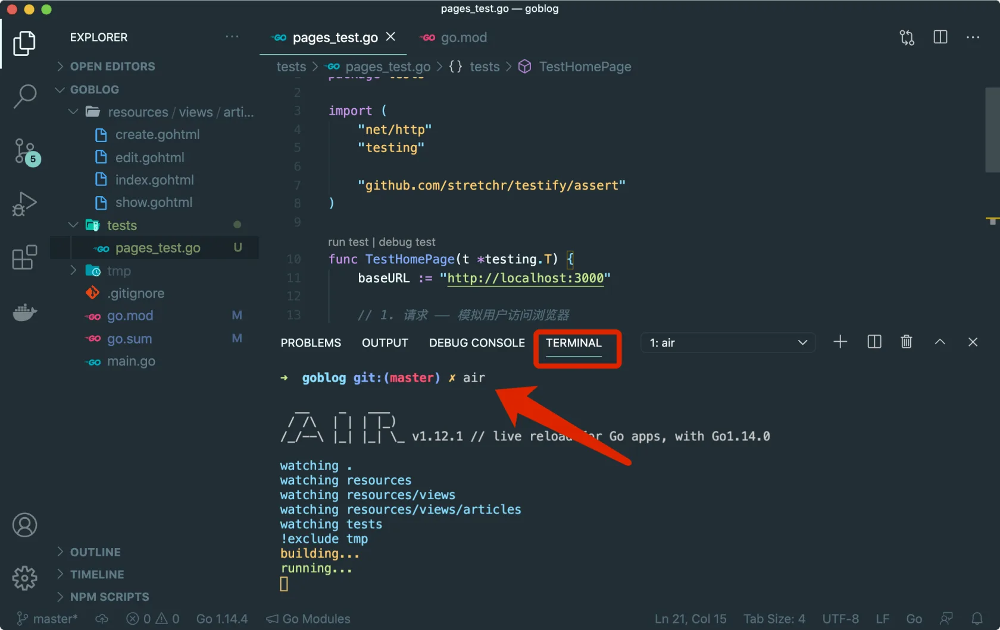
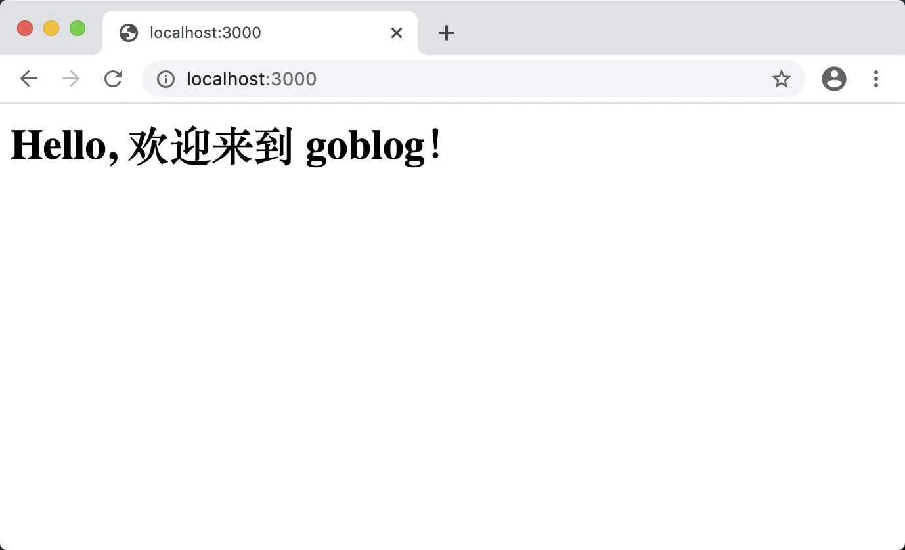
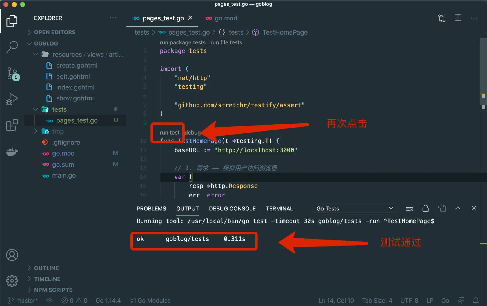

# 7.2. 重构与测试

原文链接：https://learnku.com/courses/go-basic/1.22/refactoring-testing/16507

## 说明

开始重构代码之前，我们来想想接下来的流程：

1. 修改代码；

2. 打开浏览器，测试每一个页面是否访问正常；

3. 继续修改代码；

4. 继续重复第二个动作。

可预见的，打开浏览器访问网页确认修改无误，这个动作重复性高、效率低下。并且我们目前有 9 个（加上 404 页面有 10 个）页面，如果修改到公共代码的话，还需要一口气访问这些网页来确保无误。

有没有更加合理的方式来做这件事情？

当然有，有一个软件开发里很常见的做法 —— 写测试。

这里的测试指的是自动化测试，相较之下，我们一个个打开这 10 个页面，可称为手动测试。

自动化测试的好处是可以在执行一个命令后，同时运行多至成百上千个测试，并且在很短的时间内执行完毕。自动化测试是软件健壮性的最重要的保障，一般在大公司里，核心业务都有 100% 的测试覆盖率。

## 测试的分类

测试的形式多种多样，以被测试代码的范围来区分，可分为：

1. 单元测试—— 顾名思义，测试的最小单元，测试底层功能函数，例如你写一个数据库连接的类，类里的每一个方法都可用单元测试来保证其可用性；

2. 集成测试 —— 也称为功能测试，在 Web 开发中测试整个 Web 请求或 HTTP API 请求，会模拟 HTTP 请求到自己提供的服务器上，创建或更改数据，然后检查数据库里这些数据是否变更；

3. 黑盒测试 —— 完全模拟用户测试，把应用连带服务器看成是一个整体，模拟 HTTP 请求，对返回结果进行断言。

单元测试适用于测试底层函数，集成测试 可模拟表单提交、甚至为应用创建独有的内存数据库、可调用到内部编程接口、更改应用的驱动，功能比较齐全，但是比较难理解，代码写起来也比较复杂，这本身就是一个值得深入学习的课题，本课程不会涉及太深。

黑盒测试 与 集成测试 一样，都是站在用户角度测试整个应用提供的功能，黑盒测试 的好处是代码比较简单，因为模拟用户行为，对新手来讲也比较好理解，缺点就是执行效率低，且无法在代码里自动为其创建专属的测试环境。

>

小提示： 一般来讲，测试环境需要与其他环境区分开，一方面是为了保证测试的准确性，另一方面也是避免污染其他环境。举例说明 —— 假如我们测试文章的创建功能，会模拟用户提交表单，创建一条文章数据，然后访问链接，断言标题是否与提交的表单数据对应上。此时数据库里会多出来一条我们的测试数据，我们称之为 污染。

>

小提示： 什么是断言？断言是在代码层面上，我们用以判断获取到的结果是否符合预期，以此来判断测试是否通过。后面我们会学到具体的操作，一看就懂。

## 开始测试

### 1. 安装工具

首先安装 [stretchr/testify](https://github.com/stretchr/testify) ，这是一个知名的第三方测试包，我们将用到他的断言（Assertion）功能。

根目录执行以下命令：

```bash
$ go get github.com/stretchr/testify
```

打开 go.mod 文件，可以看到 testify 包已经被加载：

go.mod

```
.
.
.
github.com/stretchr/testify v1.8.0 // indirect
)
```

打开 go.mod 文件会发现加载了很多我们没见过的包，这是 testify 所依赖的包。

为了方便引用，我们将修改 module 为更加简短的 `goblog`：

go.mod

```
module goblog
.
.
.
```

执行 tidy 命令来纠正项目：

```bash
$ go mod tidy
```

### 2. 测试首页

安装成功后开始编写测试，我们先测试 `/` 主页：

tests/pages_test.go

```go
package tests

import (
	"net/http"
	"testing"

	"github.com/stretchr/testify/assert"
)

func TestHomePage(t *testing.T) {
	baseURL := "http://localhost:3000"

	// 1. 请求 —— 模拟用户访问浏览器
	var (
		resp *http.Response
		err  error
	)
	resp, err = http.Get(baseURL + "/")

	// 2. 检测 —— 是否无错误且 200
	assert.NoError(t, err, "有错误发生，err 不为空")
	assert.Equal(t, 200, resp.StatusCode, "应返回状态码 200")
}
```

首先，本项目中的所有测试文件都将归类到 `tests` 目录下。

后缀名 `_test` 是一个特殊标识，会告知 Go 编译器和工具链这是一个测试文件。Go 编译器在编译时会跳过这些文件，而工具 `go test` 在执行时默认会运行当前目录下所有拥有 `_test` 后缀名的文件。

```go
var (
	resp *http.Response
	err  error
)
resp, err = http.Get(baseURL + "/")
```

`http` 是 Go 标准库里的 `net/http` 包，细心的朋友可能注意到了，它跟我们的 main.go 里用以搭建 HTTP 服务器使用的是同一个包。

Go 的 http 包兼具 HTTP 服务器和 HTTP 客户端的功能，HTTP 客户端支持 GET/POST/PUT 等请求方式，常用于访问网页，或者请求第三方 API 。

`http.Get()` 传参的是想要访问的 URL ，因为我们的 main.go 里监听的是本地 3000 端口：

```
http.ListenAndServe(":3000", removeTrailingSlash(router))
```

所以这里 baseURL 我们设置的值为：

```
baseURL := "http://localhost:3000"
```

`http.Get()` 返回的是 `*http.Response` 和 error ，如未出现错误 error 为 nil。按住 Ctrl 键（Mac 下按 Command 键）鼠标悬浮在 `*http.Response` 点击进入可查看其属性：

```go
type Response struct {
	Status           string        // 响应状态，字符串，"200 OK"
	StatusCode       int           // 响应状态码，200、304、404等
	Proto            string        // 协议类型，字符串，"HTTP/1.1"
	ProtoMajor       int           // 协议的主版本号， 1
	ProtoMinor       int           // 协议的副版本号，0
	Header           Header        // 响应头
	Body             io.ReadCloser // 响应的body信息
	ContentLength    int64         // 响应数据包长度
	TransferEncoding []string      // 传输编码
	Request          *Request      // 响应的请求信息
}
```

我们这里对响应的状态码 `resp.StatusCode` 以及错误进行断言：

```
assert.NoError(t, err, "有错误发生，err 不为空")
assert.Equal(t, 200, resp.StatusCode, "应返回状态码 200")
```

使用 `assert.NoError()` 来断言没有错误发生。第一个 t 为 testing 标准库里的 testing.T 对象，第二个参数为错误对象 err ，第三个参数为出错时显示的信息（选填）。

`assert.Equal()` 会断言两个值相等，第一个参数同上，第二个参数是期待的状态码，第三个参数是请求返回的状态码，第四个参数为出错时显示的信息（选填）。

以下是 testify 的常用断言函数：

```go
// 相等
func Equal(t TestingT, expected, actual interface{}, msgAndArgs ...interface{}) bool
func NotEqual(t TestingT, expected, actual interface{}, msgAndArgs ...interface{}) bool

// 是否为 nil
func Nil(t TestingT, object interface{}, msgAndArgs ...interface{}) bool
func NotNil(t TestingT, object interface{}, msgAndArgs ...interface{}) bool

// 是否为空
func Empty(t TestingT, object interface{}, msgAndArgs ...interface{}) bool
func NotEmpty(t TestingT, object interface{}, msgAndArgs ...interface{}) bool

// 是否存在错误
func NoError(t TestingT, err error, msgAndArgs ...interface{}) bool
func Error(t TestingT, err error, msgAndArgs ...interface{}) bool

// 是否为 0 值
func Zero(t TestingT, i interface{}, msgAndArgs ...interface{}) bool
func NotZero(t TestingT, i interface{}, msgAndArgs ...interface{}) bool

// 是否为布尔值
func True(t TestingT, value bool, msgAndArgs ...interface{}) bool
func False(t TestingT, value bool, msgAndArgs ...interface{}) bool

// 断言长度一致
func Len(t TestingT, object interface{}, length int, msgAndArgs ...interface{}) bool

// 断言包含、子集、非子集
func NotContains(t TestingT, s, contains interface{}, msgAndArgs ...interface{}) bool
func Subset(t TestingT, list, subset interface{}, msgAndArgs ...interface{}) (ok bool)
func NotSubset(t TestingT, list, subset interface{}, msgAndArgs ...interface{}) (ok bool)

// 断言文件和目录存在
func FileExists(t TestingT, path string, msgAndArgs ...interface{}) bool
func DirExists(t TestingT, path string, msgAndArgs ...interface{}) bool
```

混个眼熟即可，实战中使用才能记得住。

### 3. 执行测试

首先浏览器访问主页 [localhost:3000/](http://localhost:3000/) ，如下：



因为我尚未执行 `air` 命令来运行我们的程序，所以访问会显示 `ERR_CONNECTION_REFUSED`。

>

注： 如果你正在运行 air ，请先关闭以保持一致。

Go 的 VSCode 插件包含了测试相关的功能，打开测试文件的情况下，点击测试函数或者文件顶部的测试按钮即可完成测试：



错误信息如下：

```
--- FAIL: TestHomePage (0.00s)
/Users/summer/Code/go/src/github.com/summerblue/goblog/tests/pages_test.go:21:
Error Trace:    pages_test.go:21
Error:          Received unexpected error:
Get "http://localhost:3000/": dial tcp [::1]:3000: connect: connection refused
Test:           TestHomePage
Messages:       有错误发生，err 不为空
```

测试运行失败时，要仔细观察失败的提示信息，主要是上面这块。其中包括执行哪个文件里的某一行代码，哪一个测试，以及我们自定义的消息。

接下来切换到 `TERMINAL` 标签并运行 `air` 命令：



浏览器再次访问主页 [localhost:3000/](http://localhost:3000/) ，如下：



测试一下：



至此我们完成了第一个测试。

## 代码版本

开始下一节之前，我们先来为代码做下版本标记：

```bash
$ git add .
$ git commit -m "完成第一个测试"
```
