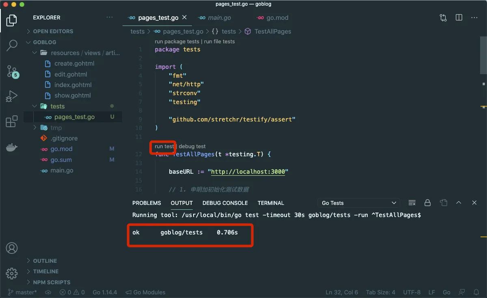
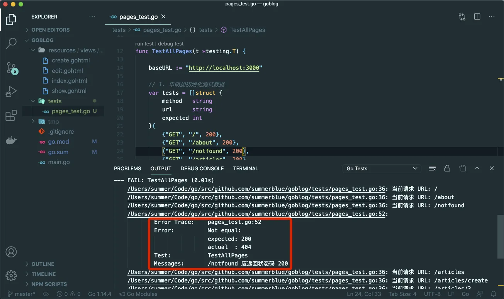
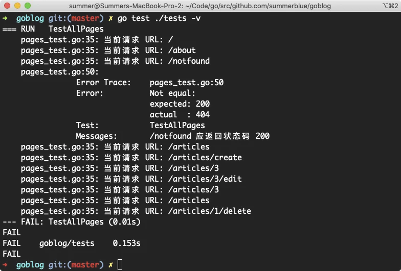

# 7.3. 表组测试

原文链接：https://learnku.com/courses/go-basic/1.22/table-group-test/16508

## 说明

上一节我们完成了第一个测试，接下来编写其他页面的测试代码。

## 关于页面

接下来编写关于页面的测试：

tests/pages_test.go

```
.
.
.

func TestAboutPage(t *testing.T) {
baseURL := "http://localhost:3000"

// 1. 请求 —— 模拟用户访问浏览器
var (
resp *http.Response
err  error
)
resp, err = http.Get(baseURL + "/about")

// 2. 检测 —— 是否无错误且 200
assert.NoError(t, err, "有错误发生，err 不为空")
assert.Equal(t, 200, resp.StatusCode, "应返回状态码 200")
}
```

关于页面的测试，跟首页的测试大部分是相同的，只是函数名称和请求的 URL 不一样。

## 表组测试

Go 语言中，对于具备相同的测试逻辑的场景，我们可以使用简洁紧凑的 表组测试（Table-Driven Test） 来编写测试，标准库中的测试也广泛使用此种方式。

我们要定义一个用于表组测试的结构体，其中要包含测试所需的输入与期望的输出。

首先来看下我们在 main.go 中所有的路由：

```
router.HandleFunc("/", homeHandler).Methods("GET").Name("home")
router.HandleFunc("/about", aboutHandler).Methods("GET").Name("about")

router.HandleFunc("/articles/{id:[0-9]+}", articlesShowHandler).Methods("GET").Name("articles.show")
router.HandleFunc("/articles", articlesIndexHandler).Methods("GET").Name("articles.index")
router.HandleFunc("/articles", articlesStoreHandler).Methods("POST").Name("articles.store")
router.HandleFunc("/articles/create", articlesCreateHandler).Methods("GET").Name("articles.create")
router.HandleFunc("/articles/{id:[0-9]+}/edit", articlesEditHandler).Methods("GET").Name("articles.edit")
router.HandleFunc("/articles/{id:[0-9]+}", articlesUpdateHandler).Methods("POST").Name("articles.update")
router.HandleFunc("/articles/{id:[0-9]+}/delete", articlesDeleteHandler).Methods("POST").Name("articles.delete")
router.NotFoundHandler = http.HandlerFunc(notFoundHandler)
```

他们的请求方法不一致，URI 不一致，还有返回的状态码不一致，这可以作为我们的基本结构体。然后所有的结构体组成一个数组，遍历这个数组，对所有元素进行请求和对结果的断言：

tests/pages_test.go

```
package tests

import (
"fmt"
"net/http"
"strconv"
"testing"

"github.com/stretchr/testify/assert"
)

func TestAllPages(t *testing.T) {

baseURL := "http://localhost:3000"

// 1. 声明加初始化测试数据
var tests = []struct {
method   string
url      string
expected int
}{
{"GET", "/", 200},
{"GET", "/about", 200},
{"GET", "/notfound", 404},
{"GET", "/articles", 200},
{"GET", "/articles/create", 200},
{"GET", "/articles/3", 200},
{"GET", "/articles/3/edit", 200},
{"POST", "/articles/3", 200},
{"POST", "/articles", 200},
{"POST", "/articles/1/delete", 404},
}

// 2. 遍历所有测试
for _, test := range tests {
t.Logf("当前请求 URL: %v \n", test.url)
var (
resp *http.Response
err  error
)
// 2.1 请求以获取响应
switch {
case test.method == "POST":
data := make(map[string][]string)
resp, err = http.PostForm(baseURL+test.url, data)
default:
resp, err = http.Get(baseURL + test.url)
}
// 2.2 断言
assert.NoError(t, err, "请求 "+test.url+" 时报错")
assert.Equal(t, test.expected, resp.StatusCode, test.url+" 应返回状态码 "+strconv.Itoa(test.expected))
}
}
```

TestHomePage 和 TestAboutPage 已经被去除掉，换为 TestAllPages。

Struct 是我们上面提到过的三个不一样的地方：

```
struct {
method   string    // 请求方法
url      string    // URI
expected int       // 状态码
}
```

其他代码我们之前讲解过，请配合代码中的注释进行阅读。

数组里的最后三个：

```
{"POST", "/articles/3", 200},
{"POST", "/articles", 200},
{"POST", "/articles/1/delete", 404},
```

第一个是编辑文章表单提交的链接，第二个是创建文章表单提交的链接，第三个是删除文章提交的链接。

前两个链接，模拟表单提交的话，如不提供数据，会返回 200 状态码，加上表单提示：

```
$ curl -i -X POST http://localhost:3000/articles
```

返回：

```
HTTP/1.1 200 OK
Content-Type: text/html; charset=utf-8
Date: Mon, 12 Oct 2020 07:33:33 GMT
Content-Length: 497

<!DOCTYPE html>
<html lang="en">
<head>
<title>创建文章 —— 我的技术博客</title>
<style type="text/css">.error {color: red;}</style>
</head>
<body>
<form action="/articles" method="post">
<p><input type="text" name="title" value=""></p>

<p class="error">标题不能为空</p>

<p><textarea name="body" cols="30" rows="10"></textarea></p>

<p class="error">内容不能为空</p>

<p><button type="submit">提交</button></p>
</form>
</body>
</html>%
```

删除文章如果不存在，也会返回 404，为了不污染开发环境的测试，我们只需要测试到这个链接是可以返回，且可以正常处理逻辑的即可。

## 跑一下测试

运行测试后，会显示 OK：



这就是我们期待的效果，在重构代码时，如果想确保代码正常工作，就过来测试一下。

接下来我们修改下代码，测试看出现错误不一致的情况，修改这一行：

```
{"GET", "/notfound", 404},
```

为：

```
{"GET", "/notfound", 200},
```

再次运行测试，可以看到测试失败，以及失败后的详细信息：



以下的这些输出：

```
/Users/summer/Code/go/src/github.com/summerblue/goblog/tests/pages_test.go:36: 当前请求 URL: /
/Users/summer/Code/go/src/github.com/summerblue/goblog/tests/pages_test.go:36: 当前请求 URL: /about
/Users/summer/Code/go/src/github.com/summerblue/goblog/tests/pages_test.go:36: 当前请求 URL: /notfound
.
.

```

是我们调用了标准库里的辅助方法打印出来的数据：

```
t.Logf("当前请求 URL: %v \n", test.url)
```

当我们执行 `go test` 时，除了失败，是不会打印出来信息的，只有当我们设置了 -v 参数以后，才会显示：



以上命令中 `./tests`是指定测试文件存放路径，`-v` 是详细打印的意思，会打印出调用的测试函数以及终端的输出。

修改回来：

```
{"GET", "/notfound", 404},
```

再次运行：


## testing.T

上面我们使用了 `t.Logf()` 方法，Go 的标准库 testing 包提供了很多辅助方法。

通过阅读官方文档，看下 testing.T 中可导出方法如下：

```
// 获取测试名称
method (*T) Name() string
// 打印日志
method (*T) Log(args ...interface{})
// 打印日志，支持 Printf 格式化打印
method (*T) Logf(format string, args ...interface{})
// 反馈测试失败，但不退出测试，继续执行
method (*T) Fail()
// 反馈测试失败，立刻退出测试
method (*T) FailNow()
// 反馈测试失败，打印错误
method (*T) Error(args ...interface{})
// 反馈测试失败，打印错误，支持 Printf 的格式化规则
method (*T) Errorf(format string, args ...interface{})
// 检测是否已经发生过错误
method (*T) Failed() bool
// 相当于 Error + FailNow，表示这是非常严重的错误，打印信息结束需立刻退出。
method (*T) Fatal(args ...interface{})
// 相当于 Errorf + FailNow，与 Fatal 类似，区别在于支持 Printf 格式化打印信息；
method (*T) Fatalf(format string, args ...interface{})
// 跳出测试，从调用 SkipNow 退出，如果之前有错误依然提示测试报错
method (*T) SkipNow()
// 相当于 Log 和 SkipNow 的组合
method (*T) Skip(args ...interface{})
// 与Skip，相当于 Logf 和 SkipNow 的组合，区别在于支持 Printf 格式化打印
method (*T) Skipf(format string, args ...interface{})
// 用于标记调用函数为 helper 函数，打印文件信息或日志，不会追溯该函数。
method (*T) Helper()
// 标记测试函数可并行执行，这个并行执行仅仅指的是与其他测试函数并行，相同测试不会并行。
method (*T) Parallel()
// 可用于执行子测试
method (*T) Run(name string, f func(t *T)) bool
```

同样的，混个脸熟即可。

## 测试与重构

就如软件大师 [Kent Beck](https://baike.baidu.com/item/Kent%20Beck/13006051?fr=aladdin) 在《重构 Refactoring》一书中描述的：

- 先让代码工作起来 —— 如果代码不能工作，就不能产生价值

- 然后再试图将它变好 —— 通过对代码进行重构，让我们自己和其他人更好地理解代码，并能按照需求不断地修改代码。

- 最后再试着让它运行得更快 —— 按照性能提升的需求来重构代码。

有了测试作为铺垫，可以放心地重构我们的项目了。

## 代码版本

开始下一节之前，我们先来为代码做下版本标记：

```
$ git add .
$ git commit -m "完成代码测试"
```
