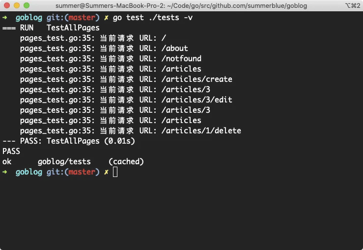
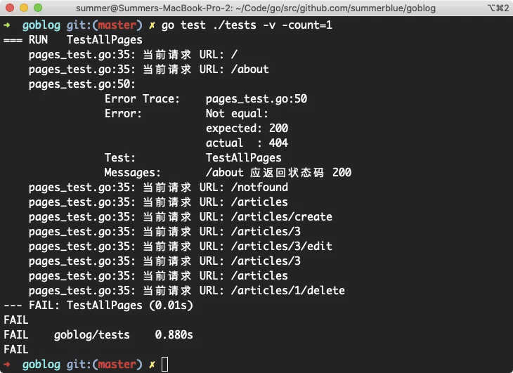
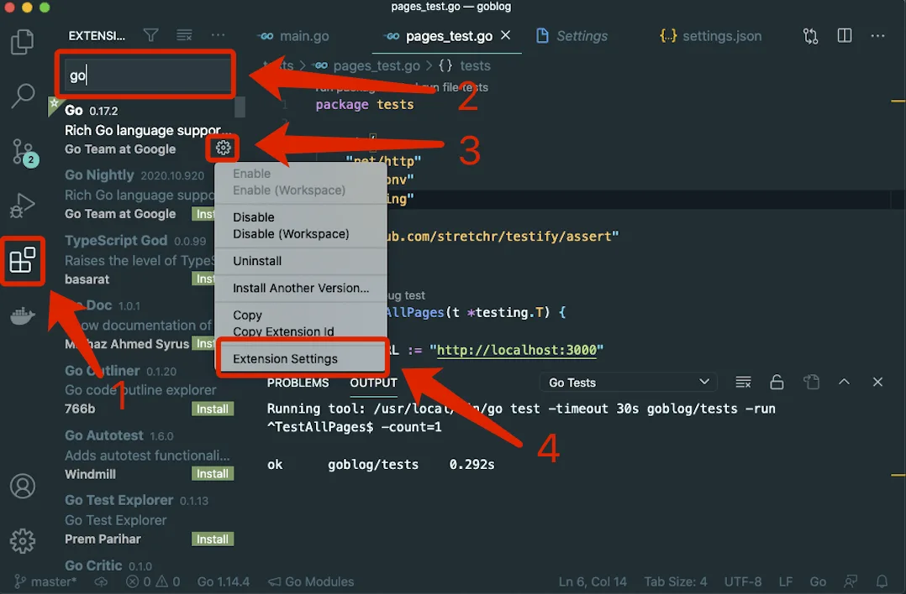
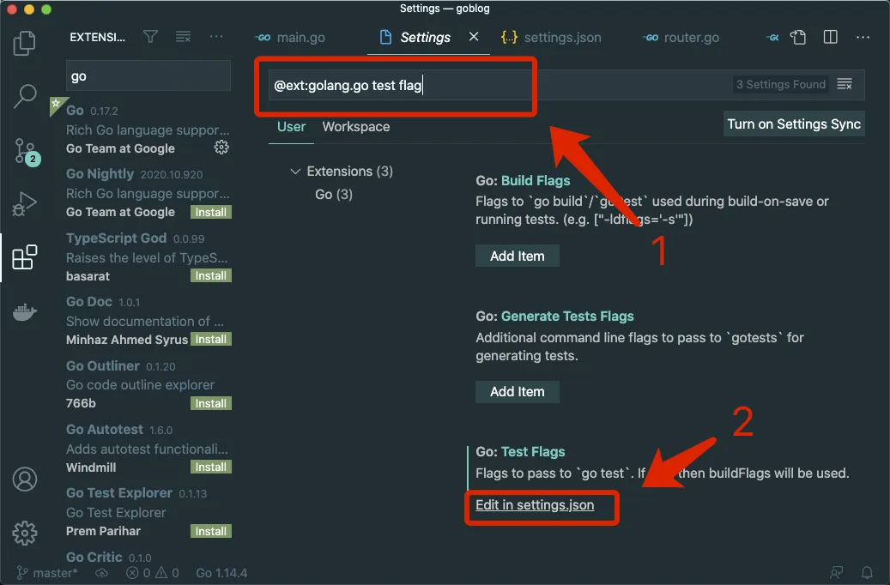
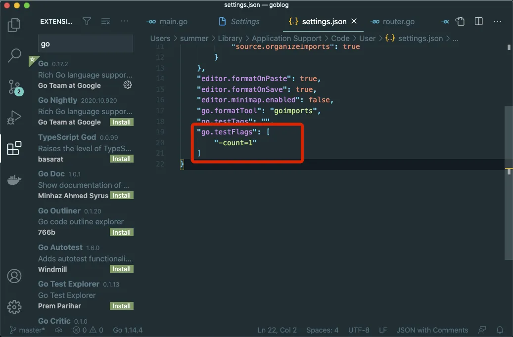
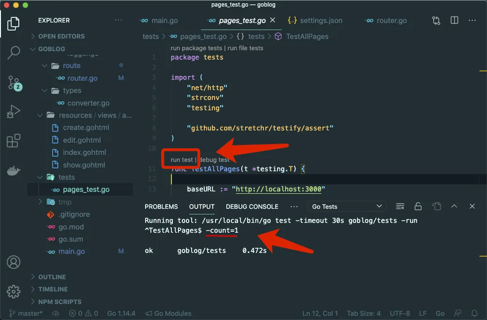

# 7.4. 缓存的测试结果

原文链接：https://learnku.com/courses/go-basic/1.22/cached-test-results/16509

## 说明

这里需要提一下，如果我们修改了 main.go 里的代码，但是并未修改 tests/pages_test.go 里的测试代码，当我们使用以下命令运行测试时：

```bash
$ go test ./tests -v
```

Go 会缓存测试的结果。

我们可以来试验一下，进入 main.go 修改路由定义为：

```
router.HandleFunc("/about", aboutHandler).Methods("GET").Name("about")
```

为：

```
router.HandleFunc("/abouttt", aboutHandler).Methods("GET").Name("about")
```

并保存。那我们运行测试代码，应该在访问 about 页面时候会报错，因为我们期待 200 会得到 404 的返回。试试看：



然而事实并非如此，测试通过了。

在这种情况下，可以为 `go test` 命令添加 `-count=1` 的参数：

```bash
$ go test ./tests -v -count=1
```

结果：



Go 为了提高测试的性能，会对包的编译后的测试代码进行缓存。一般常见的，也是官方推荐的清除缓存的方式是使用 `-count` 参数。此参数一般用以设置测试运行的次数，如果设置为 2 的话就会运行测试两次。

## VSCode 配置

VSCode 里运行测试，我们也需要为增加参数，否则也会出现测试被缓存的情况。

进入插件中心，搜索 go 关键词，定位到我们安装的插件，进入插件配置：



搜索关键词 `test flag` ，选择编辑 `settings.json` ：



在 `go.testFlags` 项里增加 `-count=1`（注意顶部的逗号）：

```
,
"go.testFlags": [
"-count=1"
]
```



再次运行测试，即可看到我们的 `-count=1` 了：



## 善后

最后将上面测试的修改纠正过来，因为我们使用了代码控制器，只需要运行以下命令即可还原修改：

```bash
$ git checkout .
```
