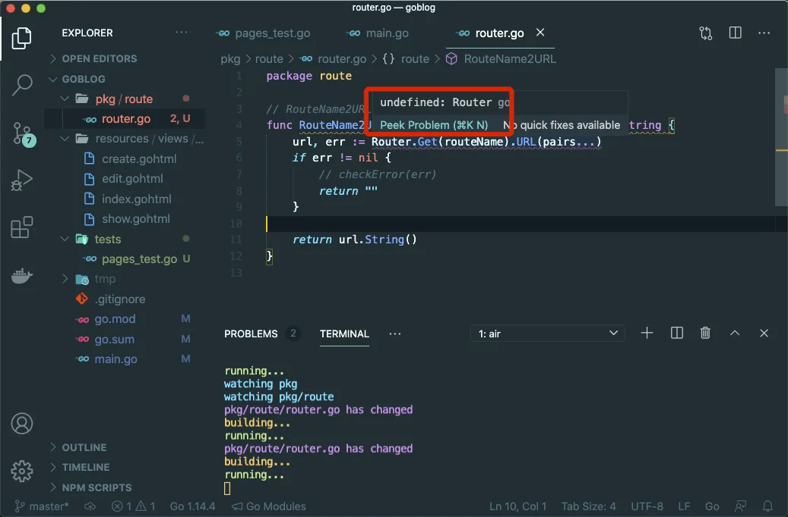
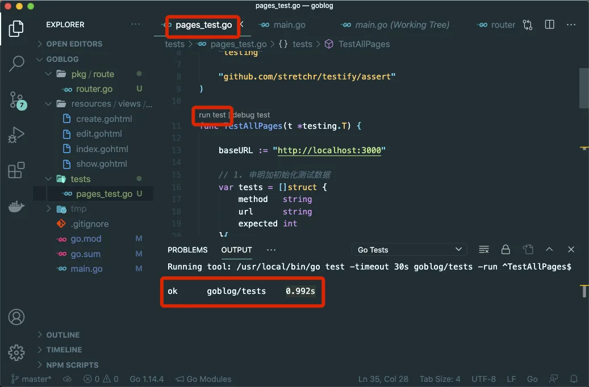
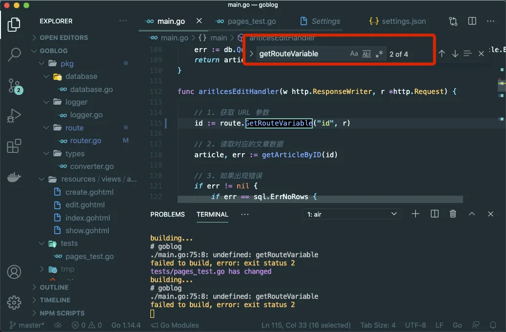

# 7.5. 开始重构

原文链接：https://learnku.com/courses/go-basic/1.22/start-refactoring/16510

## 说明

本节我们开始来重构，像我们这种要大刀阔斧修改整个项目的代码组织时，最好是先从底层的代码先入手。

所谓底层代码，就是被依赖的代码。例如辅助方法、公用方法等。

在我们的 main.go 中：

- RouteName2URL

- Int64ToString

- getRouteVariable

- initDB

- checkError

等，可以从这些代码开始重构。

## 路由包 route

我们先来抽离 RouteName2URL 函数：

pkg/route/router.go

```go
// Package route 路由相关
package route

// RouteName2URL 通过路由名称来获取 URL
func RouteName2URL(routeName string, pairs ...string) string {
	url, err := Router.Get(routeName).URL(pairs...)
	if err != nil {
		// checkError(err)
		return ""
	}

	return url.String()
}
```

VSCode 里可以看到 RouteName2URL  和 Router 会出现下划线，鼠标放上去可以看到错误提示：



如果你仔细看，会发现下划线的颜色不一样，RouteName2URL 是黄色的下划线，表示提示、建议：

```go
func name will be used as route.RouteName2URL by other packages, and that stutters; consider calling this Name2URL
```

这个插件很智能地建议我们将函数命名为 Name2URL ，这样别人调用的时候是 `route.Name2URL` 这样会更加顺口。

Router 下划线的颜色是红色，表示错误提示：

```
undefined: Router
```

Router 未定义，因为我们是在 main.go 的最顶部定义了包范围的变量 Router，而在包 route 里我们无法使用此变量。

接下来我们尝试解决这些问题：

pkg/route/router.go

```go
// Package route 路由相关
package route

import "github.com/gorilla/mux"

// Router 路由对象
var Router *mux.Router

// Initialize 初始化路由
func Initialize() {
	Router = mux.NewRouter()
}

// Name2URL 通过路由名称来获取 URL
func Name2URL(routeName string, pairs ...string) string {
	url, err := Router.Get(routeName).URL(pairs...)
	if err != nil {
		// checkError(err)
		return ""
	}

	return url.String()
}
```

我们将 Router 挪过来，且新增了 `Initialize()` 函数，用以做一些路由初始化相关的事情。

`checkError(err)` 调用我们后面再想办法来解决，目前先注释掉。

接下来修改 main.go ，需要做以下几件事情：

- 将 `RouteName2URL` 函数的定义移除

- 使用 `route.Name2URL` 来代替 `RouteName2URL`

- 去除顶部的 router 初始化，改用 `route.Router`

main.go

```go
package main

import (
    .
    .
    .
    "goblog/pkg/route"
)

var router *mux.Router
var db *sql.DB
.
.
.

func  articlesShowHandler(w http.ResponseWriter, r *http.Request) {
    .
    .
    .
    if err !=  nil {
        .
        .
        .
    } else {
        // 4. 读取成功，显示文章
        tmpl, err := template.New("show.gohtml").
        Funcs(template.FuncMap{
                "RouteName2URL": route.Name2URL,
                "Int64ToString": Int64ToString,
        }).
        ParseFiles("resources/views/articles/show.gohtml")
        .
        .
        .
    }
}
.
.
.
func  main() {
    initDB()
    createTables()

    route.Initialize()
    router = route.Router
    .
    .
    .
}
```

>

注意：顶部 “goblog/pkg/route” 要引入。

## 运行测试

修改完成后，运行测试检测一下：



测试通过，我们先将修改的代码做下版本标记：

```bash
$ git add .
$ git commit -m "重构 RouteName2URL"
```

## 重构 getRouteVariable

将 getRouteVariable 挪到我们的 route 包里，且作为可导出的函数，首字母要大写：

pkg/route/router.go

```go
.
.
.
// GetRouteVariable 获取 URI 路由参数
func GetRouteVariable(parameterName string, r *http.Request) string {
	vars := mux.Vars(r)
	return vars[parameterName]
}
```

接下来删除 main.go 中的 getRouteVariable 函数定义，并更改调用为 `route.GetRouteVariable()`。

在 VSCode 中，按住 Ctrl+f （Mac 下按 Command + f），查找关键词 `getRouteVariable` ，将所有出现的地方替换为 `route.GetRouteVariable`:



修改完成后保存，并打开 tests/pages_test.go ，运行测试。

## 代码版本

开始下一节之前，我们先来为代码做下版本标记：

```bash
$ git add .
$ git commit -m "重构 GetRouteVariable"
```
