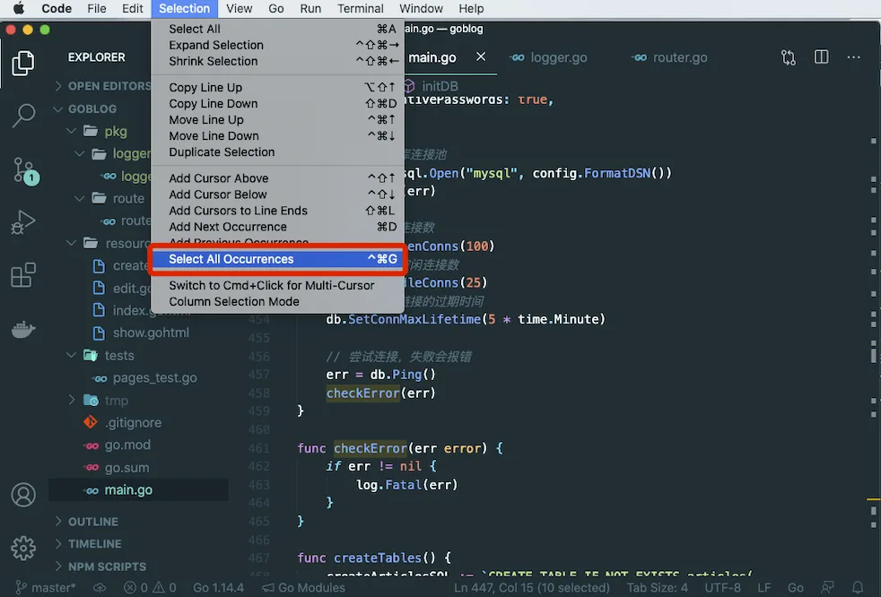

# 7.6. 日志与类型转换

原文链接：https://learnku.com/courses/go-basic/1.22/log-and-type-conversion/16511

## 说明

本节我们来抽离 checkError() 和 Int64ToString() 方法。

## checkError()

目前为止 `checkError()` 更多是打印日志，记录日志的功能。后面我们可能会添加将错误记录到文件里，或者发送到其他第三方错误收集器中。

接下来我们将其抽离到 pkg 里，为了跟标准库里的 log 做区分，我们取名为 logger：

pkg/logger/logger.go

```go
// Package logger 日志相关
package logger

import "log"

// LogError 当存在错误时记录日志
func LogError(err error) {
	if err != nil {
		log.Fatal(err)
	}
}
```

先在 main.go 里，顶部添加引入：

```
"goblog/pkg/logger"
```

接下来将 `checkError()` 函数删除。

最后 main.go 中的所有 `checkError()` 调用替换为 `logger.LogError()`，利用 VSCode 提供的多选功能可快速实现：

1. 双击选中 `checkError`;

2. 点击顶部菜单的 选中所有 选项（如下图）；

3. 批量修改为 `logger.LogError`。



## 跑一下测试

修改完成后，VSCode 里打开 tests/pages_test.go 文件，跑一下测试确认无误。

因为我们修改的代码较多，先做下版本标记：

```bash
$ git add .
$ git commit -m "重构 checkError"
```

## 重构 Int64ToString

接下来我们重构 `Int64ToString()` 方法，此方法是将 Int64 类型的数据转换为 string 类型，我们可以在 pkg 下创建一个 `types` 的目录，在此目录下创建一个 `converter.go` 文件，用以存放类型转换相关的代码：

pkg/types/converter.go

```go
// Package types 提供了一些类型转换的方法
package types

import "strconv"

// Int64ToString 将 int64 转换为 string
func Int64ToString(num int64) string {
	return strconv.FormatInt(num, 10)
}
```

先在 main.go 里，顶部添加引入：

```
"goblog/pkg/types"
```

删除 `Int64ToString()` 的函数定义，然后再修改如下：

main.go

```go
.
.
.
func  articlesShowHandler(w http.ResponseWriter, r *http.Request) {
    .
    .
    .
    if err !=  nil {
        .
        .
        .
    } else {
        // 4. 读取成功，显示文章
        tmpl, err := template.New("show.gohtml").
        Funcs(template.FuncMap{
                "RouteName2URL": route.Name2URL,
                "Int64ToString": types.Int64ToString,
        }).
        ParseFiles("resources/views/articles/show.gohtml")
        .
        .
        .
    }
}
.
.
.
```

修改完成后打开 tests/pages_test.go 文件跑一下测试，确保一切正常。

## 代码版本

开始下一节之前，我们先来为代码做下版本标记：

```bash
$ git add .
$ git commit -m "重构 Int64ToString"
```
