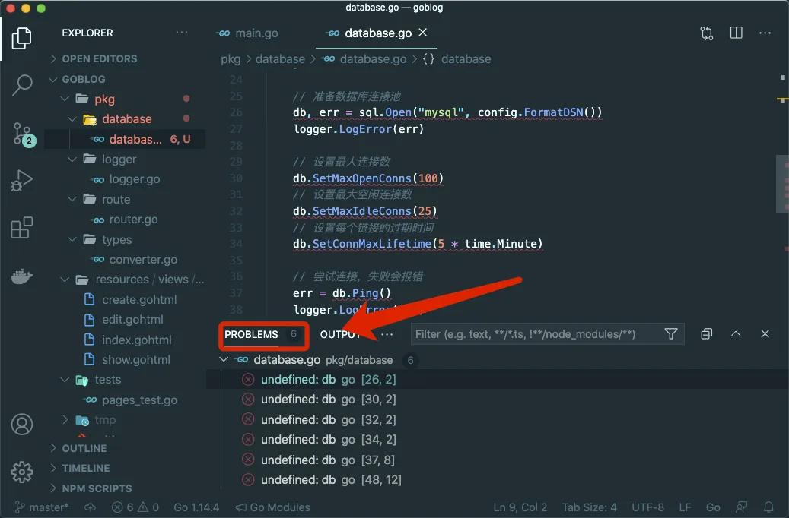
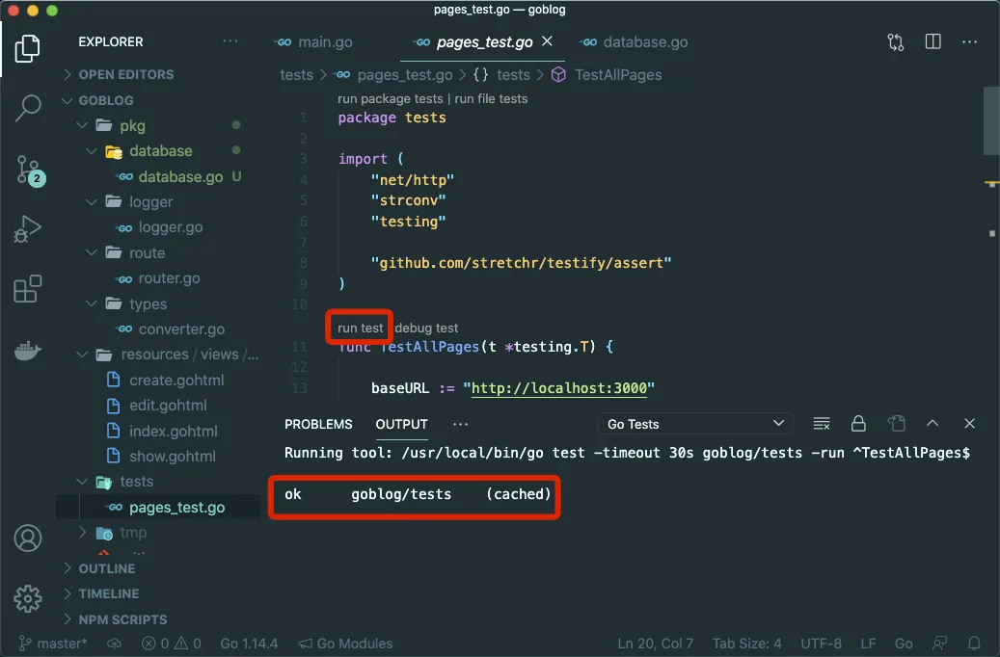

# 7.7. 数据库初始化

原文链接：https://learnku.com/courses/go-basic/1.22/refactoring-database/16512

## 说明

这一节我们来重构数据库初始化相关的代码。

## initDB 和 createTables

接下来我们新建 database 包，并把初始化的两个函数放进去：

pkg/database/database.go

```
// Package database 数据库相关
package database

import (
"database/sql"
"goblog/pkg/logger"
"time"

"github.com/go-sql-driver/mysql"
)

func initDB() {

var err error

// 设置数据库连接信息
config := mysql.Config{
User:                 "homestead",
Passwd:               "secret",
Addr:                 "127.0.0.1:33060",
Net:                  "tcp",
DBName:               "goblog",
AllowNativePasswords: true,
}

// 准备数据库连接池
db, err = sql.Open("mysql", config.FormatDSN())
logger.LogError(err)

// 设置最大连接数
db.SetMaxOpenConns(100)
// 设置最大空闲连接数
db.SetMaxIdleConns(25)
// 设置每个链接的过期时间
db.SetConnMaxLifetime(5 * time.Minute)

// 尝试连接，失败会报错
err = db.Ping()
logger.LogError(err)
}

func createTables() {
createArticlesSQL := `CREATE TABLE IF NOT EXISTS articles(
id bigint(20) PRIMARY KEY AUTO_INCREMENT NOT NULL,
title varchar(255) COLLATE utf8mb4_unicode_ci NOT NULL,
body longtext COLLATE utf8mb4_unicode_ci
); `

_, err := db.Exec(createArticlesSQL)
logger.LogError(err)
}
```

打开 VSCode 的 `PROBLEMS` 错误信息显示框里，可以看到提示 `undefined: db`：



我们在重构 route 包时遇到相同的问题，接下来使用同样的方法来解决。

修改后如下：

pkg/database/database.go

```
// Package database 数据库相关
package database

import (
"database/sql"
"goblog/pkg/logger"
"time"

"github.com/go-sql-driver/mysql"
)

// DB 数据库对象
var DB *sql.DB

// Initialize 初始化数据库
func Initialize() {
initDB()
createTables()
}

func initDB() {

var err error

// 设置数据库连接信息
config := mysql.Config{
User:                 "root",
Passwd:               "secret",
Addr:                 "127.0.0.1:3306",
Net:                  "tcp",
DBName:               "goblog",
AllowNativePasswords: true,
}

// 准备数据库连接池
DB, err = sql.Open("mysql", config.FormatDSN())
logger.LogError(err)

// 设置最大连接数
DB.SetMaxOpenConns(100)
// 设置最大空闲连接数
DB.SetMaxIdleConns(25)
// 设置每个链接的过期时间
DB.SetConnMaxLifetime(5 * time.Minute)

// 尝试连接，失败会报错
err = DB.Ping()
logger.LogError(err)
}

func createTables() {
createArticlesSQL := `CREATE TABLE IF NOT EXISTS articles(
id bigint(20) PRIMARY KEY AUTO_INCREMENT NOT NULL,
title varchar(255) COLLATE utf8mb4_unicode_ci NOT NULL,
body longtext COLLATE utf8mb4_unicode_ci
); `

_, err := DB.Exec(createArticlesSQL)
logger.LogError(err)
}
```

注意 DB 对象和 `Initialize()` 函数我们要对外开放，让 main.go 里可以直接调用，所以必须使用首字母大写的方式。

先在 main.go 里，顶部添加引入：

```
"goblog/pkg/database"
```

接下来删除掉 `initDB()` 和 `createTables()` 两个函数的定义及其调用。

接下来修改 main 函数，新增调用：

main.go

```
.
.
.
func main() {

database.Initialize()
db = database.DB

route.Initialize()
router = route.Router
.
.
.
}
```

main 包里的 db 和 router 只是一个过渡，后面我们将代码挪出 main 包以后，这两个变量将会被删除。

修改以后打开 tests/pages_test.go 文件，运行测试，可以看到测试通过：



## 代码版本

开始下一节之前，我们先来为代码做下版本标记：

```
$ git add .
$ git commit -m "重构  initDB 和 createTables"
```
