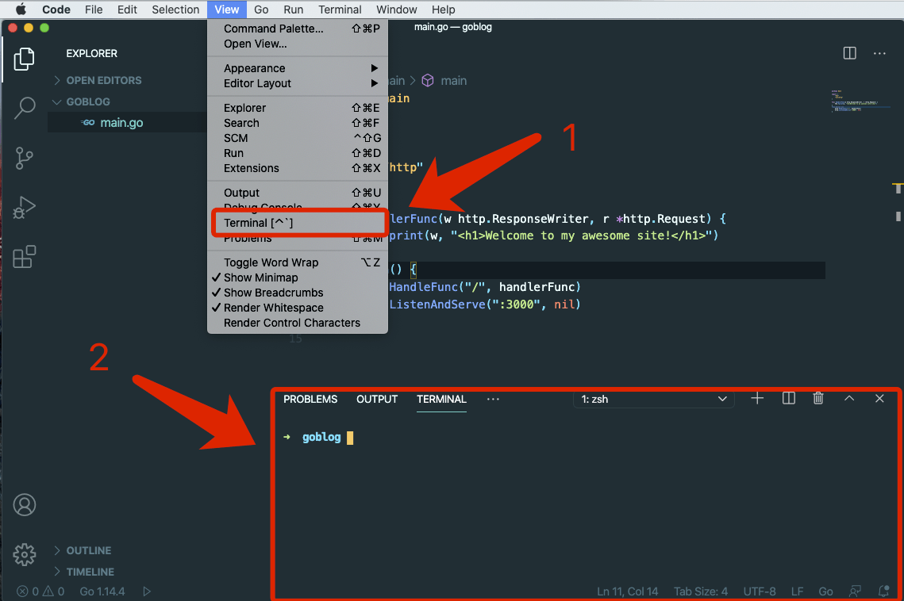
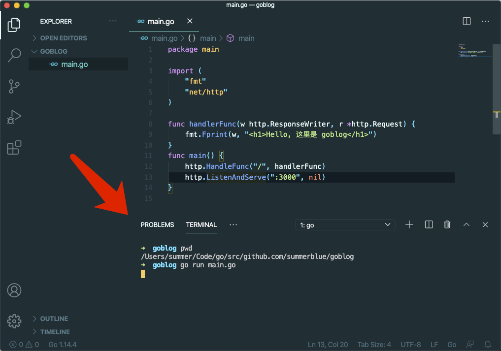
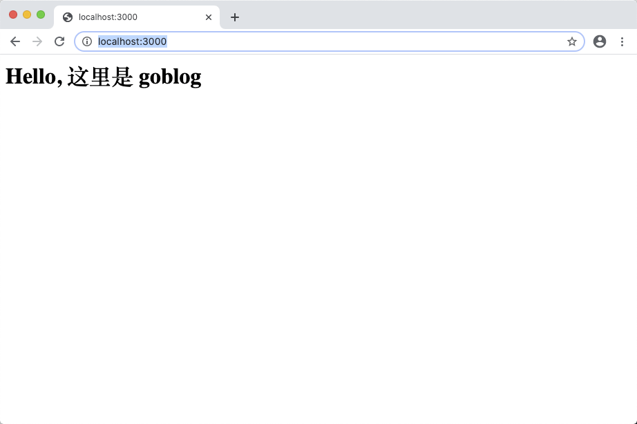

# 3.1. 新建项目

原文链接：https://learnku.com/courses/go-basic/1.22/new-project/16477

## 说明

我们要开始来写代码了。本节的任务是创建项目。

## 创建项目目录

一般我们会把项目放置于 `$GOPATH/src` 目录下。

推荐的做法是将 GitHub 用户名作为命名空间，如我的 GitHub 用户名是 [summerblue](http://github.com/summerblue)，我的 goblog 项目存放目录是：

```
$ cd $GOPATH/src
$ mkdir -p github.com/summerblue/goblog
$ cd github.com/summerblue/goblog
```

这样做除了将项目推送到 GitHub 时项目地址保持一致外，另一个好处是未来随着 Go 项目增多，`src` 目录仍可保持有序。

如果你不想将代码托管到 GitHub 上，或者其他原因，可使用以下：

```
$ cd $GOPATH/src
$ mkdir goblog
$ cd goblog
```

以上两种做法选择一种即可，接下来的课程中我们都将相对于根目录 `goblog` 来讲解 。命令行如果没有特殊说明的话，也是默认在 `goblog` 目录中执行。

## 创建 main.go 文件

命令行 VSCode 编辑器：

```
$ code .
```

右键新建文件：

main.go

```
package main

import (
"fmt"
"net/http"
)

func handlerFunc(w http.ResponseWriter, r *http.Request) {
fmt.Fprint(w, "<h1>Hello, 这里是 goblog</h1>")
}
func main() {
http.HandleFunc("/", handlerFunc)
http.ListenAndServe(":3000", nil)
}
```

>

提示： 先不用细究以上代码，后面我们会详细讲解。

保存后，打开 VSCode 的内置终端，可以尝试背下快捷键，以后会经常使用：



VSCode 的内置终端默认打开的就是项目所在目录，我们可以使用以下命令打印当前目录进行确认：

```
$ pwd
```

接下来在内置终端里运行我们 go 程序：

```
$ go run main.go
```

如下：



运行成功后，此时浏览器打开 [localhost:3000/](http://localhost:3000/) 即可看到：



在 VSCode 的内置终端内，使用快捷键 `Ctrl+C` 可关闭以上 go 程序的运行。

## 代码版本

日常编程中，所有代码都应该使用 Git 版本控制器来管理。接下来一起为项目代码新增版本控制：

```
$ git init .
$ git add .
$ git commit -m "初始化"
```
