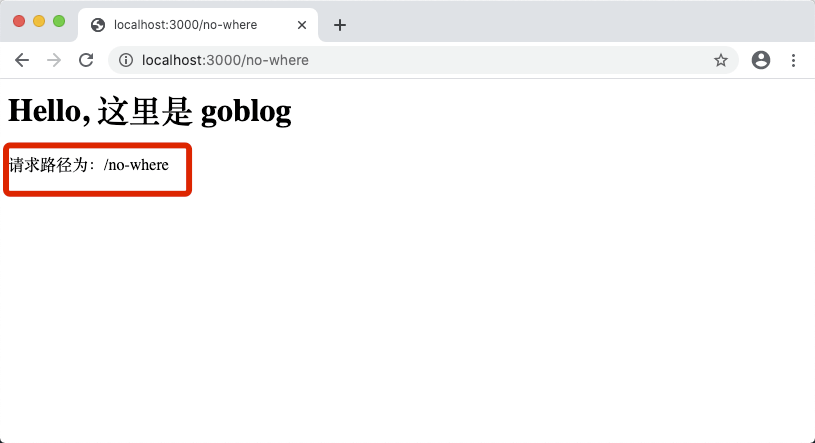
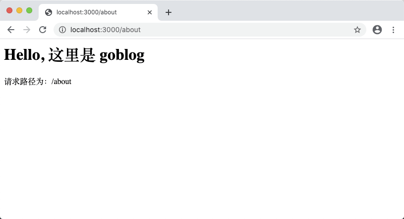
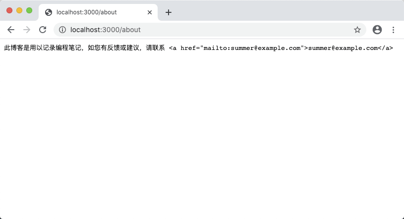
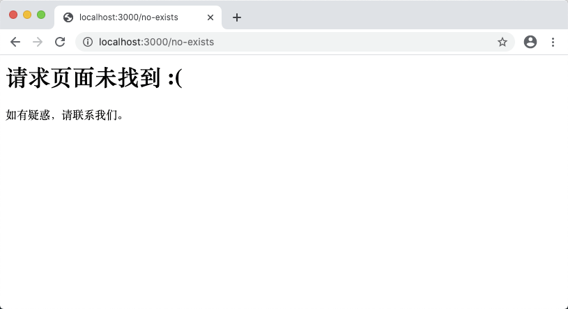

# 3.3. 新增页面

原文链接：https://learnku.com/courses/go-basic/1.22/add-static-page/16479

## 说明

本节我们来开始为 goblog 应用新增页面。

## URL 路径解析

goblog 中 URL 路径解析的代码如下：

```
http.HandleFunc("/", handlerFunc)
```

新人在学习 http 包时，很多时候会误以为这段代码中反斜杠 `/` 是站点的根目录，其实不然。

我们来做个试验：

main.go

```
package main

import (
"fmt"
"net/http"
)

func handlerFunc(w http.ResponseWriter, r *http.Request) {
fmt.Fprint(w, "<h1>Hello, 这里是 goblog</h1>")
fmt.Fprint(w, "请求路径为："+r.URL.Path)
}

func main() {
http.HandleFunc("/", handlerFunc)
http.ListenAndServe(":3000", nil)
}
```

以上代码我们新增了这一行：

```
fmt.Fprint(w, "请求路径为："+r.URL.Path)
```

用以打印当前请求的路径，保存修改后，我们重新启动程序：

```
$ go run main.go
```

>

注意： 如果你之前已运行过以上命令，请 Ctrl + C 退出，然后再重新运行以上命令。

浏览器访问以下三个链接，看看页面显示的结果：

- [localhost:3000/](http://localhost:3000/)

- [localhost:3000/about](http://localhost:3000/about)

- [localhost:3000/no-where](http://localhost:3000/no-where)

例如：



可以看出，`http.HandleFunc` 里传参的 `/` 意味着 任意路径。

我们可以利用此机制来设置多页面访问，修改代码如下：

main.go

```
package main

import (
"fmt"
"net/http"
)

func handlerFunc(w http.ResponseWriter, r *http.Request) {
if r.URL.Path == "/" {
fmt.Fprint(w, "<h1>Hello, 这里是 goblog</h1>")
} else if r.URL.Path == "/about" {
fmt.Fprint(w, "此博客是用以记录编程笔记，如您有反馈或建议，请联系 "+
"<a href=\"mailto:summer@example.com\">summer@example.com</a>")
} else {
fmt.Fprint(w, "<h1>请求页面未找到 :(</h1>"+
"<p>如有疑惑，请联系我们。</p>")
}
}

func main() {
http.HandleFunc("/", handlerFunc)
http.ListenAndServe(":3000", nil)
}
```

新增了 about 页面，浏览器尝试访问 [localhost:3000/about](http://localhost:3000/about) ：



跟我们的预期不一致，那是因为我们需要重启 `go run` 命令。使用 Ctrl + C 中断内置命令行中 `go run` 的运行，然后再：

```
$ go run main.go
```

重启后再次访问 [localhost:3000/about](http://localhost:3000/about) ：



可以看到逻辑已更新。如果我们随意访问一个不存在的页面，如 [localhost:3000/no-exists](http://localhost:3000/no-exists) 还可以看到：



我们现在有两个问题。

第一个问题是修改代码后都需要手动去 Ctrl+C 停止 `go run` 命令，再重新运行。效率低下。

第二个问题是 about 页面的解析并不如我们的预想的那样，客户端并没有将内容按照 HTML 格式来解析。

后面的章节里我们将逐个解决这些问题。

## 版本控制

本节我们新增了 about 页面，开始下节课之前我们先来做版本标记：

```
$ git add .
$ git commit -m "新增关于页面"
```
