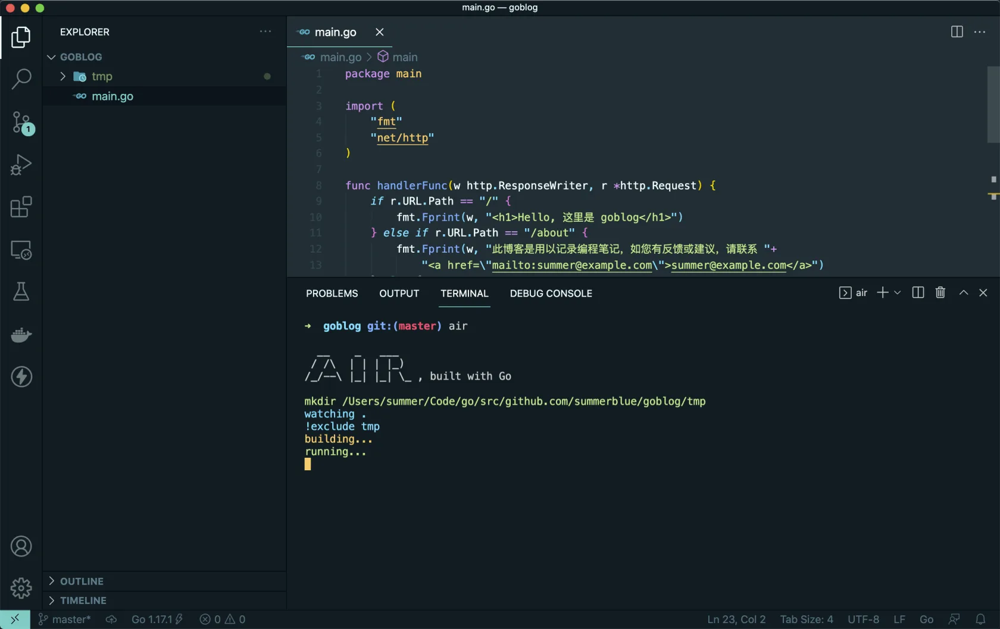
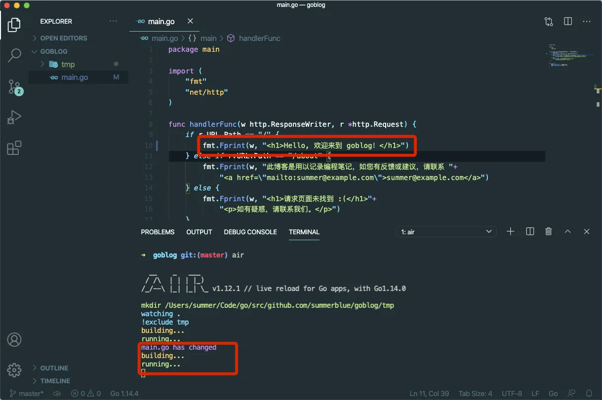
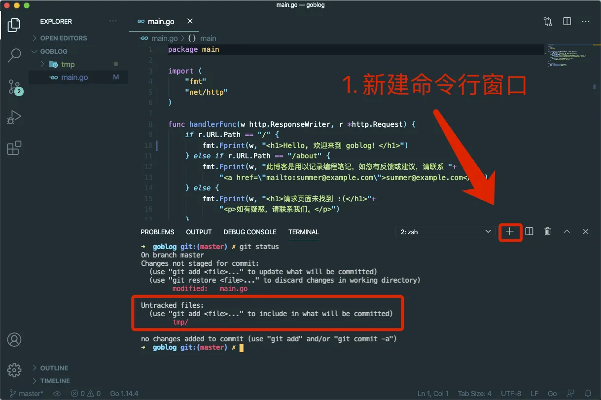
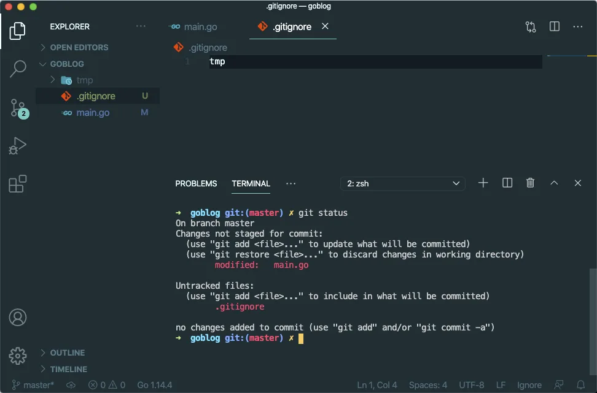

# 3.4. 自动重载

原文链接：https://learnku.com/courses/go-basic/1.22/automatic-overloading/16480

## 说明

Go 语言为编译型语言，编译型语言有诸多好处，如：

- 部署简单

- 提早发现错误

- 执行效率高

然而这也意味着代码修改后需重新编译才能看到变更，这为我们本地开发带来了诸多不便。

本节中我们将一起探讨如何使用第三方工具来提高开发效率。

## 初始化 Go Modules

air 需要项目是 Go Modules 才能工作，我们先：

```
$ go mod init
```

>

注意：Go Modules 我们后面章节中会详细讲解。

## 安装 air

自动重载方案，比较老牌的是 [fresh](https://github.com/gravityblast/fresh) ，不过此项目已经放弃维护。

本课程我们将使用的是 [air](https://github.com/cosmtrek/air)。接下来先安装 air 。

使用以下命令来安装 air ：

```
$ GO111MODULE=on  go install github.com/cosmtrek/air@latest
```

（windows下[github.com/cosmtrek/air/releases](https://github.com/cosmtrek/air/releases)  此处下载后放入Go安装目录下的bin目录，重命名为air.exe）

最前面的 `GO111MODULE=on` 是只为当前命令启用 Go Module，开启以后我们才能使用 [Go Proxy 进行加速](https://learnku.com/go/wikis/38122)。后续我们会深入讲解 Go Module ，这里你只需要记住这个用法即可。

>

注意： 以上操作如果遇到错误，请先确保你的 Go 版本是 1.22。使用此命令查看 `go version`。

安装成功后使用以下命令检查下：

```
$ air -v

__    _   ___
/ /\  | | | |_)
/_/--\ |_| |_| \_ , built with Go

```

## 使用 air

在我们的 goblog 项目根目录运行以下命令：

```
$ air
```

在 VSCode 内置命令行中执行结果如下：



此时浏览器访问 [localhost:3000/](http://localhost:3000/) ：


## 测试自动加载

修改 main.go 文件如下：

main.go

```
package main

import (
"fmt"
"net/http"
)

func handlerFunc(w http.ResponseWriter, r *http.Request) {
if r.URL.Path == "/" {
fmt.Fprint(w, "<h1>Hello, 欢迎来到 goblog！</h1>")
} else if r.URL.Path == "/about" {
fmt.Fprint(w, "此博客是用以记录编程笔记，如您有反馈或建议，请联系 "+
"<a href=\"mailto:summer@example.com\">summer@example.com</a>")
} else {
fmt.Fprint(w, "<h1>请求页面未找到 :(</h1>"+
"<p>如有疑惑，请联系我们。</p>")
}
}

func main() {
http.HandleFunc("/", handlerFunc)
http.ListenAndServe("localhost:3000", nil)
}
```

保存后可以看到命令行有相关的更信息：



浏览器访问 [localhost:3000/](http://localhost:3000/) ：


即可看到我们修改后的欢迎语。至此我们成功集成了 air 自动重置功能。

后续的课程中，请确保 air 命令行时刻处于运行状态。air 还有很多参数可供设置，我们会在后续课程中使用到时再做讲解。

## 新的命令行窗口

为了保持 air 窗口持续运行着，我们点击 `+` 按钮新建命令行窗口，并使用命令:

```
$ git status
```

来查看文件修改状态：



从上图可以看到我们的根目录下多了一个 `tmp` 文件夹，这是 air 命令的编译文件存放地。我们需要设置版本控制器将其排除在外：

.gitignore

```
tmp
```

再次执行 `git status` 即可看到 tmp 目录已被排除在外：



接下来我们可以放心地将代码纳入版本控制器中：

```
$ git add .
$ git commit -m "自动重载"
```
