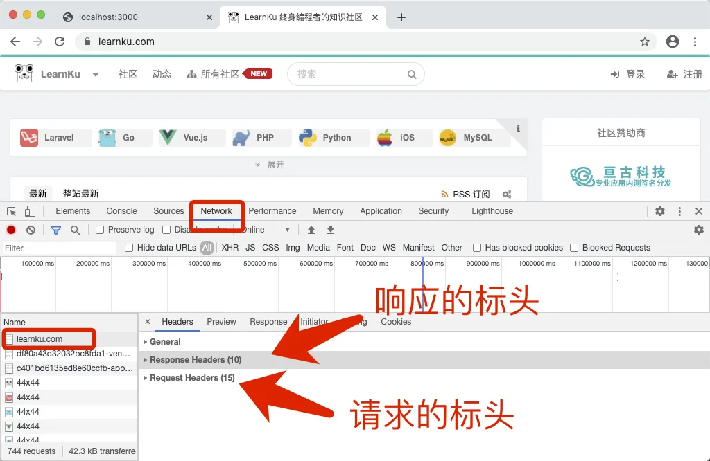
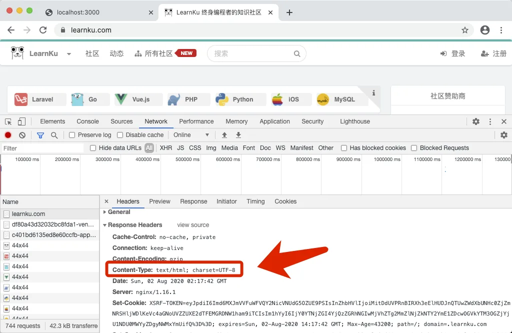
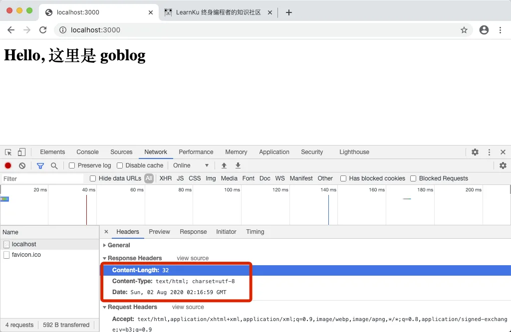
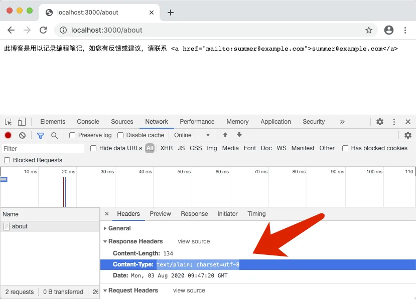
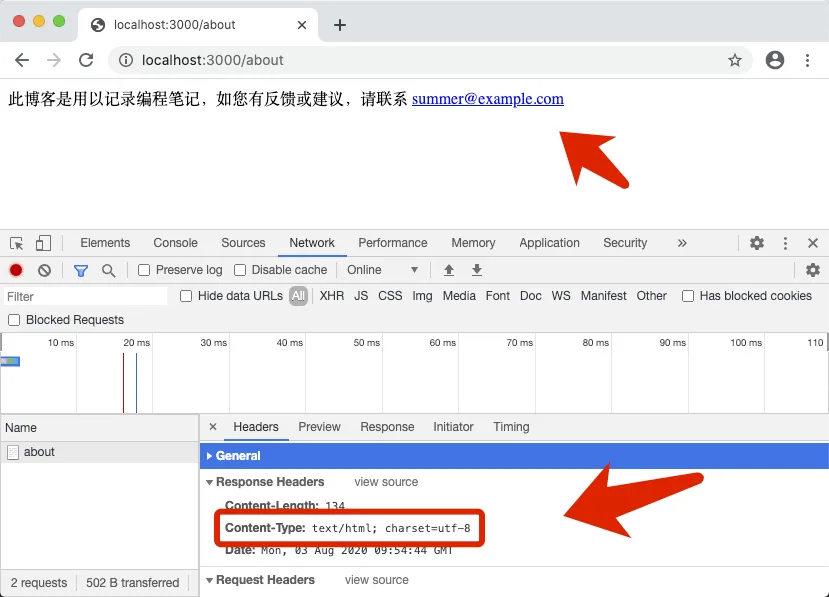
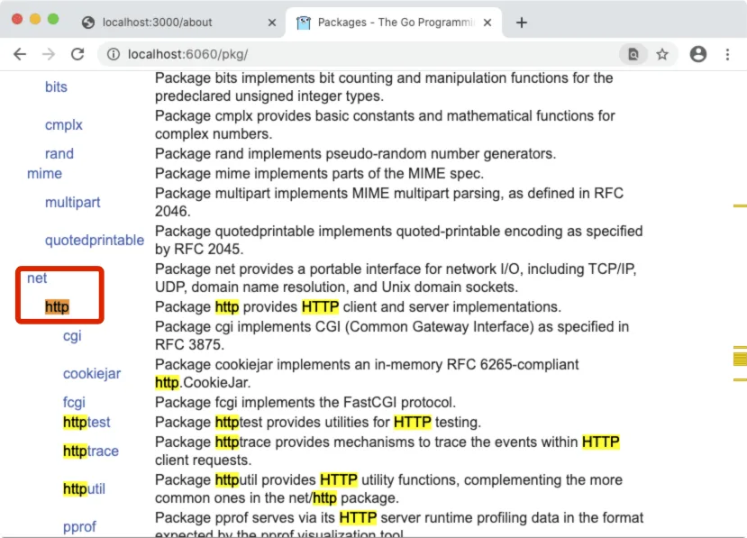
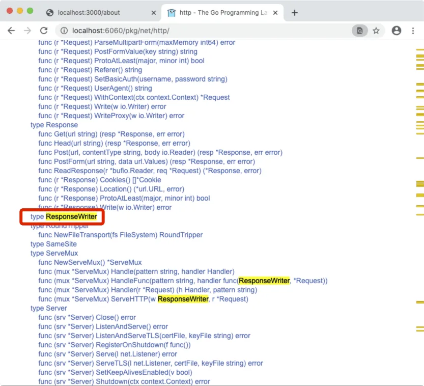
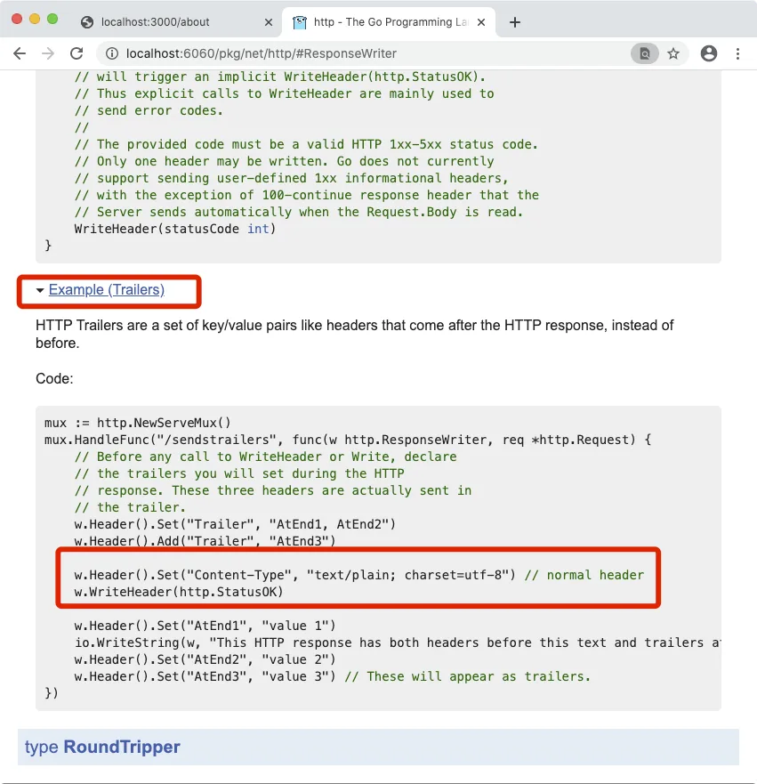

# 3.5. 设置标头

原文链接：https://learnku.com/courses/go-basic/1.22/set-the-header-which-can-be-put-later-and-explained-in-the-cookie-page/16481

## 说明

本节我们将为返回内容设置正确的标头，以解决 about 页面 HTML 无法正确解析的问题。

同时，我们将一起学习如何在本地查阅 Go 文档。

## 查看标头信息

什么是 HTTP 标头？

HTTP 请求是无状态的，HTTP 标头是客户端与服务端通讯的重要方式。

## 设置标头

如何查看标头呢？

访问 [learnku.com/](https://learnku.com/) ，网页上右键菜单选择『审查元素』，选中『网络』栏目，为方便区分我们点击前面的小三角形进行折叠：



查看响应标头：



浏览器 [localhost:3000](http://localhost:3000) ，右键查看网络请求：



可以看到的我们的 Web 服务器只返回了几个标头，且 `Content-Type:`  的内容为 `text/html; charset=utf-8`。

查看解析有问题的 [localhost:3000/about](http://localhost:3000/about) 页面：



可以看到服务端返回的  `Content-Type:` 的值为 `text/plain; charset=utf-8` ，很明显标头错误了。

## Content-Type 标头

`Content-Type:` 响应标头是告知客户端内容的类型，客户端再根据这个信息将内容正确地呈现给用户。

常见的内容类型有：

- `text/html` —— HTML 文档

- `text/plain` —— 文本内容

- `text/css`—— CSS 样式文件

- `text/javascript` —— JS 脚本文件

- `application/json`—— JSON 格式的数据

- `application/xml` —— XML 格式的数据

- `image/png` —— PNG 图片

接下来我们将尝试服务端返回正确的 `Content-Type:` 标头。

## 返回正确的  `Content-Type:`

main.go

```go
package main

import (
	"fmt"
	"net/http"
)

func handlerFunc(w http.ResponseWriter, r *http.Request) {
	w.Header().Set("Content-Type", "text/html; charset=utf-8")
	if r.URL.Path == "/" {
		fmt.Fprint(w, "<h1>Hello, 欢迎来到 goblog！</h1>")
	} else if r.URL.Path == "/about" {
		fmt.Fprint(w, "此博客是用以记录编程笔记，如您有反馈或建议，请联系 "+
			"<a href=\"mailto:summer@example.com\">summer@example.com</a>")
	} else {
		fmt.Fprint(w, "<h1>请求页面未找到 :(</h1>"+
			"<p>如有疑惑，请联系我们。</p>")
	}
}

func main() {
	http.HandleFunc("/", handlerFunc)
	http.ListenAndServe(":3000", nil)
}
```

浏览器访问 [localhost:3000/about](http://localhost:3000/about)



可以看到标头成功设置，内容也被正确解析为 HTML 了。

## 如何知道 http 包有哪些接口呢？

上面的代码中，我们使用这一行来设置标头：

```
w.Header().Set("Content-Type", "text/html; charset=utf-8")
```

那么我们怎么知道 `w` 对象所代表的 `http.ResponseWriter` 有哪些接口的呢？

答：看 Go 文档。

## 本地查看 Go 文档

在我们的 goblog 项目目录下，命令行运行：

```bash
$ godoc -http=:6060
```

[localhost:6060/pkg/](http://localhost:6060/pkg/) 进入标准库文档，定位到 `net/http`:



在索引里定位 `type ResponseWriter` 的定义（ [快速链接](http://localhost:6060/pkg/net/http/#ResponseWriter) ）：



滚动下来，点击 `Example` 取消折叠，即可看到示例代码：



>

提示： Go 是开源软件，标准库的文档非常齐全。早期学习 Go 时，要培养自己查阅 API 文档的习惯。可能一开始你会找不到方向，或者因为信息量太大而产生焦虑，看不下去，没关系，我们每个人都会这样。谨记，作为一个优秀的 Go 程序员，阅读文档是必备的修行。

## 版本控制

本节我们修复了 about 页面未能正确解析 HTML 的 Bug，开始下一节之前，我们先标记下代码版本：

```bash
$ git add .
$ git commit -m "设置标头"
```
