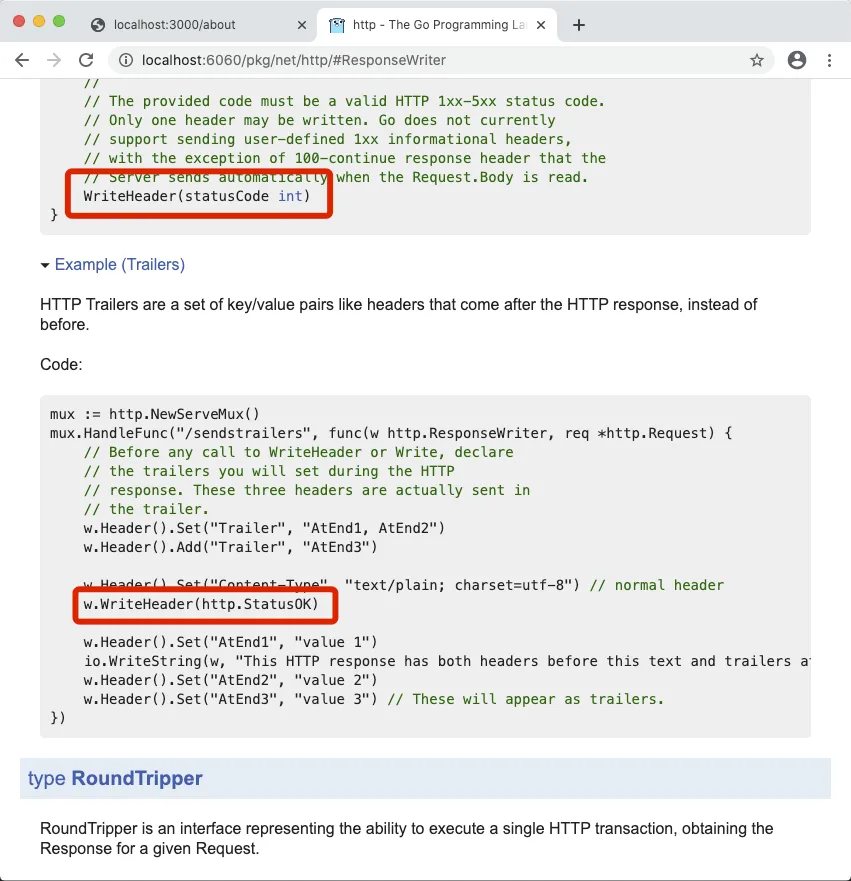
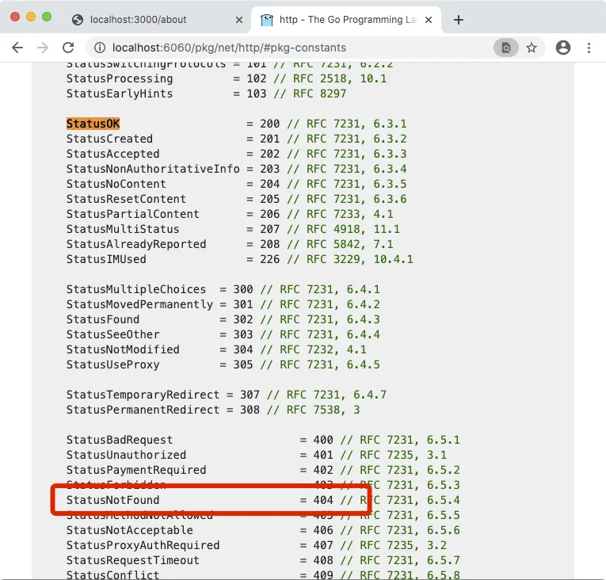
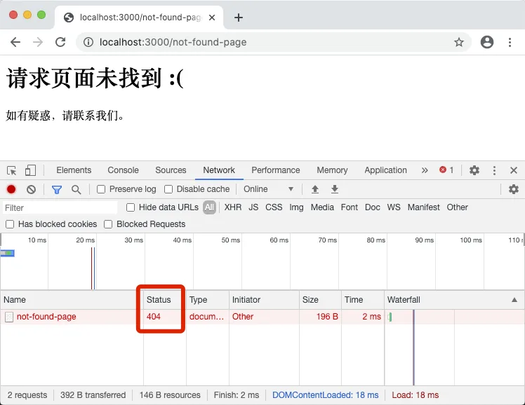

# 3.6. 404 状态码

原文链接：https://learnku.com/courses/go-basic/1.22/404-status-code/16482

## 说明

本节我们将为 goblog 添加正确 404 响应状态码。

## Web 数据响应

Web 的响应与请求结构是类似的，响应分为三个部分：响应行、响应头部、响应体。

1. 响应行：协议、响应状态码和状态描述，如： HTTP/1.1 200 OK

2. 响应标头：包含各种头部字段信息，如cookie，Content-Type等头部信息。

3. 响应体：携带客户端想要的数据，格式与编码由头部的Content-Type决定。

响应状态码的有固定取值和意义：

- 100~199：表示服务端成功接收客户端请求，要求客户端继续提交下一次请求才能完成整个处理过程。

- 200~299：表示服务端成功接收请求并已完成整个处理过程。最常用就是：200

- 300~399：为完成请求，客户端需进一步细化请求。比较常用的如：客户端请求的资源已经移动一个新地址使用302表示将资源重定向,客户端请求的资源未发生改变，使用304，告诉客户端从本地缓存中获取。

- 400~499：客户端的请求有错误，如：404表示你请求的资源在web服务器中找不到，403表示服务器拒绝客户端的访问，一般是权限不够。

- 500~599：服务器端出现错误，最常用的是：500

## 404 标头

在 http 包中我们是通过与 `http.ResponseWriter` 交互来改变响应内容的，要添加的 HTTP 状态码的话，我们先访问 `ResponseWriter` 的文档  [localhost:6060/pkg/net/http/#Respon...](http://localhost:6060/pkg/net/http/#ResponseWriter) ：

>

提示： 本地文档访问请运行命令 `godoc -http=:6060` 。



可以看到提供了 `WriteHeader()` 方法以及代码示例：

```
w.WriteHeader(http.StatusOK)
```

页面按快捷键 `Ctrl+F` 搜索关键词 `StatusOK`，即可定位到设置状态码的常量：



选中我们的 404 状态码，在代码中添加：

main.go

```go
package main

import (
	"fmt"
	"net/http"
)

func handlerFunc(w http.ResponseWriter, r *http.Request) {
	w.Header().Set("Content-Type", "text/html; charset=utf-8")
	if r.URL.Path == "/" {
		fmt.Fprint(w, "<h1>Hello, 欢迎来到 goblog！</h1>")
	} else if r.URL.Path == "/about" {
		fmt.Fprint(w, "此博客是用以记录编程笔记，如您有反馈或建议，请联系 "+
			"<a href=\"mailto:summer@example.com\">summer@example.com</a>")
	} else {
		w.WriteHeader(http.StatusNotFound)
		fmt.Fprint(w, "<h1>请求页面未找到 :(</h1>"+
			"<p>如有疑惑，请联系我们。</p>")
	}
}

func main() {
	http.HandleFunc("/", handlerFunc)
	http.ListenAndServe(":3000", nil)
}
```

顺便访问一个不存在的页面：



## 版本控制

接下来把代码纳入版本控制器中：

```bash
$ git add .
$ git commit -m "404 状态码"
```
