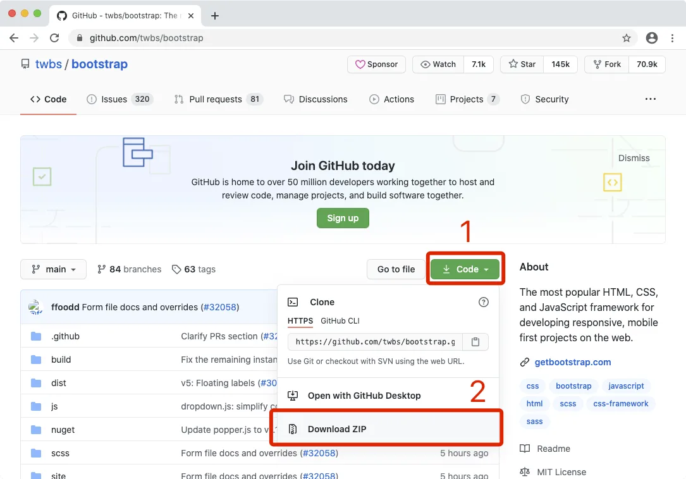
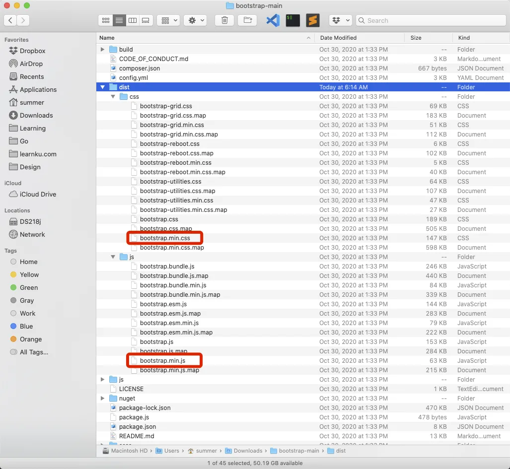
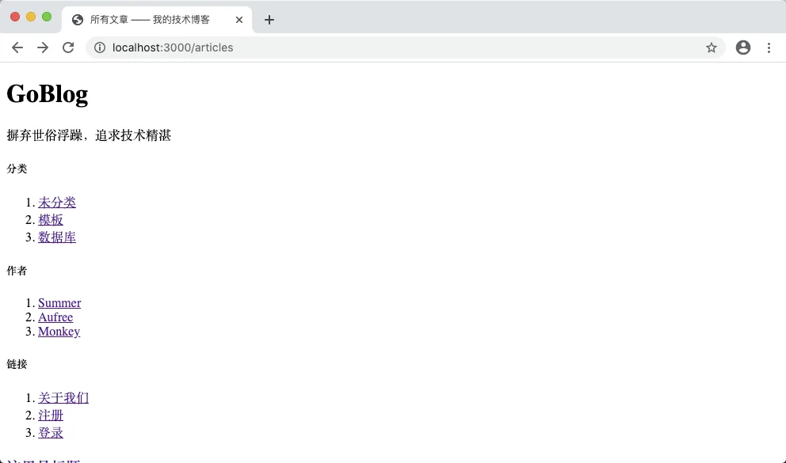
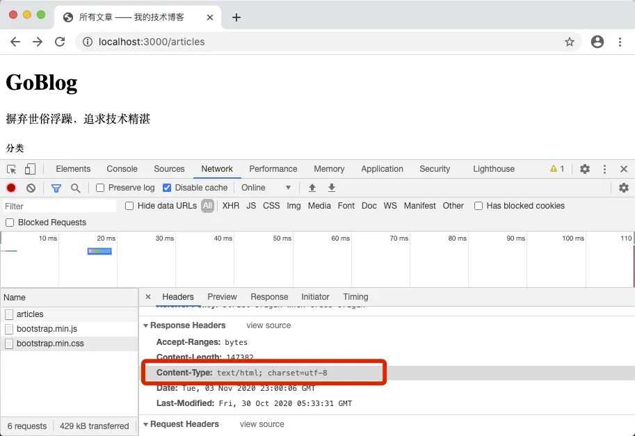
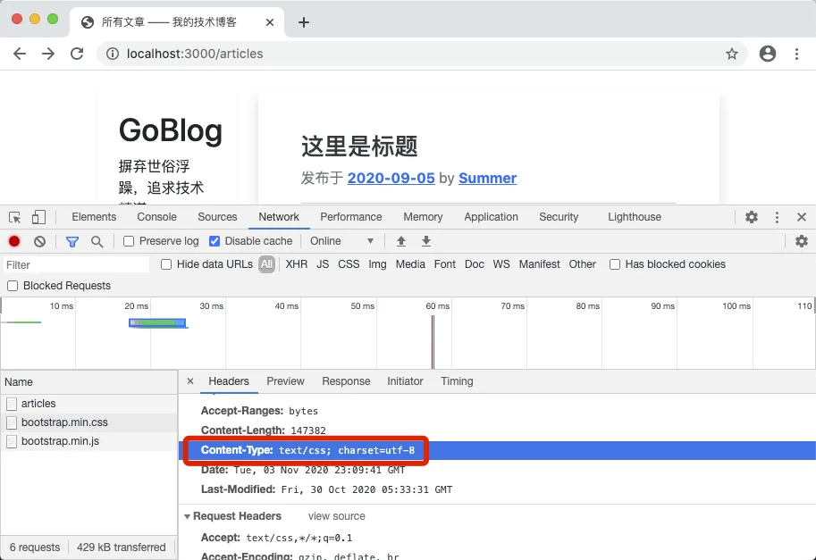
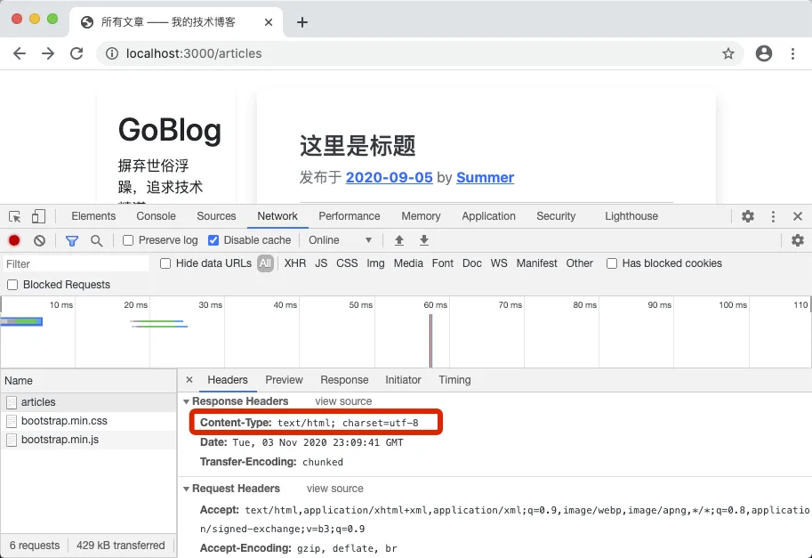
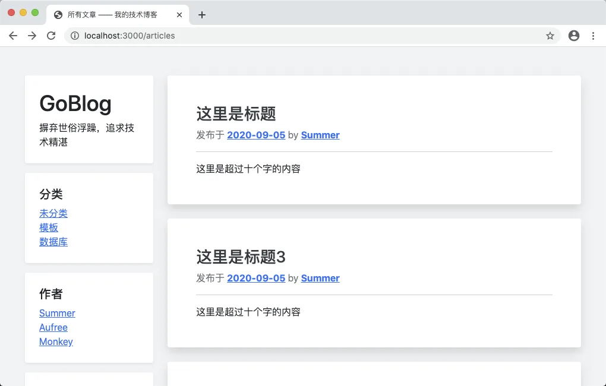

# 9.1. 集成 Bootstrap

原文链接：https://learnku.com/courses/go-basic/1.22/integrated-bootstrap/16524

## 说明

本节课我们将集成 Bootstrap 前端 UI 框架，来让页面更加美观。

## 下载 Bootstrap

前往 [github.com/twbs/bootstrap](https://github.com/twbs/bootstrap)  下载源码，如下图：



下载完成后解压，前往解压后的目录下，进入 dist 目录（distribution 的缩写），定位到下图两个文件：



项目根下创建 public 目录，将他们分别移动到以下位置：

```
public
├── css
│   └── bootstrap.min.css
└── js
└── bootstrap.min.js
```

## 访问静态文件

网页加载样式文件的前提是这些文件能被访问到：

- [localhost:3000/css/bootstrap.min.cs...](http://localhost:3000/css/bootstrap.min.css)

- [localhost:3000/js/bootstrap.min.js](http://localhost:3000/js/bootstrap.min.js)

目前这两个文件皆为 404 的响应，那是因为我们还未注册路由。

下面我们先注册路由：

routes/web.go

```go
.
.
.
// RegisterWebRoutes 注册网页相关路由
func RegisterWebRoutes(r *mux.Router) {

    .
    .
    .

    // 静态资源
    r.PathPrefix("/css/").Handler(http.FileServer(http.Dir("./public")))
    r.PathPrefix("/js/").Handler(http.FileServer(http.Dir("./public")))

    // 中间件：强制内容类型为 HTML
    r.Use(middlewares.ForceHTML)
}
```

`PathPrefix()` 匹配参数里 `/css/` 前缀的 URI ， 链式调用 `Handler()` 指定处理器为 `http.FileServer()`。

`http.FileServer()` 是文件目录处理器，参数 `http.Dir("./public")` 是指定在此目录下寻找文件。

此时访问以下两个文件应能正常访问：

- [localhost:3000/css/bootstrap.min.cs...](http://localhost:3000/css/bootstrap.min.css)

- [localhost:3000/js/bootstrap.min.js](http://localhost:3000/js/bootstrap.min.js)

## 集成到模板中

先从文章列表页入手，我们在顶部和底部加载 Bootstrap 文件，且为其组织简单的结构：

resources/views/articles/index.gohtml

```
<!DOCTYPE html>
<html lang="en">

<head>
<title>所有文章 —— 我的技术博客</title>
<link href="/css/bootstrap.min.css" rel="stylesheet">
</head>

<body>

<div class="container-sm">
<div class="row mt-5">

<div class="col-md-3 blog-sidebar">
<div class="p-4 mb-3 bg-white rounded shadow-sm">
<h1>GoBlog</h1>
<p class="mb-0">摒弃世俗浮躁，追求技术精湛</p>
</div>

<div class="p-4 bg-white rounded shadow-sm mb-3">
<h5>分类</h5>
<ol class="list-unstyled mb-0">
<li><a href="#">未分类</a></li>
<li><a href="#">模板</a></li>
<li><a href="#">数据库</a></li>
</ol>
</div>

<div class="p-4 bg-white rounded shadow-sm mb-3">
<h5>作者</h5>
<ol class="list-unstyled mb-0">
<li><a href="#">Summer</a></li>
<li><a href="#">Aufree</a></li>
<li><a href="#">Monkey</a></li>
</ol>
</div>

<div class="p-4 bg-white rounded shadow-sm mb-3">
<h5>链接</h5>
<ol class="list-unstyled">
<li><a href="#">关于我们</a></li>
<li><a href="#">注册</a></li>
<li><a href="#">登录</a></li>
</ol>
</div>
</div><!-- /.blog-sidebar -->

<div class="col-md-9 blog-main">

{{ range $key, $article := . }}

<div class="blog-post bg-white p-5 rounded shadow mb-4">
<h3 class="blog-post-title"><a href="{{ $article.Link }}" class="text-dark text-decoration-none">{{ $article.Title }}</a></h3>
<p class="blog-post-meta text-secondary">发布于 <a href="" class="font-weight-bold">2020-09-05</a> by <a href="#" class="font-weight-bold">Summer</a></p>

<hr>
{{ $article.Body }}

</div><!-- /.blog-post -->

{{ end }}

<nav class="blog-pagination mb-5">
<a class="btn btn-outline-primary" href="#">下一页</a>
<a class="btn btn-outline-secondary disabled" href="#" tabindex="-1" aria-disabled="true">上一页</a>
</nav>

</div><!-- /.blog-main -->

</div>
</div>

<script src="/js/bootstrap.min.js"></script>

</body>

</html>
```

保存成功后，浏览器访问  [localhost:3000/articles](http://localhost:3000/articles) ：



查看下页面源码，访问 js 和 css 文件发现一切正常。

审查页面元素，查看响应标头：



发现服务端返回的内容类型标头是：

```
Content-Type: text/html; charset=utf-8
```

问题出在我们强制将所有 HTTP 响应类型设置为 HTML。我们知道，服务端响应的 `Content-Type` 是用来告知浏览器如何处理响应内容的，我们需要为其设置正确的响应标头。

先来看看那段强制内容类型标头为 HTML 的代码，并将其注释掉：

routes/web.go

```go
.
.
.
// RegisterWebRoutes 注册网页相关路由
func RegisterWebRoutes(r *mux.Router) {

    .
    .
    .

    // 中间件：强制内容类型为 HTML
    // r.Use(middlewares.ForceHTML)
}
```

先来一起回忆下，之前我们设置 ForceHTML 中间件的目的是为了让 HTML 页面得以正常渲染。

再次刷新 [localhost:3000/articles](http://localhost:3000/articles) ：



样式标头正常，页面也能正常渲染。点击查看 articles 页面返回的标头：



也正常。也就是说，我们将 ForceHTML 去除后，仍然能正常解析 HTML。

看下我们渲染模板的代码：

app/http/controllers/articles_controller.go

```go
.
.
.
// Index 文章列表页
func (*ArticlesController) Index(w http.ResponseWriter, r *http.Request) {

    // 1. 获取结果集
    articles, err := article.GetAll()

    if err != nil {
        // 数据库错误
        logger.LogError(err)
        w.WriteHeader(http.StatusInternalServerError)
        fmt.Fprint(w, "500 服务器内部错误")
    } else {
        // 2. 加载模板
        tmpl, err := template.ParseFiles("resources/views/articles/index.gohtml")
        logger.LogError(err)

        // 3. 渲染模板，将所有文章的数据传输进去
        err = tmpl.Execute(w, articles)
        logger.LogError(err)
    }
}
.
.
.
```

渲染模板的调用 `tmpl.Execute(w, articles)`，`Execute()` 在执行时会设置正确的 HTML 标头。

而解析静态文件所用到的 `http.FileServer()` 内部也会根据文件后缀设置正确的标头。

所以标头这块不需要我们干预。

## 自定义样式文件

目前页面有点偏白，我们加个背景颜色：

public/css/app.css

```
body {
background-color: #F0F2F5;
}
```

加载我们上面的自定义样式表：

resources/views/articles/index.gohtml

```
.
.
.

<head>
<title>所有文章 —— 我的技术博客</title>
<link href="/css/bootstrap.min.css" rel="stylesheet">
<link href="/css/app.css" rel="stylesheet">
</head>
.
.
.
```

刷新页面：



好看一点了。

目前页面上有一些未开发的功能，如分类、作者、创建时间等，我们将在后面的课程中处理。Web 开发就是这样，先把想要的元素写上去，然后再为其开发功能。

## 代码版本

开始下一节之前，我们先来为代码做下版本标记：

```bash
$ git add .
$ git commit -m "美化文章列表页"
```
