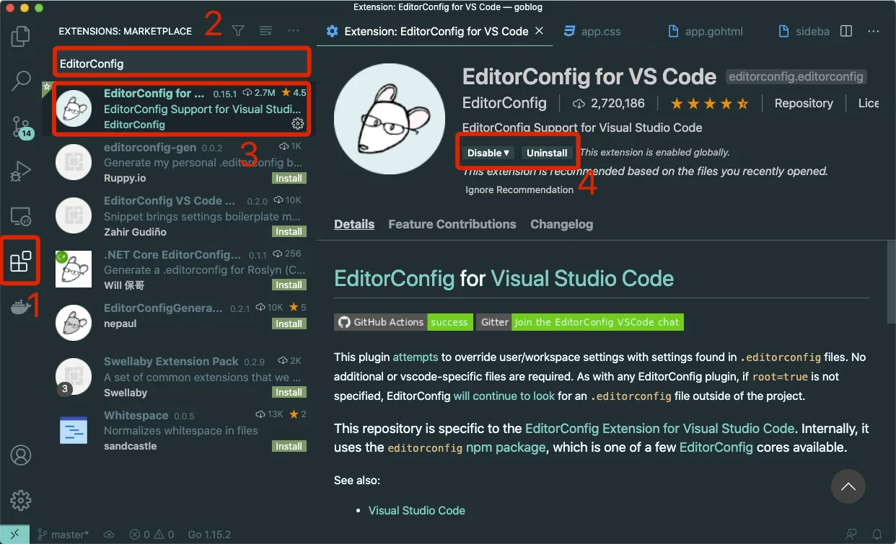

# 9.2. 编码格式 EditorConfig

原文链接：https://learnku.com/courses/go-basic/1.22/encoding-format-editorconfig/16525

## 说明

这一节我们来聊一下，如何统一编码格式。

项目中 `.go` 后缀名的 Go 代码有我们之前安装的 [vscode-go](https://github.com/golang/vscode-go) 插件在强制编码格式，我们无需担心。

现在我们需要考虑的是，`.gohtml` 缩进使用的是 VSCode 默认的 4 个空格长度的 Tab，因为 HTML 层级较多，我们一般推荐使用 2 个空格长度的缩进，以方便在同一个视窗中看到更多的代码。

## EditorConfig

你可能说，VSCode 编辑器设定一下就可以了。但是你同事或者其他的项目参与人员，可能不知道怎么设置，你还得通知到他们统一起来，如果是开源项目，这基本上是不可实现的。

通用的做法是利用 Editor Config 工具，大部分的编辑器都支持此插件，有些编辑器还内置了这个插件。

在 VSCode 的插件管理页面，搜索 `EditorConfig`，然后点击安装：



接下来根目录下创建 .editorconfig 文件：

.editorconfig

```
; https://editorconfig.org/

root = true

[*.gohtml]
; 设定文件编码
charset = utf-8
; 移除文件尾部多余的空格
trim_trailing_whitespace = true
; 使用空格来做缩进
indent_style = space
; 缩进长度为两个空格
indent_size = 2
```

这样 EditorConfig 插件就会根据我们的配置来规范代码格式。

## 代码版本

开始下一节之前，我们先来为代码做下版本标记：

```bash
$ git add .
$ git commit -m "新增 EditorConfig"
```
