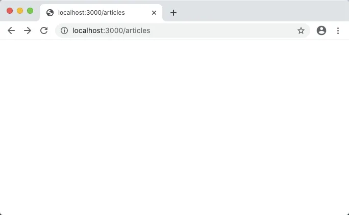
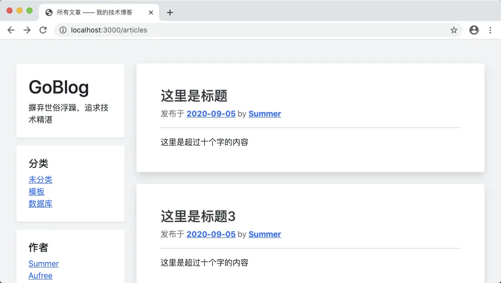

# 9.3. 切割模板

原文链接：https://learnku.com/courses/go-basic/1.22/use-sub-template/16526

## 说明

按照一般的逻辑，美化完文章列表页后，接下来就是文章内容页和创建页面。

但是我们停下来想一想，以我们现在的结构，如果我们要美化文章内容页，需要将 resources/views/articles/index.gohtml 文件所有内容复制一遍，然后再修改核心内容部分，这样会造成很多重复的代码，不方便维护。

事实上，我们可以共享头部、尾部和左边导航栏。接下来一起来拆分模板。

## 模板结构

文章的列表页、详情页、创建页和修改页，皆使用同一套布局，我们将统一放置于 resources/views/layouts 目录下，另外为了方便维护，我们将左边栏也划分出来。

resources/views/layouts/app.gohtml

```
{{define "app"}}
<!DOCTYPE html>
<html lang="en">

<head>
<title>{{template "title" .}}</title>
<link href="/css/bootstrap.min.css" rel="stylesheet">
<link href="/css/app.css" rel="stylesheet">
</head>

<body>

<div class="container-sm">
<div class="row mt-5">

{{template "sidebar" .}}

{{template "main" .}}

</div>
</div>

<script src="/js/bootstrap.min.js"></script>

</body>

</html>
{{end}}
```

Go 标准库的模板分层使用很简单，只要是两个关键词 `define` 和 `template` 。

`{{define ... }}` 是定义模板，而 `{{template ...}}` 是使用模板。

`{{define ... }}` 跟着的参数是模板的名称，而 `{{template ...}}` 有两个参数，第一个是模板，第二个是传给模板使用的数据。

main 模板和 title 模板在布局文件 `app.gohtml` 中，我们可以把他们理解为内容的占位符。所有继承此布局文件的模板，都会定义各自的 main 和 title 模板。本文随后会有例子。

接下来创建 `sidebar` 模板：

resources/views/layouts/sidebar.gohtml

```
{{define "sidebar"}}
<div class="col-md-3 blog-sidebar">
<div class="p-4 mb-3 bg-white rounded shadow-sm">
<h1><a href="/" class="link-dark text-decoration-none">GoBlog</a></h1>
<p class="mb-0">摒弃世俗浮躁，追求技术精湛</p>
</div>

<div class="p-4 bg-white rounded shadow-sm mb-3">
<h5>分类</h5>
<ol class="list-unstyled mb-0">
<li><a href="#">未分类</a></li>
<li><a href="#">模板</a></li>
<li><a href="#">数据库</a></li>
</ol>
</div>

<div class="p-4 bg-white rounded shadow-sm mb-3">
<h5>作者</h5>
<ol class="list-unstyled mb-0">
<li><a href="#">Summer</a></li>
<li><a href="#">Aufree</a></li>
<li><a href="#">Monkey</a></li>
</ol>
</div>

<div class="p-4 bg-white rounded shadow-sm mb-3">
<h5>链接</h5>
<ol class="list-unstyled">
<li><a href="#">关于我们</a></li>
<li><a href="#">注册</a></li>
<li><a href="#">登录</a></li>
</ol>
</div>
</div>
{{end}}
```

上面的 sidebar 模板目前来讲，只供我们在布局文件中使用。

接下来是文章列表页：

resources/views/articles/index.gohtml

```
{{define "title"}}
所有文章 —— 我的技术博客
{{end}}

{{define "main"}}
<div class="col-md-9 blog-main">

{{ range $key, $article := . }}

<div class="blog-post bg-white p-5 rounded shadow mb-4">
<h3 class="blog-post-title"><a href="{{ $article.Link }}" class="text-dark text-decoration-none">{{ $article.Title }}</a></h3>
<p class="blog-post-meta text-secondary">发布于 <a href="" class="font-weight-bold">2020-09-05</a> by <a href="#" class="font-weight-bold">Summer</a></p>

<hr>
{{ $article.Body }}

</div><!-- /.blog-post -->

{{ end }}

<nav class="blog-pagination mb-5">
<a class="btn btn-outline-primary" href="#">下一页</a>
<a class="btn btn-outline-secondary disabled" href="#" tabindex="-1" aria-disabled="true">上一页</a>
</nav>

</div><!-- /.blog-main -->
{{end}}
```

不难发现，有了共享模板，`index.gohtml` 的内容精简很多，精简意味着方便修改和维护。

## 渲染模板

有了模板分层，接下来我们需要告诉模板引擎如何渲染。

下面是我们之前的渲染，只适合渲染一个文件：

```
// 2. 加载模板
tmpl, err := template.ParseFiles("resources/views/articles/index.gohtml")
logger.LogError(err)

// 3. 渲染模板，将所有文章的数据传输进去
err = tmpl.Execute(w, articles)
logger.LogError(err)
```

现在我们的将模板划分了三个文件，需要都加载这些文件：

app/http/controllers/articles_controller.go

```
.
.
.
// Index 文章列表页
func (*ArticlesController) Index(w http.ResponseWriter, r *http.Request) {
.
.
.
} else {
// ---  2. 加载模板 ---

// 2.0 设置模板相对路径
viewDir := "resources/views"

// 2.1 所有布局模板文件 Slice
files, err := filepath.Glob(viewDir + "/layouts/*.gohtml")
logger.LogError(err)

// 2.2 在 Slice 里新增我们的目标文件
newFiles := append(files, viewDir+"/articles/index.gohtml")

// 2.3 解析模板文件
tmpl, err := template.ParseFiles(newFiles...)
logger.LogError(err)

// 2.4 渲染模板，将所有文章的数据传输进去
err = tmpl.ExecuteTemplate(w, "myapp", articles)
logger.LogError(err)
}
}
```

以上就是加载所有相关模板文件，再解析，然后渲染。`filepath.Glob()` 这是我们第一次使用 filepath 包，此包是 Go 提供的统一不同系统的路径处理包。`Glob()` 方法会生成与传参匹配的文件名称 Slice。

`template.ParseFiles(newFiles...)` 的 `ParseFiles()` 是可变参数方法，三个点是 Go 提供的语法糖。

Slice 后加三个点，可以自动将 Slice 分解，并作为可变函数的参数。以下代码示例方便大家理解：

```
params := []string{"g.txt", "h.txt", "i.txt"}
tmpl, err := template.ParseFiles(params...)
// 上面代码等同下面
tmpl, err := template.ParseFiles("g.txt", "h.txt", "i.txt")
```

回到我们的逻辑代码。渲染模板那块，也使用了新的 `ExecuteTemplate()` 方法，此方法声明如下：

```
func (t *Template) ExecuteTemplate(wr io.Writer, name string, data interface{}) error {
```

第一个参数和最后一个参数与 `tmpl.Execute()` 方法一致。中间参数 `name` 是最终我们想要渲染的模板名称。

注意这里是模板关键词 `define` 定义的模板名称，不是模板文件名称。

保存修改后，打开浏览器 [localhost:3000/articles](http://localhost:3000/articles) ：



空白页面。这是正常的。因为我们在 `app.gohtml` 定义的是：

```
{{define "app"}}
```

而我们加载的是：

```
err = tmpl.ExecuteTemplate(w, "myapp", articles)
```

这是一个比较容易混淆的概念，新手容易将 `tmpl.ExecuteTemplate()` 的中间参数理解为是文件名称，为了加深印象，让读者尝试下错误的情况。

请模板名称修改为以下：

```
err = tmpl.ExecuteTemplate(w, "app", articles)
```

再次刷新浏览器 [localhost:3000/articles](http://localhost:3000/articles) ：



可以看到成功加载。

## 代码版本

开始下一节之前，我们先来为代码做下版本标记：

```
$ git add .
$ git commit -m "切割模板"
```
