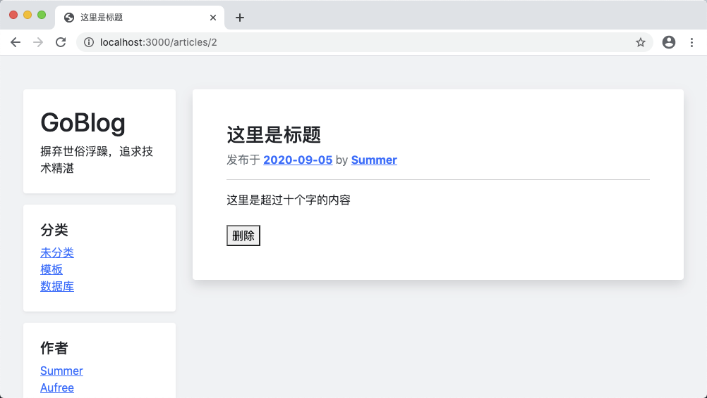

# 9.4. 文章内容页

原文链接：https://learnku.com/courses/go-basic/1.22/article-show-page/16527

## 说明

上节我们重构了文章列表页面模板，本节将修改文章内容页模板以适应新的布局。

## 修改模板

首先修改文章显示的模板：

resources/views/articles/show.gohtml

```
{{define "title"}}
{{ .Title }}
{{end}}

{{define "main"}}
<div class="col-md-9 blog-main">

<div class="blog-post bg-white p-5 rounded shadow mb-4">
<h3 class="blog-post-title">{{ .Title }}</h3>
<p class="blog-post-meta text-secondary">发布于 <a href="" class="font-weight-bold">2020-09-05</a> by <a href="#" class="font-weight-bold">Summer</a></p>

<hr>
{{ .Body }}

{{/* 构建删除按钮  */}}
{{ $idString := Uint64ToString .ID  }}
<form class="mt-4" action="{{ RouteName2URL "articles.delete" "id" $idString }}" method="post">
<button type="submit" onclick="return confirm('删除动作不可逆，请确定是否继续')">删除</button>
</form>

</div><!-- /.blog-post -->
</div>

{{end}}
```

跟文章列表页的 `index.gohtml` 一样，我们使用模板关键词 `define` 定义了 `title` 和 `main` 模板，以供 `app` 模板使用。

## 模板渲染

接下来修改模板渲染：

app/http/controllers/articles_controller.go

```
.
.
.
// Show 文章详情页面
func (*ArticlesController) Show(w http.ResponseWriter, r *http.Request) {
.
.
.
} else {
// ---  4. 读取成功，显示文章 ---

// 4.0 设置模板相对路径
viewDir := "resources/views"

// 4.1 所有布局模板文件 Slice
files, err := filepath.Glob(viewDir + "/layouts/*.gohtml")
logger.LogError(err)

// 4.2 在 Slice 里新增我们的目标文件
newFiles := append(files, viewDir+"/articles/show.gohtml")

// 4.3 解析模板文件
tmpl, err := template.New("show.gohtml").
Funcs(template.FuncMap{
"RouteName2URL": route.Name2URL,
"Uint64ToString": types.Uint64ToString,
}).ParseFiles(newFiles...)
logger.LogError(err)

// 4.4 渲染模板，将所有文章的数据传输进去
err = tmpl.ExecuteTemplate(w, "app", article)
logger.LogError(err)
}
}
.
.
.
```

大部分的代码跟文章列表的渲染类似，在 `4.3 解析模板` 注释那里有些许不同，因为我们使用了自定义模板函数。

## 浏览器试一下



一切如预期。

## 代码版本

开始下一节之前，我们先来为代码做下版本标记：

```
$ git add .
$ git commit -m "文章内容页"
```
