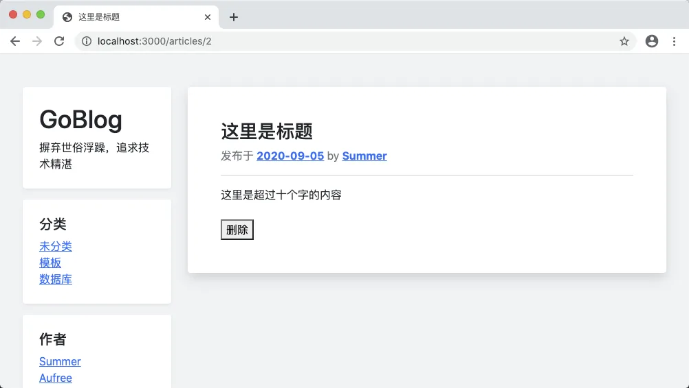
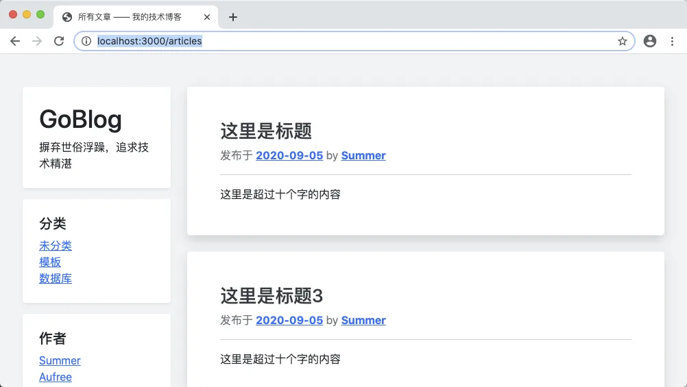
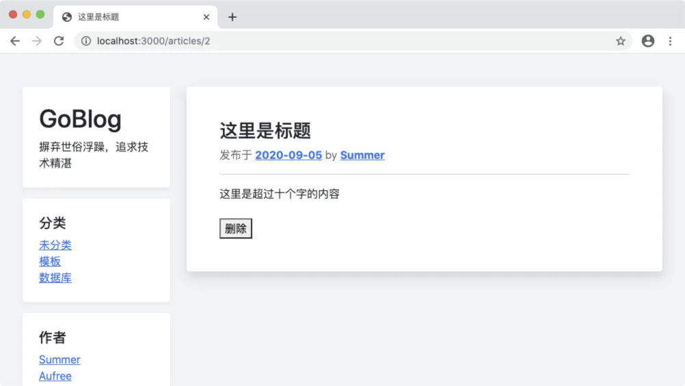

# 9.5. 模型基类和 pkg/view 包

原文链接：https://learnku.com/courses/go-basic/1.22/model-base-class-and-pkg-view-package/16528

## 说明

目前渲染视图那里有很多重复代码。为了方便维护，我们需将这些代码抽象出来。

## 计划一下

文章列表和内容页的渲染代码大同小异，我们先来看下差异。

文章内容页：

```
// ---  4. 读取成功，显示文章 ---

// 4.0 设置模板相对路径
viewDir := "resources/views"

// 4.1 所有布局模板文件 Slice
files, err := filepath.Glob(viewDir + "/layouts/*.gohtml")
logger.LogError(err)

// 4.2 在 Slice 里新增我们的目标文件
newFiles := append(files, viewDir+"/articles/show.gohtml")

// 4.3 解析模板文件
tmpl, err := template.New("show.gohtml").
Funcs(template.FuncMap{
"RouteName2URL": route.Name2URL,
"Uint64ToString": types.Uint64ToString,
}).ParseFiles(newFiles...)
logger.LogError(err)

// 4.4 渲染模板，将所有文章的数据传输进去
err = tmpl.ExecuteTemplate(w, "app", article)
logger.LogError(err)
```

文章列表页：

```
// ---  2. 加载模板 ---

// 2.0 设置模板相对路径
viewDir := "resources/views"

// 2.1 所有布局模板文件 Slice
files, err := filepath.Glob(viewDir + "/layouts/*.gohtml")
logger.LogError(err)

// 2.2 在 Slice 里新增我们的目标文件
newFiles := append(files, viewDir+"/articles/index.gohtml")

// 2.3 解析模板文件
tmpl, err := template.ParseFiles(newFiles...)
logger.LogError(err)

// 2.4 渲染模板，将所有文章的数据传输进去
err = tmpl.ExecuteTemplate(w, "app", article)
logger.LogError(err)
```

区别在于 `ParseFiles` 那里，内容页自定义模板方法 `RouteName2URL` 用以生成删除链接，代码如下：

```
{{/* 构建删除按钮  */}}
{{ $idString := Uint64ToString .ID  }}
<form class="mt-4" action="{{ RouteName2URL "articles.delete" "id" $idString }}" method="post">
<button type="submit" onclick="return confirm('删除动作不可逆，请确定是否继续')">删除</button>
</form>
```

现在我们统一使用了数据模型，`Uint64ToString` 方法可以去掉，只需要我们统一为所有模型新增一个方法，用以获取字符串的 ID 值即可。

我们先来假设这个方法存在，取名为 `GetStringID()` ，模板即可修改为：

resources/views/articles/show.gohtml

```
.
.
.
{{/* 构建删除按钮  */}}
<form class="mt-4" action="{{ RouteName2URL "articles.delete" "id" .GetStringID }}" method="post">
<button type="submit" onclick="return confirm('删除动作不可逆，请确定是否继续')">删除</button>
</form>
.
.
.
```

渲染部分的代码也删除 `Uint64ToString` 的设置：

app/http/controllers/articles_controller.go

```go
.
.
.
func (*ArticlesController) Show(w http.ResponseWriter, r *http.Request) {
    .
    .
    .
} else {
    // ---  4. 读取成功，显示文章 ---
    .
    .
    .
    // 4.3 解析模板文件
    tmpl, err := template.New("show.gohtml").
    Funcs(template.FuncMap{
            "RouteName2URL": route.Name2URL,
    }).ParseFiles(newFiles...)
    .
    .
    .
}
}
```

## 模型基类

这里需要我们考虑一下 `GetStringID()` 方法的存放位置。虽然我们可以将其放到 Article 模型里，以供这次使用，但是其他模型也会需要用到此方法，如何在多个模型里共享方法？

我们可以使用模型基类来解决。基类里存放项目模型里共用的方法和属性。

创建基类：

app/models/model.go

```go
// Package models 模型基类
package models

import (
	"goblog/pkg/types"
)

// BaseModel 模型基类
type BaseModel struct {
	ID uint64
}

// GetStringID 获取 ID 的字符串格式
func (a BaseModel) GetStringID() string {
	return types.Uint64ToString(a.ID)
}
```

至此基类创建完毕。

## 加载模型基类

接下来在 Article 模型中加载模型基类：

app/models/article/article.go

```go
.
.
.
// Article 文章模型
type Article struct {
    models.BaseModel

    Title string
    Body  string
}
.
.
.
```

修改完成后，刷新页面，确保一切正常：



## pkg/view 包

铺垫工作做好了，接下来开始抽象 view 包。

将文章控制器 Show 方法里的渲染代码提取出来，并稍作修改：

pkg/view/view.go

```go
// Package view 视图渲染
package view

import (
	"goblog/pkg/logger"
	"goblog/pkg/route"
	"html/template"
	"io"
	"path/filepath"
	"strings"
)

// Render 渲染视图
func Render(w io.Writer, name string, data interface{}) {
	// 1 设置模板相对路径
	viewDir := "resources/views/"

	// 2. 语法糖，将 articles.show 更正为 articles/show
	name = strings.Replace(name, ".", "/", -1)

	// 3 所有布局模板文件 Slice
	files, err := filepath.Glob(viewDir + "layouts/*.gohtml")
	logger.LogError(err)

	// 4 在 Slice 里新增我们的目标文件
	newFiles := append(files, viewDir+name+".gohtml")

	// 5 解析所有模板文件
	tmpl, err := template.New(name + ".gohtml").
		Funcs(template.FuncMap{
			"RouteName2URL": route.Name2URL,
		}).ParseFiles(newFiles...)
	logger.LogError(err)

	// 6 渲染模板
	err = tmpl.ExecuteTemplate(w, "app", data)
	logger.LogError(err)
}
```

代码逻辑上，新增了语法糖，自动将 articles.show 更正为 articles/show。用到了 strings 包的 `Replace()` 方法，此方法定义如下：

```go
func Replace(s, old, new string, n int) string
```

n 是允许替换的次数，设置为 -1 意味着替换所有。

接下来修改控制器：

app/http/controllers/articles_controller.go

```go
.
.
.
// Show 文章详情页面
func (*ArticlesController) Show(w http.ResponseWriter, r *http.Request) {
    .
    .
    .
} else {
    // ---  4. 读取成功，显示文章 ---
    view.Render(w, "articles.show", article)
}
}

// Index 文章列表页
func (*ArticlesController) Index(w http.ResponseWriter, r *http.Request) {
    .
    .
    .
} else {
    // ---  2. 加载模板 ---
    view.Render(w, "articles.index", articles)
}
}
```

太棒了，代码非常简洁。接下来尝试访问这两个页面 [localhost:3000/articles](http://localhost:3000/articles) ：



随便点击一篇文章，一切正常：



## 代码版本

开始下一节之前，我们先来为代码做下版本标记：

```bash
$ git add .
$ git commit -m "模型基类和 view 包"
```
