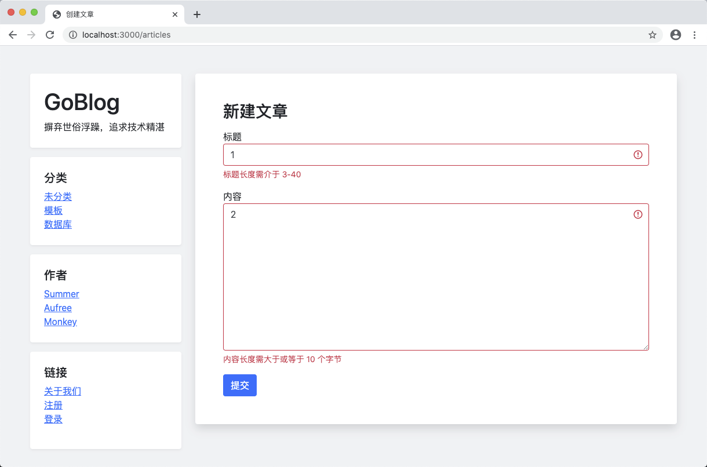
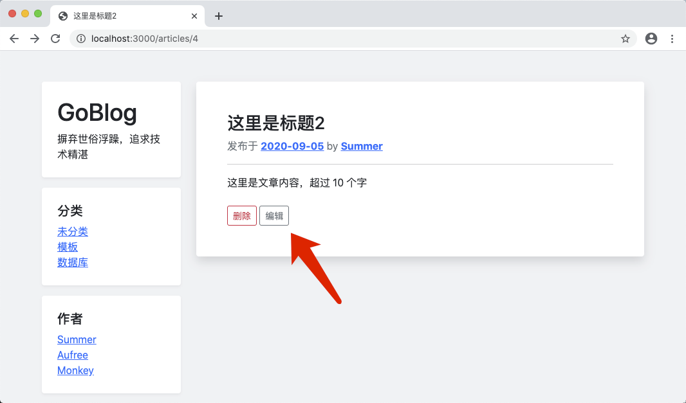
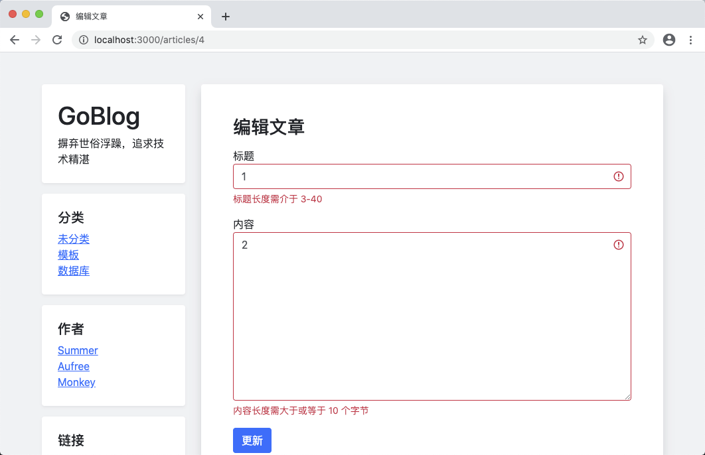

# 9.6. 美化文章表单页

原文链接：https://learnku.com/courses/go-basic/1.22/beautify-article-forms/16529

## 说明

本节来继续优化创建和编辑文章相关页面。

## 创建表单页面

基于 Bootstrap 的结构对创建页面模板进行优化：

resources/views/articles/create.gohtml

```
{{define "title"}}
创建文章
{{end}}

{{define "main"}}
<div class="col-md-9 blog-main">
<div class="blog-post bg-white p-5 rounded shadow mb-4">

<h3>新建文章</h3>

<form action="{{ RouteName2URL "articles.store" }}" method="post">

<div class="form-group mt-3">
<label for="title">标题</label>
<input type="text" class="form-control {{if .Errors.title }}is-invalid {{end}}" name="title" value="{{ .Title }}" required>
{{ with .Errors.title }}
<div class="invalid-feedback">
{{ . }}
</div>
{{ end }}
</div>

<div class="form-group mt-3">
<label for="body">内容</label>
<textarea name="body" cols="30" rows="10" class="form-control {{if .Errors.body }}is-invalid {{end}}">{{ .Body }}</textarea>
{{ with .Errors.body }}
<div class="invalid-feedback">
{{ . }}
</div>
{{ end }}
</div>

<button type="submit" class="btn btn-primary mt-3">提交</button>

</form>

</div><!-- /.blog-post -->
</div>

{{end}}
```

注意 form 元素那里我们使用了 `RouteName2URL`。

```
{{if .Errors.title }}is-invalid {{end}}
```

模板的 `if` 判断语句，如果发生错误，就显示 `is-invalid` CSS 类。

## 创建页面的控制器方法

因为不需要传参 URL 参数，模板里我们直接使用 `RouteName2URL` 生成 URL，代码可以变得很简洁：

app/http/controllers/articles_controller.go

```
.
.
.
// Create 文章创建页面
func (*ArticlesController) Create(w http.ResponseWriter, r *http.Request) {
view.Render(w, "articles.create", ArticlesFormData{})
}
.
.
.
// Store 文章创建页面
func (*ArticlesController) Store(w http.ResponseWriter, r *http.Request) {
.
.
.
} else {
view.Render(w, "articles.create", ArticlesFormData{
Title:  title,
Body:   body,
Errors: errors,
})
}
}
```

## 开始测试

1. 访问 [localhost:3000/articles/create](http://localhost:3000/articles/create)

2. 填写简单内容提交，应能看到错误提示

3. 填写符合要求的内容，应能看到提示创建成功。



## 编辑文章视图

接下来修改编辑页面。

同样的，我们先从模板文件入手：

resources/views/articles/edit.gohtml

```
{{define "title"}}
编辑文章
{{end}}

{{define "main"}}
<div class="col-md-9 blog-main">
<div class="blog-post bg-white p-5 rounded shadow mb-4">

<h3>编辑文章</h3>

<form action="{{ RouteName2URL "articles.update" "id" .Article.GetStringID }}" method="post">

{{template "form-fields" . }}

<button type="submit" class="btn btn-primary mt-3">更新</button>

</form>

</div><!-- /.blog-post -->
</div>

{{end}}
```

## 共用表单字段

我们留意到创建和编辑页面，表单内部的内容是一样的，所以抽出来放到模板里来共享：

resources/views/articles/_form_field.gohtml

```

{{define "form-fields"}}
<div class="form-group mt-3">
<label for="title">标题</label>
<input type="text" class="form-control {{if .Errors.title }}is-invalid {{end}}" name="title" value="{{ .Title }}" required>
{{ with .Errors.title }}
<div class="invalid-feedback">
{{ . }}
</div>
{{ end }}
</div>

<div class="form-group mt-3">
<label for="body">内容</label>
<textarea name="body" cols="30" rows="10" class="form-control {{if .Errors.body }}is-invalid {{end}}">{{ .Body }}</textarea>
{{ with .Errors.body }}
<div class="invalid-feedback">
{{ . }}
</div>
{{ end }}
</div>
{{ end }}
```

创建文章页面也一并修改：

resources/views/articles/create.gohtml

```
{{define "title"}}
创建文章
{{end}}

{{define "main"}}
<div class="col-md-9 blog-main">
<div class="blog-post bg-white p-5 rounded shadow mb-4">

<h3>新建文章</h3>

<form action="{{ RouteName2URL "articles.store" }}" method="post">

{{template "form-fields" . }}

<button type="submit" class="btn btn-primary mt-3">提交</button>

</form>

</div><!-- /.blog-post -->
</div>

{{end}}
```

## 重构 Render 方法

Go 模板引擎渲染时需要加载所有相关的模板，但是在我们之前订阅的 `view.Render()` 方法中：

```
func Render(w io.Writer, name string, data interface{})
```

只能接受一个模板名称，然而在编辑页面中，需要加载两个模板文件：

- `articles/_form_field.gohtml`

- `articles/edit.gohtml`

我们需要重新修改 Render 以满足需求：

pkg/view/view.go

```
// Package view 视图渲染
package view

import (
"goblog/pkg/logger"
"goblog/pkg/route"
"html/template"
"io"
"path/filepath"
"strings"
)

// Render 渲染视图
func Render(w io.Writer, data interface{}, tplFiles ...string) {
// 1 设置模板相对路径
viewDir := "resources/views/"

// 2. 遍历传参文件列表 Slice，设置正确的路径，支持 dir.filename 语法糖
for i, f := range tplFiles {
tplFiles[i] = viewDir + strings.Replace(f, ".", "/", -1) + ".gohtml"
}

// 3. 所有布局模板文件 Slice
layoutFiles, err := filepath.Glob(viewDir + "layouts/*.gohtml")
logger.LogError(err)

// 4. 合并所有文件
allFiles := append(layoutFiles, tplFiles...)

// 5 解析所有模板文件
tmpl, err := template.New("").
Funcs(template.FuncMap{
"RouteName2URL": route.Name2URL,
}).ParseFiles(allFiles...)
logger.LogError(err)

// 6 渲染模板
err = tmpl.ExecuteTemplate(w, "app", data)
logger.LogError(err)
}
```

修改后的 Render 方法支持 `tplFiles...` 不限参数传参，需要多少个模板，直接作为参数附加即可。

接下来修改控制器里的方法：

app/http/controllers/articles_controller.go

```
.
.
.
// ArticlesFormData 创建博文表单数据
type ArticlesFormData struct {
Title, Body string
Article     article.Article
Errors      map[string]string
}
.
.
.
// Edit 文章更新页面
func (*ArticlesController) Edit(w http.ResponseWriter, r *http.Request) {

// 1. 获取 URL 参数
id := route.GetRouteVariable("id", r)

// 2. 读取对应的文章数据
_article, err := article.Get(id)

// 3. 如果出现错误
if err != nil {
if err == gorm.ErrRecordNotFound {
// 3.1 数据未找到
w.WriteHeader(http.StatusNotFound)
fmt.Fprint(w, "404 文章未找到")
} else {
// 3.2 数据库错误
logger.LogError(err)
w.WriteHeader(http.StatusInternalServerError)
fmt.Fprint(w, "500 服务器内部错误")
}
} else {
// 4. 读取成功，显示编辑文章表单
view.Render(w, ArticlesFormData{
Title:   _article.Title,
Body:    _article.Body,
Article: _article,
Errors:  nil,
}, "articles.edit", "articles._form_field")
}
}
.
.
.
```

ArticlesFormData 中，因为我们的 URL 都使用自定义模板方法 RouteName2URL 来生成，所以废弃掉。新增了 Article 对象，方便模板中使用。

处理更新提交过的来表单，也需要修改模板加载逻辑：

app/http/controllers/articles_controller.go

```
.
.
.
// Update 更新文章
func (*ArticlesController) Update(w http.ResponseWriter, r *http.Request) {
.
.
.
} else {
// 4.3 表单验证不通过，显示理由
view.Render(w, ArticlesFormData{
Title:   title,
Body:    body,
Article: _article,
Errors:  errors,
}, "articles.edit", "articles._form_field")
}
}
}
.
.
.
```

接下来是创建相关的控制器逻辑，也需要加载 `_form_field.gohtml` 模板：

app/http/controllers/articles_controller.go

```
.
.
.
// Create 文章创建页面
func (*ArticlesController) Create(w http.ResponseWriter, r *http.Request) {
view.Render(w, ArticlesFormData{}, "articles.create", "articles._form_field")
}
.
.
.
// Store 文章创建页面
func (*ArticlesController) Store(w http.ResponseWriter, r *http.Request) {
.
.
.
} else {
view.Render(w, ArticlesFormData{
Title:  title,
Body:   body,
Errors: errors,
}, "articles.create", "articles._form_field")
}
}
.
.
.
```

另外，其他使用了 `view.Render()` 的地方，因为我们重构了此方法，所以把所有调用的地方都修改下：

app/http/controllers/articles_controller.go

```
// Show 文章详情页面
func (*ArticlesController) Show(w http.ResponseWriter, r *http.Request) {
.
.
.
} else {
// ---  4. 读取成功，显示文章 ---
view.Render(w, article, "articles.show")
}
}

// Index 文章列表页
func (*ArticlesController) Index(w http.ResponseWriter, r *http.Request) {
.
.
.
} else {
// ---  2. 加载模板 ---
view.Render(w, articles, "articles.index")
}
}
```

为了方便进入编辑页面，我们修改下文章显示页面：

resources/views/articles/show.gohtml

```
{{define "title"}}
{{ .Title }}
{{end}}

{{define "main"}}
<div class="col-md-9 blog-main">

<div class="blog-post bg-white p-5 rounded shadow mb-4">
<h3 class="blog-post-title">{{ .Title }}</h3>
<p class="blog-post-meta text-secondary">发布于 <a href="" class="font-weight-bold">2020-09-05</a> by <a href="#" class="font-weight-bold">Summer</a></p>

<hr>
{{ .Body }}

{{/* 构建删除按钮  */}}
<form class="mt-4" action="{{ RouteName2URL "articles.delete" "id" .GetStringID }}" method="post">
<button type="submit" onclick="return confirm('删除动作不可逆，请确定是否继续')" class="btn btn-outline-danger btn-sm">删除</button>
<a href="{{ RouteName2URL "articles.edit" "id" .GetStringID }}" class="btn btn-outline-secondary btn-sm">编辑</a>
</form>

</div><!-- /.blog-post -->
</div>

{{end}}
```

新增了编辑链接：



点击进入编辑页面，提交不合规的内容，成功显示提示：



合理的内容修改，也可以成功提交。

## 代码版本

开始下一节之前，我们先来为代码做下版本标记：

```
$ git add .
$ git commit -m "美化文章表单页"
```
