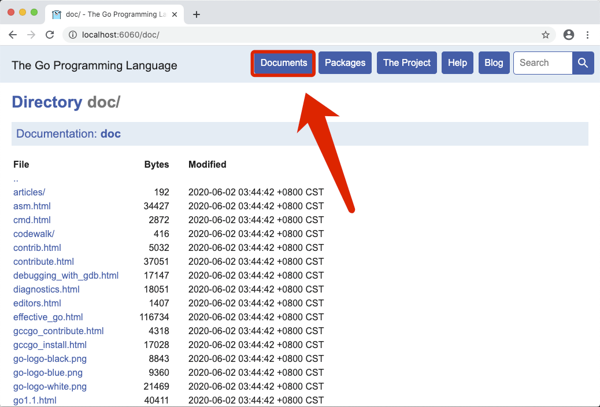
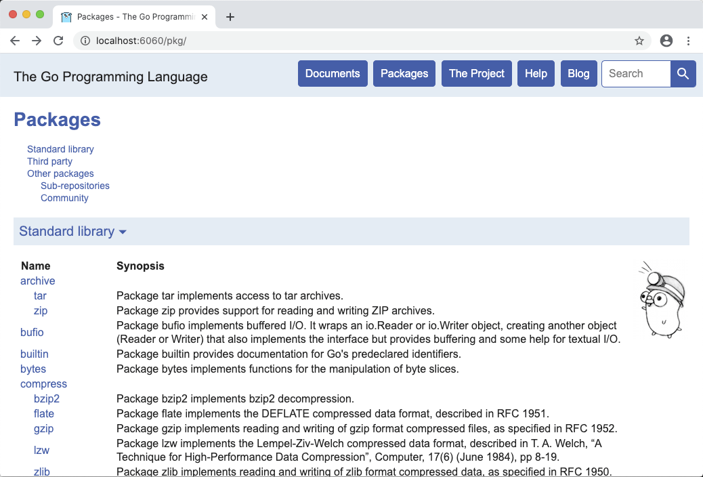

# 2.2. Go Docs

原文链接：https://learnku.com/courses/go-basic/1.22/go-docs/16475

## 说明

开发时，我们需要经常查阅 Go 语言官方文档，可惜因国内访问外网不稳定，golang.org 经常会出现无法访问的情况。

幸运的是，Go 团队提供了 `godoc` 工具，允许我们在本地直接访问 Go 文档。

>

本章节不会影响后续的教程，如遇到问题，卡住了，可跳过。

## 安装 godoc

运行以下命令：

```
$ godoc -http=:6060
```

如果提示 `godoc` 命令不存在。那是因为 godoc 在 go 1.13 版本后被从核心包中移除，我们需要安装它。

安装 godoc 之前，我们需要设置 `$GOPROXY` 变量来做下载加速（详见 [Wiki：Go 国内加速：Go 国内加速镜像](https://learnku.com/go/wikis/38122) ）：

```
# Mac

go env -w  GOPROXY=https://goproxy.cn,direct
# Windows
$env:GOPROXY="https://goproxy.cn,direct"
```

>

Windows 用户如未生效，请按照这个视频教程来配置 Windows 的环境变量 —— [002. Go 开发环境配置（Windows 10）](https://learnku.com/courses/go-video/2022/go-development-environment-configuration-windows-10/11304) 。

使用以下命令安装 godoc：

```
$ GO111MODULE=on  go install golang.org/x/tools/cmd/godoc@latest
```

如果你是 Mac 环境，且使用 `brew install go` 的话，Brew 已经为你安装 godoc。

## 本地运行 godoc

在成功运行行下命令后：

```
$ godoc -http=:6060
```

访问 [localhost:6060/doc](http://localhost:6060/doc) 是一些 Go 的主要文档，如发布日志、Effective Go 等：



浏览器访问 [localhost:6060/pkg](http://localhost:6060/pkg) 是标准库以及加载过的第三方库的文档：



## 结语

在后面的课程中，当我们指定查看官方文档时，如你网络不稳定，即可使用此方法来查看文档。
