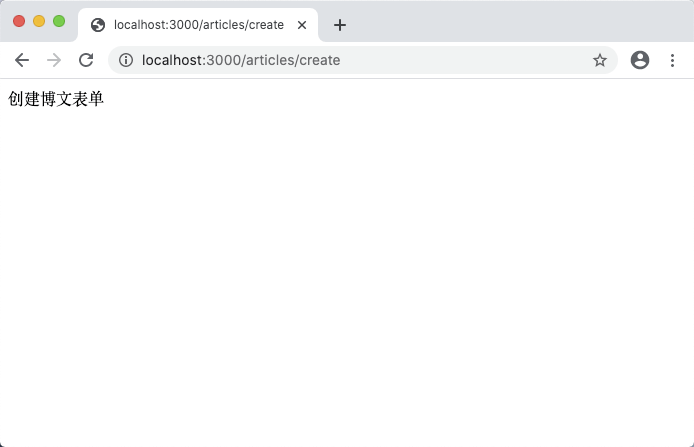
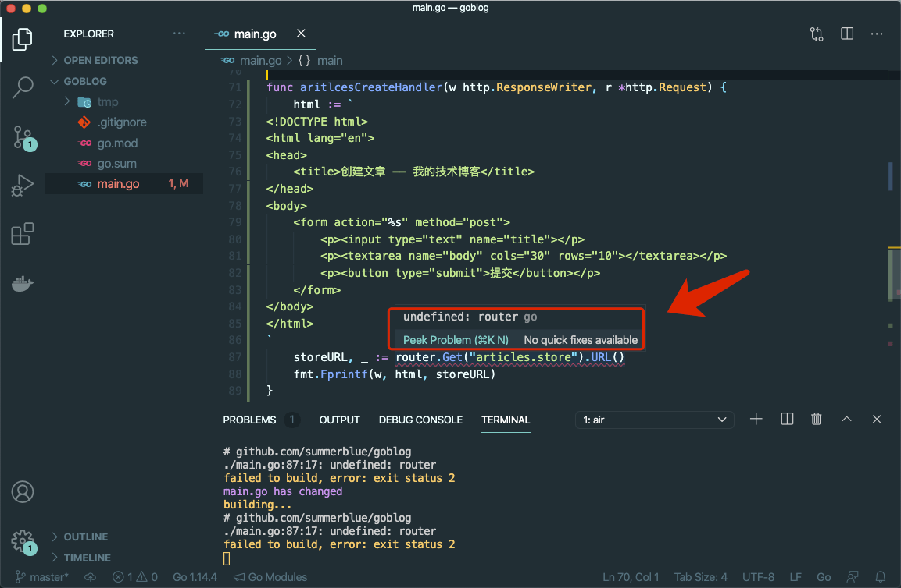
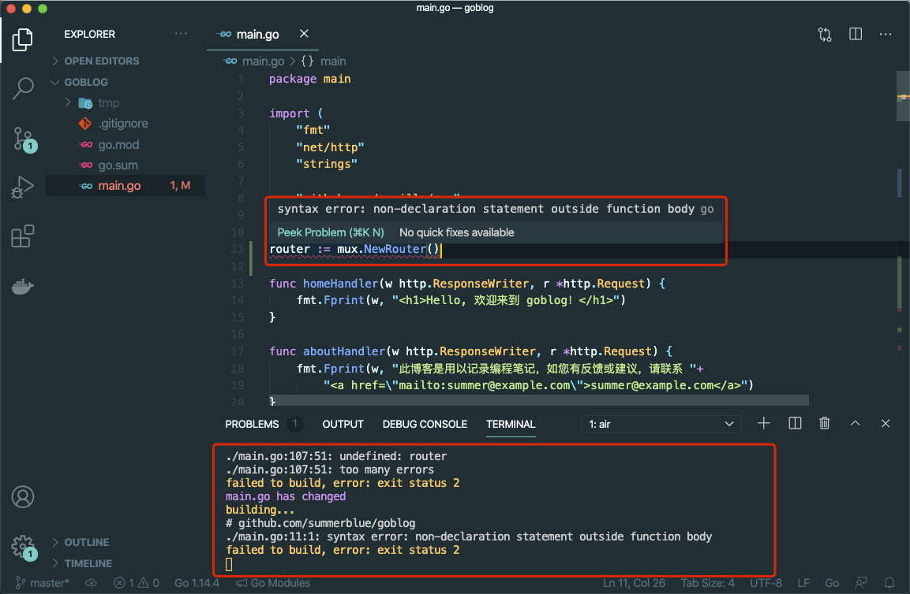
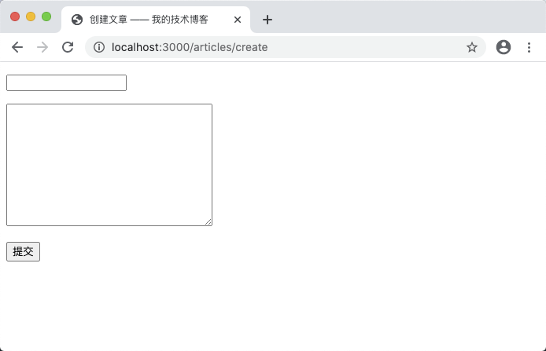
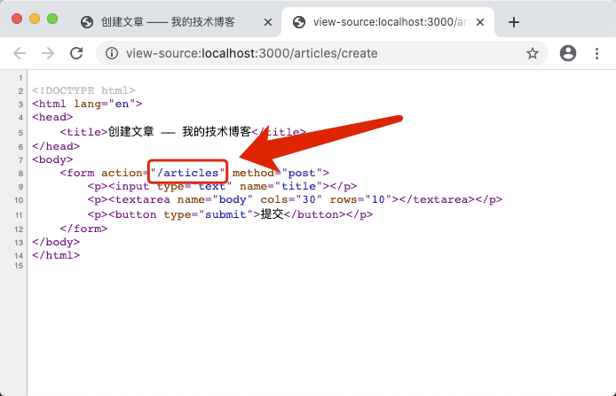

# 5.1. 创建博文

原文链接：https://learnku.com/courses/go-basic/1.22/create-blog/16490

## 说明

本节开始，我们将开发创建博客相关的功能。

## 新增路由

main.go

```
func articlesCreateHandler(w http.ResponseWriter, r *http.Request) {
fmt.Fprint(w, "创建博文表单")
}

func main() {
.
.
.

router.HandleFunc("/articles/create", articlesCreateHandler).Methods("GET").Name("articles.create")

// 自定义 404 页面
router.NotFoundHandler = http.HandlerFunc(notFoundHandler)

// 中间件：强制内容类型为 HTML
router.Use(forceHTMLMiddleware)

http.ListenAndServe(":3000", removeTrailingSlash(router))
}
```

以上代码注意：

1. 我们新增了 `/articles/create` 路由和 `articlesCreateHandler` 请求处理器;

2. 移除了 `router.Use(forceHTMLMiddleware)` 后面的测试路由命名相关的代码。

打开浏览器 [localhost:3000/articles/create](http://localhost:3000/articles/create) ，可见：



## 构建表单

接下来我们构建表单，修改 `articlesCreateHandler` 函数的代码如下：

```
func articlesCreateHandler(w http.ResponseWriter, r *http.Request) {
html := `
<!DOCTYPE html>
<html lang="en">
<head>
<title>创建文章 —— 我的技术博客</title>
</head>
<body>
<form action="%s" method="post">
<p><input type="text" name="title"></p>
<p><textarea name="body" cols="30" rows="10"></textarea></p>
<p><button type="submit">提交</button></p>
</form>
</body>
</html>
`
storeURL, _ := router.Get("articles.store").URL()
fmt.Fprintf(w, html, storeURL)
}
```

代码分析：

我们使用上标符号 ``` 来书写 HTML 代码，一般多行字符串可以使用这种方式。

```
storeURL, _ := router.Get("articles.store").URL()
```

使用路由名称传参给 `router.Get()` 方法来获取创建博文的链接，使用命名路由的好处是为 URL 修改提供了灵活性。

保存文件后发现命令行里我们的自动重载程序 `air` 报错了，VSCode 里鼠标放上去，也可以看到提示信息：



>

undefined: router

`router` 变量未定义。

这里有个 Go 语言变量作用域的问题，`main()` 函数中定义的 `router := mux.NewRouter()` 无法在函数 `articlesCreateHandler()` 中使用，因为 `router` 是函数级别的变量，Go 语言中函数间的变量是不可见的。我们可以使用包级别的变量来解决此问题，只需要将 `router` 变量初始代码移出 `main()` 方法，置于文件顶部：

main.go

```
package main

import (
"fmt"
"net/http"
"strings"

"github.com/gorilla/mux"
)

router := mux.NewRouter()

.
.
.
```

保存文件会提示一下错误：



```
syntax error: non-declaration statement outside function body

# 翻译
语法错误：函数外无法使用变量赋值语句
```

原因是包级别的变量声明时不能使用 `:=` 语法，修改为带关键词 `var` 的变量声明即可：

main.go

```
package main

import (
"fmt"
"net/http"
"strings"

"github.com/gorilla/mux"
)

var router = mux.NewRouter()

.
.
.
```

保存后将编译成功，浏览器访问 [localhost:3000/articles/create](http://localhost:3000/articles/create) ，可见：



浏览器上右键，查看源码：



可以看到命名路由为我们生成的链接。

## 代码版本

开始下一节之前，我们先来为代码做下版本标记：

```
$ git add .
$ git commit -m "新建博文表单"
```
