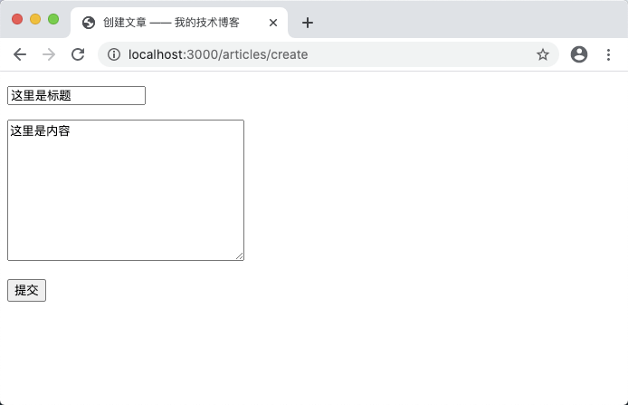
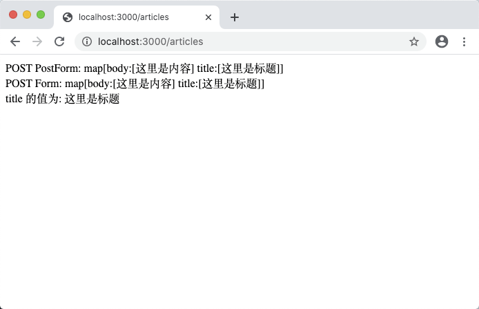
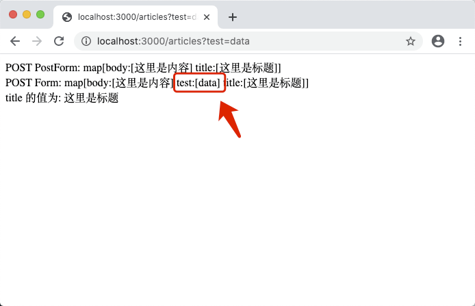
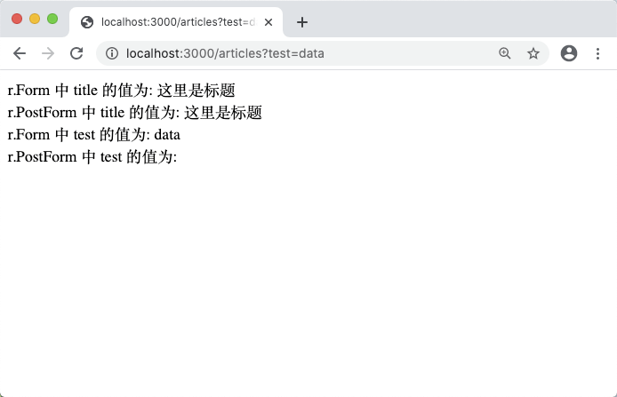

# 5.2. 读取表单数据

原文链接：https://learnku.com/courses/go-basic/1.22/read-request-data/16491

## 说明

上一节我们完成了表单的构建，这一节来处理表单提交过来的数据。

## 接收数据

在 `main()` 函数里有这一行是设置保存表单数据的路由：

```
router.HandleFunc("/articles", articlesStoreHandler).Methods("POST").Name("articles.store")
```

指定到了 `articlesStoreHandler()` 函数中，接下来我们修改此函数，将用户提交的数据打印出来：

main.go

```
.
.
.
func articlesStoreHandler(w http.ResponseWriter, r *http.Request) {

err := r.ParseForm()
if err != nil {
// 解析错误，这里应该有错误处理
fmt.Fprint(w,  "请提供正确的数据！")
return
}

title := r.PostForm.Get("title")

fmt.Fprintf(w, "POST PostForm: %v <br>", r.PostForm)
fmt.Fprintf(w, "POST Form: %v <br>", r.Form)
fmt.Fprintf(w, "title 的值为: %v", title)
}

.
.
.
```

代码解析：

`r.ParseForm()` 由 http 包提供，从请求中解析请求参数，必须是执行完这段代码，后面 `r.PostForm` 和 `r.Form` 才能读取到数据，否则为空数组。

关于错误处理，一般常见的简写是：

```
if err := r.ParseForm(); err != nil {
// 解析错误，这里应该有错误处理
fmt.Fprint(w,  "请提供正确的数据！")
return
}
```

修改完成后，打开 [localhost:3000/articles/create](http://localhost:3000/articles/create) ，在标题和内容里随便填入点信息：



点击提交可见：



打印出来的数据可见 `r.PostForm` 和 `r.Form` 的数据是一样的。

- Form：存储了 post、put 和 get 参数，在使用之前需要调用 ParseForm 方法。

- PostForm：存储了 post、put 参数，在使用之前需要调用 ParseForm 方法。

我们修改代码来验证两者区别：

main.go

```
.
.
.
func articlesCreateHandler(w http.ResponseWriter, r *http.Request) {
html := `
<!DOCTYPE html>
<html lang="en">
<head>
<title>创建文章 —— 我的技术博客</title>
</head>
<body>
<form action="%s?test=data" method="post">
<p><input type="text" name="title"></p>
<p><textarea name="body" cols="30" rows="10"></textarea></p>
<p><button type="submit">提交</button></p>
</form>
</body>
</html>
`
storeURL, _ := router.Get("articles.store").URL()
fmt.Fprintf(w, html, storeURL)
}
.
.
.
```

注意修改的这一段，添加了 URL 参数：

```
<form action="%s?test=data" method="post">
```

重新打开 [localhost:3000/articles/create](http://localhost:3000/articles/create) 并填写数据（注意如果你使用浏览器的回退功能的话，需要重新刷新页面），再次提交：



可见 `r.Form` 比 `r.PostForm` 多了 URL 参数里的数据。

如不想获取所有的请求内容，而是逐个获取的话，这也是比较常见的操作，无需使用 `r.ParseForm()` 可直接使用 `r.FormValue()` 和 `r.PostFormValue()` 方法：

main.go

```
.
.
.
func articlesStoreHandler(w http.ResponseWriter, r *http.Request) {
fmt.Fprintf(w, "r.Form 中 title 的值为: %v <br>", r.FormValue("title"))
fmt.Fprintf(w, "r.PostForm 中 title 的值为: %v <br>", r.PostFormValue("title"))
fmt.Fprintf(w, "r.Form 中 test 的值为: %v <br>", r.FormValue("test"))
fmt.Fprintf(w, "r.PostForm 中 test 的值为: %v <br>", r.PostFormValue("test"))
}
.
.
.
```

刷新页面并提交表单，打印出来的数据如下：



## 代码版本

开始下一节之前，我们先来为代码做下版本标记：

```
$ git add .
$ git commit -m "读取请求数据"
```
