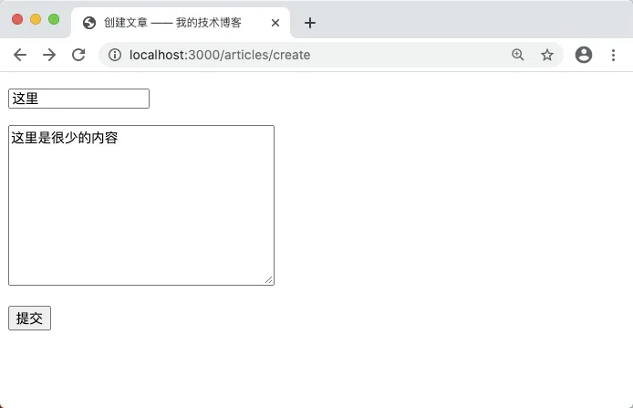
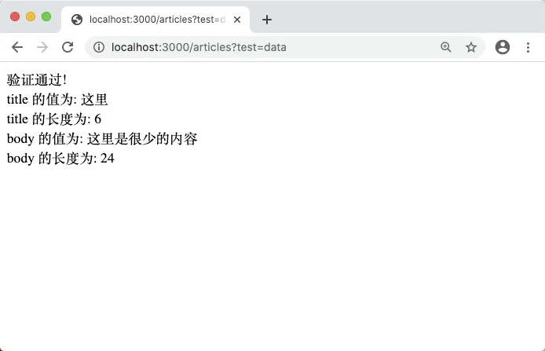
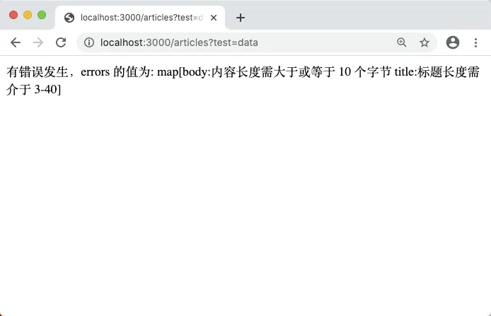
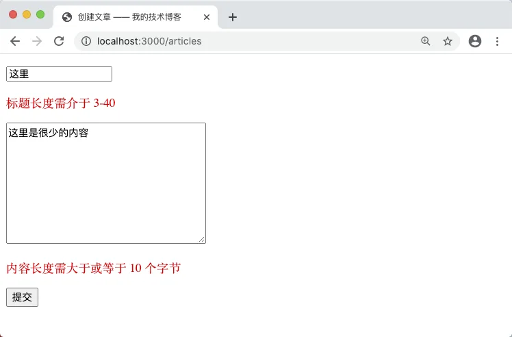

# 5.3. 表单验证

原文链接：https://learnku.com/courses/go-basic/1.22/form-validation/16492

## 说明

现在我们学会了如何获取数据，接下来需要对表单数据进行验证。

验证规则如下：

- 标题不能为空，且要大于两个字符，且小于 40 个字符

- 内容不能为空，且要大于 10 个字符

## 表单验证

接下来修改 `articlesStoreHandler()` 方法，先对数据进行验证：

main.go

```go
.
.
.
func articlesStoreHandler(w http.ResponseWriter, r *http.Request) {

    title := r.PostFormValue("title")
    body := r.PostFormValue("body")

    errors := make(map[string]string)

    // 验证标题
    if title == "" {
        errors["title"] = "标题不能为空"
    } else if len(title) < 3 || len(title) > 40 {
        errors["title"] = "标题长度需介于 3-40"
    }

    // 验证内容
    if body == "" {
        errors["body"] = "内容不能为空"
    } else if len(body) < 10 {
        errors["body"] = "内容长度需大于或等于 10 个字节"
    }

    // 检查是否有错误
    if len(errors) == 0 {
        fmt.Fprint(w, "验证通过!<br>")
        fmt.Fprintf(w, "title 的值为: %v <br>", title)
        fmt.Fprintf(w, "title 的长度为: %v <br>", len(title))
        fmt.Fprintf(w, "body 的值为: %v <br>", body)
        fmt.Fprintf(w, "body 的长度为: %v <br>", len(body))
    } else {
        fmt.Fprintf(w, "有错误发生，errors 的值为: %v <br>", errors)
    }
}
.
.
.
```

测试一下，打开 [localhost:3000/articles/create](http://localhost:3000/articles/create) ，填入很少的内容：



提交以后，发现显示的是 `验证通过!` ：



且命名是两个中文汉字，使用 `len()` 函数计数却为 6 个。

Go 语言的内建函数 len()，可以用来获取切片、字符串、通道（channel）等的长度。

这里的差异是由于 Go 语言的字符串都以 UTF-8 格式保存，每个中文占用 3 个字节，因此使用 len() 获得两个中文文字对应的 6 个字节。

如果希望按习惯上的字符个数来计算，就需要使用 Go 语言中 utf8 包提供的 RuneCountInString() 函数来计数。重新修改代码：

main.go

```go
.
.
.
func articlesStoreHandler(w http.ResponseWriter, r *http.Request) {

    title := r.PostFormValue("title")
    body := r.PostFormValue("body")

    errors := make(map[string]string)

    // 验证标题
    if title == "" {
        errors["title"] = "标题不能为空"
    } else if utf8.RuneCountInString(title) < 3 || utf8.RuneCountInString(title) > 40 {
        errors["title"] = "标题长度需介于 3-40"
    }

    // 验证内容
    if body == "" {
        errors["body"] = "内容不能为空"
    } else if utf8.RuneCountInString(body) < 10 {
        errors["body"] = "内容长度需大于或等于 10 个字节"
    }

    // 检查是否有错误
    if len(errors) == 0 {
        fmt.Fprint(w, "验证通过!<br>")
        fmt.Fprintf(w, "title 的值为: %v <br>", title)
        fmt.Fprintf(w, "title 的长度为: %v <br>", utf8.RuneCountInString(title))
        fmt.Fprintf(w, "body 的值为: %v <br>", body)
        fmt.Fprintf(w, "body 的长度为: %v <br>", utf8.RuneCountInString(body))
    } else {
        fmt.Fprintf(w, "有错误发生，errors 的值为: %v <br>", errors)
    }
}
.
.
.
```

再次提交，即可看到正确的报错信息：



## 出错时提示

数据验证的逻辑是：

- 正确的时候存入数据库

- 错误时重新显示表单，并显示错误提示

接下来我们先来处理错误提示。

发生错误时，也就是 `errors` 的长度大于零时，我们会把 `errors` 传参到 HTML 中进行渲染。Go 标准库的 `html/template`，就是专门为这种场景所设计的。

main.go

```go
.
.
.
// ArticlesFormData 创建博文表单数据
type ArticlesFormData struct {
    Title, Body string
    URL         *url.URL
    Errors      map[string]string
}

func articlesStoreHandler(w http.ResponseWriter, r *http.Request) {
    .
    .
    .

    // 检查是否有错误
    if len(errors) == 0 {
        .
        .
        .
    } else {

        html := `
        <!DOCTYPE html>
        <html lang="en">
        <head>
        <title>创建文章 —— 我的技术博客</title>
        <style type="text/css">.error {color: red;}</style>
        </head>
        <body>
        <form action="{{ .URL }}" method="post">
        <p><input type="text" name="title" value="{{ .Title }}"></p>
        {{ with .Errors.title }}
        <p class="error">{{ . }}</p>
        {{ end }}
        <p><textarea name="body" cols="30" rows="10">{{ .Body }}</textarea></p>
        {{ with .Errors.body }}
        <p class="error">{{ . }}</p>
        {{ end }}
        <p><button type="submit">提交</button></p>
        </form>
        </body>
        </html>
        `
        storeURL, _ := router.Get("articles.store").URL()

        data := ArticlesFormData{
            Title:  title,
            Body:   body,
            URL:    storeURL,
            Errors: errors,
        }
        tmpl, err := template.New("create-form").Parse(html)
        if err != nil {
            panic(err)
        }

        err = tmpl.Execute(w, data)
        if err != nil {
            panic(err)
        }
    }
}
.
.
.
```

代码分析：

首先我们定义一个 `ArticlesFormData` struct，用以给模板文件传输变量时使用。

接下来是构建 ArticlesFormData 里的数据，`storeURL` 是通过路由参数生成的 URL 路径。

```
tmpl, err := template.New("create-form").Parse(html)
```

这是 `template.New()` 包的初始化。`html` 变量里是包含模板语法的内容，模板语法以双层大括号 `{{` 包起来，关于模板的使用以及更多的语法，我们下节再探讨。

此时再次刷新浏览器，即可看到我们的错误提示被成功渲染：



## 代码版本

开始下一节之前，我们先来为代码做下版本标记：

```bash
$ git add .
$ git commit -m "表单验证"
```
