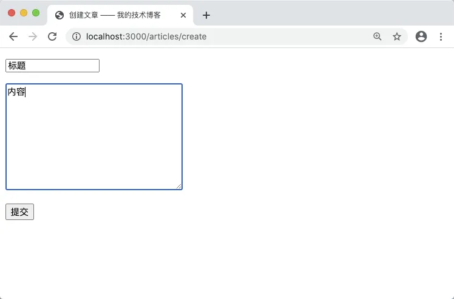
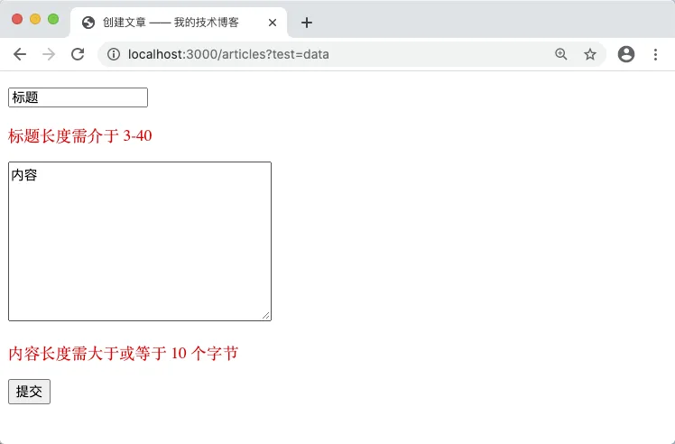
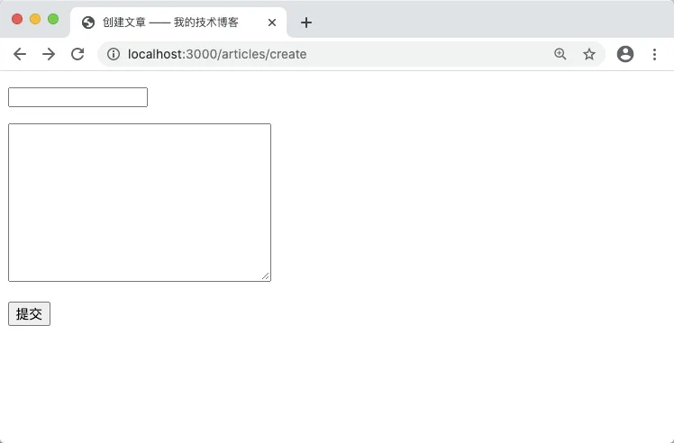

# 5.4. 模板文件

原文链接：https://learnku.com/courses/go-basic/1.22/use-template/16493

## 说明

上一节我们使用 Go 的 template 标准库来构建表单。

本节我们一起重构 `articlesCreateHandler()` 和 `articlesStoreHandler()` 函数，为了遵循最佳实践，使其更方便维护，将 HTML 抽离并放置于独立的模板文件中。同时两个函数也会共用一个模板文件。

## 模板文件

我们先来让 `articlesStoreHandler()` 使用模板文件：

main.go

```go
.
.
.
func articlesStoreHandler(w http.ResponseWriter, r *http.Request) {
    .
    .
    .

    // 检查是否有错误
    if len(errors) == 0 {
        .
        .
        .
    } else {

        storeURL, _ := router.Get("articles.store").URL()

        data := ArticlesFormData{
            Title:  title,
            Body:   body,
            URL:    storeURL,
            Errors: errors,
        }
        tmpl, err := template.ParseFiles("resources/views/articles/create.gohtml")
        if err != nil {
            panic(err)
        }

        err = tmpl.Execute(w, data)
        if err != nil {
            panic(err)
        }
    }
}
.
.
.
```

以上的修改：1. 删了 html 变量， 2. 使用以下这段代码加载模板文件，其他代码保持不变：

```
tmpl, err := template.ParseFiles("resources/views/articles/create.gohtml")
```

关于模板后缀名 `.gohtml` ，可以使用任意后缀名，这不会影响代码的运行。常见的 Go 模板后缀名有 `.tmpl`、`.tpl`、 `.gohtml` 等。

Go 官方 [开源的 Blog 代码](https://github.com/golang/blog/tree/master/template) 中，使用的是 `.tmpl`，然而在 LearnKu 的 Go 论坛里，我们推荐使用 `.gohtml`。原因是避免与其他语言的模板后缀产生不必要的冲突。PHP 或其他语言可能会使用相同后缀，且你都是使用 VSCode 来作为编辑器，那么 VSCode 将无法准确地提供代码高亮。

接下来创建模板文件：

resources/views/articles/create.gohtml

```
<!DOCTYPE html>
<html lang="en">
<head>
<title>创建文章 —— 我的技术博客</title>
<style type="text/css">.error {color: red;}</style>
</head>
<body>
<form action="{{ .URL }}" method="post">
<p><input type="text" name="title" value="{{ .Title }}"></p>
{{ with .Errors.title }}
<p class="error">{{ . }}</p>
{{ end }}
<p><textarea name="body" cols="30" rows="10">{{ .Body }}</textarea></p>
{{ with .Errors.body }}
<p class="error">{{ . }}</p>
{{ end }}
<p><button type="submit">提交</button></p>
</form>
</body>
</html>
```

浏览器打开 [localhost:3000/articles/create](http://localhost:3000/articles/create) ，填入内容：



点击提交：



修改成功。

## 统一模板

接下来修改 `/articles/create` 的代码来加载同一个模板：

main.go

```go
func articlesCreateHandler(w http.ResponseWriter, r *http.Request) {

	storeURL, _ := router.Get("articles.store").URL()
	data := ArticlesFormData{
		Title:  "",
		Body:   "",
		URL:    storeURL,
		Errors: nil,
	}
	tmpl, err := template.ParseFiles("resources/views/articles/create.gohtml")
	if err != nil {
		panic(err)
	}

	err = tmpl.Execute(w, data)
	if err != nil {
		panic(err)
	}
}
```

这里我们使用与 articlesStoreHandler 类似的代码，需要特别注意的是 `panic()` 函数的使用。

>

知识点： 在 Go 中，一般 err 处理方式可以是给用户提示或记录到错误日志里，这种很多时候为 业务逻辑错误。当有重大错误，或者系统错误时，例如无法加载模板文件，就使用 `panic()` 。应用里需要有一套合理的错误机制，后面的开发中我们会详细讲解到。

访问 [localhost:3000/articles/create](http://localhost:3000/articles/create) ，可以见成功渲染：



## 代码版本

开始下一节之前，我们先来为代码做下版本标记：

```bash
$ git add .
$ git commit -m "使用模板文件"
```
