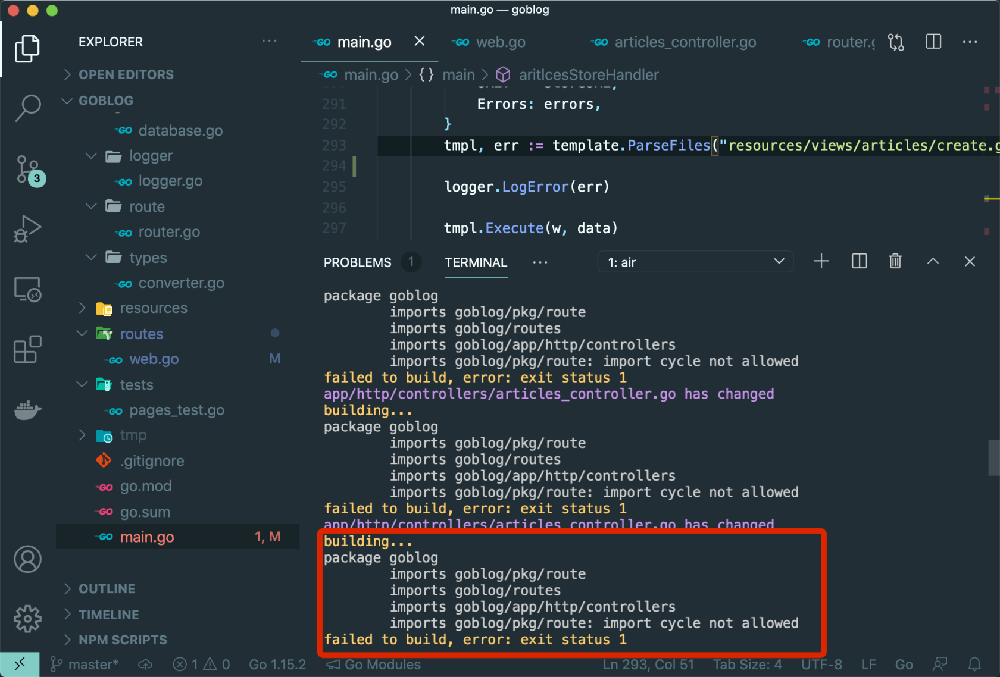
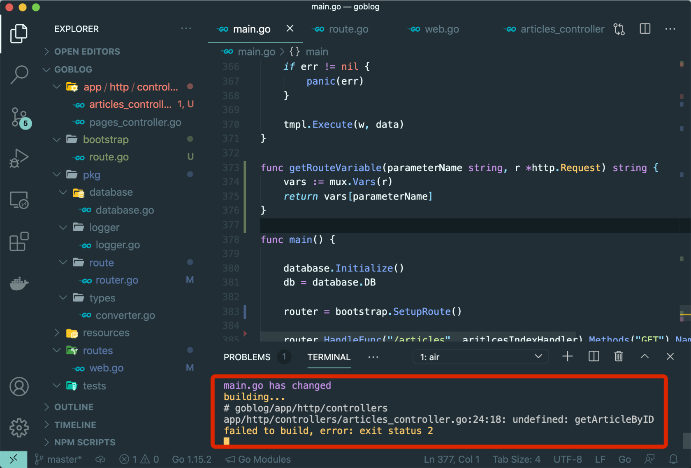

# 8.2. 循环引用

原文链接：https://learnku.com/courses/go-basic/1.22/circular-reference/16515

## 说明

上节我们在重构几个静态页面时，也构建了我们的 MVC 雏形 —— 控制器加路由。

这一节开始，我们将接触模型和视图。

我们会先从 `articles.show` 开始，慢慢将 main.go 里的控制器逻辑移到专属的文章控制器中。

## 注册路由

前往我们的专属路由文件里注册路由：

routes/web.go

```
.
.
.
func  RegisterWebRoutes(r *mux.Router) {
.
.
.

// 文章相关页面
ac := new(controllers.ArticlesController)
r.HandleFunc("/articles/{id:[0-9]+}", ac.Show).Methods("GET").Name("articles.show")
}
```

随后请前往 main.go 文件中，将我们已不再需要的代码删除：

```
router.HandleFunc("/articles/{id:[0-9]+}", articlesShowHandler).Methods("GET").Name("articles.show")
```

## ArticlesController 控制器

ArticlesController 还不存在，接下来新建此文件和 `Show` 方法：

app/http/controllers/articles_controller.go

```
package controllers

import (
"net/http"
)

// ArticlesController 文章相关页面
type ArticlesController struct {
}

// Show 文章详情页面
func (*ArticlesController) Show(w http.ResponseWriter, r *http.Request) {

}
```

架子搭好了，进入 main.go 里，找到 `articlesShowHandler` 将内容复制到刚刚创建的 `Show` 方法中：

app/http/controllers/articles_controller.go

```
.
.
.
func (*ArticlesController) Show(w http.ResponseWriter, r *http.Request) {
// 1. 获取 URL 参数
id := route.GetRouteVariable("id", r)

// 2. 读取对应的文章数据
article, err := getArticleByID(id)

// 3. 如果出现错误
if err != nil {
if err == sql.ErrNoRows {
// 3.1 数据未找到
w.WriteHeader(http.StatusNotFound)
fmt.Fprint(w, "404 文章未找到")
} else {
// 3.2 数据库错误
logger.LogError(err)
w.WriteHeader(http.StatusInternalServerError)
fmt.Fprint(w, "500 服务器内部错误")
}
} else {
// 4. 读取成功，显示文章
tmpl, err := template.New("show.gohtml").
Funcs(template.FuncMap{
"RouteName2URL": route.Name2URL,
"Int64ToString": types.Int64ToString,
}).
ParseFiles("resources/views/articles/show.gohtml")
logger.LogError(err)
err = tmpl.Execute(w, article)
logger.LogError(err)
}
}
```

>

注：黏贴的同时，请将 main.go 里的 `articlesShowHandler` 函数删除，我们已经不再需要此函数了。

## import cycle not allowed 循环导入问题

保存文件时，我们可以看到命令行里会有错误提示：



关注这块内容：

```
package goblog
imports goblog/pkg/route
imports goblog/routes
imports goblog/app/http/controllers
imports goblog/pkg/route: import cycle not allowed
failed to build, error: exit status 1
```

循环导入是  Go 语言中常见的一个报错。

分解下问题——在我们的 goblog 项目中导入依赖是这样的：

1. main 包里面引入 goblog/pkg/route ，调用 route.Initialize 进行路由初始化；

2. goblog/pkg/route 里 Initialize 函数加载了  goblog/routes 注册路由 `routes.RegisterWebRoutes(Router)`；

3. goblog/routes 包里加载了控制器的包  goblog/app/http/controllers

4. 控制器包里再次使用了路由工具包 goblog/pkg/route  ！！出现循环引用问题了！！

Go 编译器不允许这样做是出于编译性能考虑。允许循环引用会使编译时间激增，一旦某个包更新，整个依赖循环都需要重新编译。

解决方法很简单，我们重新组织下代码即可，保持自上而下的依赖关系。目前我们的 goblog/pkg/route 里面做了两件事情：

1. 路由初始化 —— 注册路由

2. 提供路由相关的工具方法

路由初始化更加贴近我们的业务逻辑，可以抽出来放到专门负责初始化的包里，并将 pkg/route 从最顶级的 main 包里移除。这样 pkg/route 只存放路由相关工具方法，供控制器调用。

## 路由初始化

新建 bootstrap 包，这个包将用来存放程序初始化相关逻辑，例如路由初始化、数据库初始化、配置信息初始化等。

新建以下文件：

bootstrap/route.go

```
// Package bootstrap 负责应用初始化相关工作，比如初始化路由。
package bootstrap

import (
"goblog/routes"

"github.com/gorilla/mux"
)

// SetupRoute 路由初始化
func SetupRoute() *mux.Router {
router := mux.NewRouter()
routes.RegisterWebRoutes(router)
return router
}
```

接下来修改 main.go，将以下两行：

```
route.Initialize()
router = route.Router
```

替换为：

```
router = bootstrap.SetupRoute()
```

接下来修改 pkg 里的 route 包，将初始化的代码删除，只保留两个工具函数：

pkg/route/router.go

```
// Package route 路由相关
package route

import (
"net/http"

"github.com/gorilla/mux"
)

// Name2URL 通过路由名称来获取 URL
func Name2URL(routeName string, pairs ...string) string {
var route *mux.Router
url, err := route.Get(routeName).URL(pairs...)
if err != nil {
// checkError(err)
return ""
}

return url.String()
}

// GetRouteVariable 获取 URI 路由参数
func GetRouteVariable(parameterName string, r *http.Request) string {
vars := mux.Vars(r)
return vars[parameterName]
}
```

保存文件后， air 自动编译还是会出现循环引用错误，这是因为我们的 main 包里仍然在使用 `route.GetRouteVariable()` 函数。

打开 main.go 文件，你可以看到所有调用 `route.GetRouteVariable()` 的地方都是 Handler，这些 Handler 将会一个个被我们重构到专属的控制器里，然而目前来讲，为了保持 最小化修改 这个重构的最佳实践，我们可以先使用折中方案——将 `GetRouteVariable()` 方法重新移回 main.go 中，并将这个本地的方法替换掉  `route.GetRouteVariable()` 的调用。

具体操作如下。

main.go 里新增 `getRouteVariable()` 方法，因为不需要导出，函数名首字母小写：

main.go

```
.
.
.
func getRouteVariable(parameterName string, r *http.Request) string {
vars := mux.Vars(r)
return vars[parameterName]
}

func main() {
.
.
.
}
```

接下来是在 main.go 文件中查找关键词 `route.GetRouteVariable`，并将所有出现的地方替换为 `getRouteVariable` ，修改完成后保存文件。

可以看到 air 自动编译报了另一个错误，这很好，说明我们已经解决了循环引用的问题：



## 代码版本

开始下一节之前，我们先来为代码做下版本标记：

```
$ git add .
$ git commit -m "解决循环引用问题"
```
