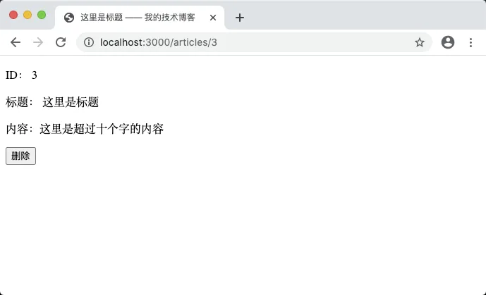
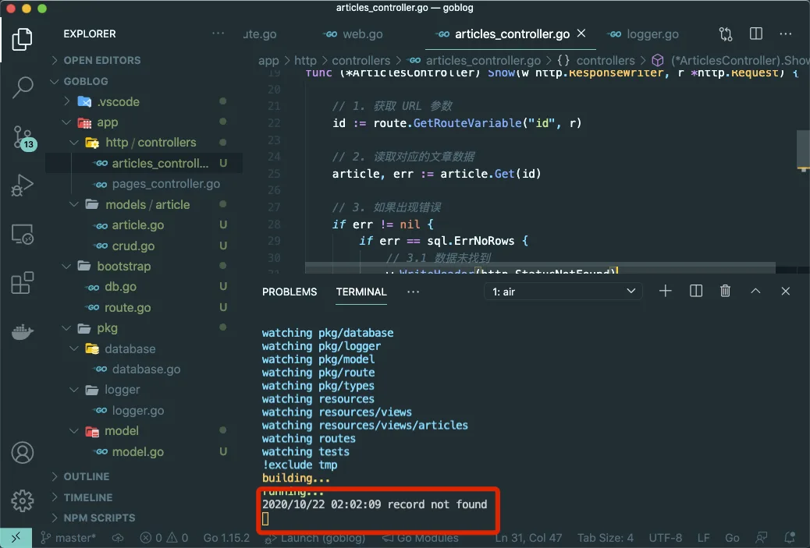
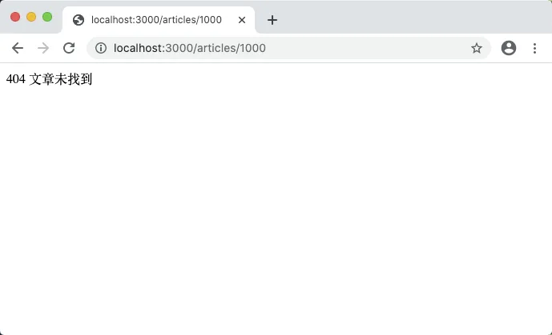

# 8.4. Article 模型

原文链接：https://learnku.com/courses/go-basic/1.22/article-model/16517

## 说明

本节我们来解决命令行里 air 自动编译项目 `undefined: getArticleByID` 的报错。

## 新建模型

`getArticleByID()` 是我们在 main.go 中创建的函数，用以获取 ID 对应的文章。

接下来我们使用 GORM 来实现相同的功能，首先创建 Article 模型文件：

app/models/article/article.go

```
// Package article 应用的文章模型
package article

// Article 文章模型
type Article struct {
ID    uint64
Title string
Body  string
}
```

注意我们将 ID 从 int64 修改为 uint64 ，因为数据库的 ID 为大于 0 的自增整数，所以我们使用更加合适的 uint64 来设定。

下面简单介绍下 Go 里面的整型。

整型分为以下两个大类： 按长度分为：int8、int16、int32、int64 对应的无符号整型：uint8、uint16、uint32、uint64。

Go 整数具体数值区间如下：

| 类型 |
| --- |
| 描述 |

| uint8 |
| --- |
| 无符号 8位整型 (0 到 255) |

| uint16 |
| --- |
| 无符号 16位整型 (0 到 65535) |

| uint32 |
| --- |
| 无符号 32位整型 (0 到 4294967295) |

| uint64 |
| --- |
| 无符号 64位整型 (0 到 18446744073709551615) |

| int8 |
| --- |
| 有符号 8位整型 (-128 到 127) |

| int16 |
| --- |
| 有符号 16位整型 (-32768 到 32767) |

| int32 |
| --- |
| 有符号 32位整型 (-2147483648 到 2147483647) |

| int64 |
| --- |
| 有符号 64位整型 (-9223372036854775808 到 9223372036854775807) |

| int |
| --- |
| 根据宿主机的机器字长决定，32 位的机器就是 int32，64 位就是 int64 |

| uint |
| --- |
| 根据宿主机的机器字长决定，32 位的机器就是 uint32，64 位就是 uint64 |

由于 Go 语言中各 int 类型的取值范围不同，各 int 类型间进行转换时会出现截断问题，使用时请谨慎。

接下来创建获取文章的方法：

app/models/article/crud.go

```
package article

import (
"goblog/pkg/model"
"goblog/pkg/types"
)

// Get 通过 ID 获取文章
func Get(idstr string) (Article, error) {
var article Article
id := types.StringToUint64(idstr)
if err := model.DB.First(&article, id).Error; err != nil {
return article, err
}

return article, nil
}
```

`First()` 是 gorm.DB 提供的用以从结果集中获取第一条数据的查询方法，需要注意的是第二个参数可以传参整型或者字符串 ID，但是传字符串会有 SQL 注入的风险，所以安全起见，我们使用 `StringToUint64` 做类型转换。

`.Error` 是 GORM 的错误处理机制。与常见的 Go 代码不同，因 GORM 提供的是链式 API，如果遇到任何错误，GORM 会设置 `*gorm.DB` 的 Error 字段，您需要像这样检查它。

在 GORM 中，当 `First`、`Last`、`Take` 方法找不到记录时，GORM 会返回 `ErrRecordNotFound` 错误。

`types.StringToUint64()` 是需要我们新增的函数：

pkg/types/converter.go

```
.
.
.

// StringToUint64 将字符串转换为 uint64
func StringToUint64(str string) uint64 {
i, err := strconv.ParseUint(str, 10, 64)
if err != nil {
logger.LogError(err)
}
return i
}
```

StringToUint64 将字符串转换为 uint64 类型，且内部做好了错误处理。

接下来是修改控制器的调用：

app/http/controllers/articles_controller.go

```
.
.
.

// Show 文章详情页面
func (*ArticlesController) Show(w http.ResponseWriter, r *http.Request) {

.
.
.

// 2. 读取对应的文章数据
article, err := article.Get(id)

.
.
.
}
```

修改后浏览器里刷新 [localhost:3000/articles/3](http://localhost:3000/articles/3) 页面，页面无法展示。

## invalid memory address or nil pointer dereference

命令行可以看见 air 的报错信息：

```
$ air
.
.
.
2022/08/17 08:44:14 template: show.gohtml:20:21: executing "show.gohtml" at <RouteName2URL "articles.delete" "id" $idString>: error calling RouteName2URL: runtime error: invalid memory address or nil pointer dereference
```

RouteName2URL 用的是 `route.Name2URL()` 方法，我来看下此方法：

```
// Name2URL 通过路由名称来获取 URL
func Name2URL(routeName string, pairs ...string) string {
var route *mux.Router
url, err := route.Get(routeName).URL(pairs...)
if err != nil {
// checkError(err)
return ""
}

return url.String()
}
```

问题出在 `route` 变量上，我们只声明，没有初始化。这个变量的值，应该与 `bootstrap.SetupRoute()` 里的 router 变量一致。

我们需要有一套机制来将  `bootstrap.SetupRoute()` 里的 router 变量传给 route.Name2URL 。

重构 route 包：

pkg/route/router.go

```
// Package route 路由相关
package route

import (
"goblog/pkg/logger"
"net/http"

"github.com/gorilla/mux"
)

var route *mux.Router

// SetRoute 设置路由实例，以供 Name2URL 等函数使用
func SetRoute(r *mux.Router) {
route = r
}

// Name2URL 通过路由名称来获取 URL
func Name2URL(routeName string, pairs ...string) string {
url, err := route.Get(routeName).URL(pairs...)
if err != nil {
logger.LogError(err)
return ""
}

return url.String()
}
.
.
.
```

这样的话就可以通过 `SetRoute` 来传参对象变量了：

bootstrap/route.go

```
.
.
.
// SetupRoute 路由初始化
func SetupRoute() *mux.Router {
router := mux.NewRouter()
routes.RegisterWebRoutes(router)

route.SetRoute(router)

return router
}
```

浏览器打开 [localhost:3000/articles/3](http://localhost:3000/articles/3) ，页面仍然无法访问。

## wrong type for value; expected int64; got uint64

查看命令行 air 命令的输出：

```
$ air
.
.
.
2022/08/17 08:53:35 template: show.gohtml:19:34: executing "show.gohtml" at <.ID>: wrong type for value; expected int64; got uint64
```

查看 show.gohtml 代码：

```
{{/* 构建删除按钮  */}}
{{ $idString := Int64ToString .ID  }}
<form action="{{ RouteName2URL "articles.delete" "id" $idString }}" method="post">
<button type="submit" onclick="return confirm('删除动作不可逆，请确定是否继续')">删除</button>
</form>
```

可以看到这一行 `$idString := Int64ToString .ID` 出了问题，因为上面我们将 ID 从 int64 改为 uint64 ，这里需要一并修改。

新增方法：

pkg/types/converter.go

```
.
.
.

// Uint64ToString 将 uint64 转换为 string
func Uint64ToString(num uint64) string {
return strconv.FormatUint(num, 10)
}
```

控制器将 Int64ToString 改为 Uint64ToString：

app/http/controllers/articles_controller.go

```
.
.
.
// Show 文章详情页面
func (*ArticlesController) Show(w http.ResponseWriter, r *http.Request) {
.
.
.
} else {
// 4. 读取成功，显示文章
tmpl, err := template.New("show.gohtml").
Funcs(template.FuncMap{
"RouteName2URL":  route.Name2URL,
"Uint64ToString": types.Uint64ToString,
}).
```

模板里同样修改  Int64ToString 为 Uint64ToString：

resources/views/articles/show.gohtml

```
{{/* 构建删除按钮  */}}
{{ $idString := Uint64ToString .ID  }}
<form action="{{ RouteName2URL "articles.delete" "id" $idString }}" method="post">
<button type="submit" onclick="return confirm('删除动作不可逆，请确定是否继续')">删除</button>
</form>
```

再次刷新 [localhost:3000/articles/3](http://localhost:3000/articles/3) ，即可看到删除按钮：



问题解决。

## 文章不存在的情况

试试访问不存在的文章 [localhost:3000/articles/1000](http://localhost:3000/articles/1000) ，可见：


查看命令行输出：



>

record not found

数据不存在，以下代码：

```
if err != nil {
if err == sql.ErrNoRows {
// 3.1 数据未找到
w.WriteHeader(http.StatusNotFound)
fmt.Fprint(w, "404 文章未找到")
} else {
// 3.2 数据库错误
logger.LogError(err)
w.WriteHeader(http.StatusInternalServerError)
fmt.Fprint(w, "500 服务器内部错误")
}
}
```

看来是走了 3.2 的情况，按下 Ctrl （Mac 下按 Command 键）+ 点击 `LogError` 进入名称，进入查看函数声明。原来是我们使用 `log.Fatal()` 来输出错误信息：

```
// LogError 当存在错误时记录日志
func LogError(err error) {
if err != nil {
log.Fatal(err)
}
}
```

鼠标悬停在 `log.Fatal()` 方法调用上，可以看到介绍：

>

Fatal is equivalent to Print() followed by a call to os.Exit(1).

打印数据以后程序就退出了。这跟我们的预期不一致，当存在错误时，我们希望记录下来，然后程序继续执行。

修改一下：

pkg/logger/logger.go

```
// Package logger 日志相关
package logger

import "log"

// LogError 当存在错误时记录日志
func LogError(err error) {
if err != nil {
log.Println(err)
}
}
```

`log.Println()` 会在 `log.Print()` 的基础上增加回车换行符。`ln` 是 `line` 的简写。

浏览器访问不存在的文章 [localhost:3000/articles/1000](http://localhost:3000/articles/1000) ，这次可以看到显示内部错误：


然而这并非我们想看到的结果，我们希望看到的是 `404 文章未找到` 。问题主要出在这个判断上：

```
if err == sql.ErrNoRows {
```

上面我们已经讲过了，针对结果集为空的情况，GORM 有单独的错误类型 —— `gorm.ErrRecordNotFound` ，修改判断：

app/http/controllers/articles_controller.go

```
.
.
.

// Show 文章详情页面
func (*ArticlesController) Show(w http.ResponseWriter, r *http.Request) {

.
.
.

// 3. 如果出现错误
if err != nil {
if err == gorm.ErrRecordNotFound { // <---- 这一行
// 3.1 数据未找到
.
.
.
} else {
// 3.2 数据库错误
.
.
.
}
} else {
// 4. 读取成功，显示文章
.
.
.
}
}
```

浏览器访问不存在的文章 [localhost:3000/articles/1000](http://localhost:3000/articles/1000) ，结果符合预期：



## 代码版本

开始下一节之前，我们先来为代码做下版本标记：

```
$ git add .
$ git commit -m "新建 Article 模型"
```
