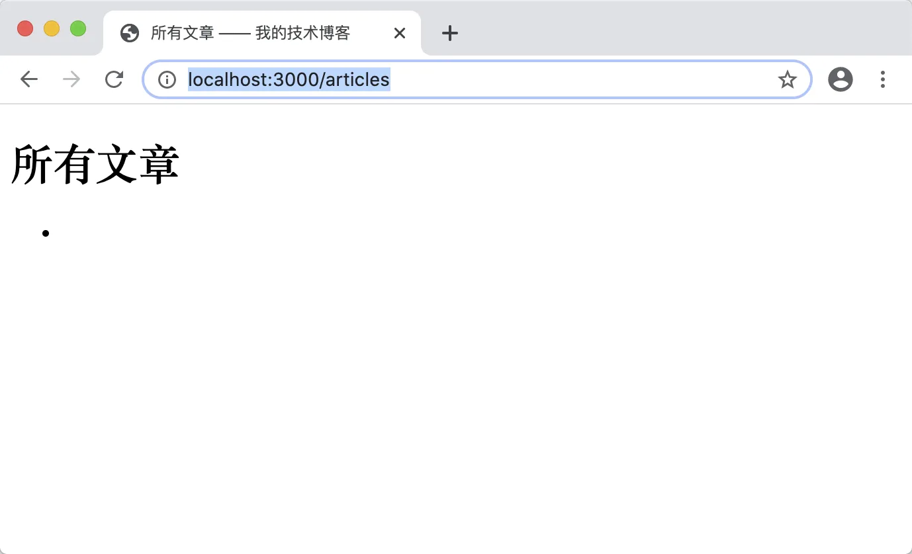
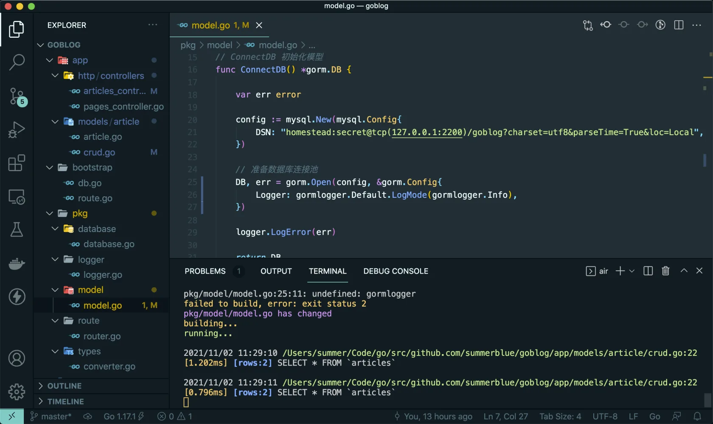
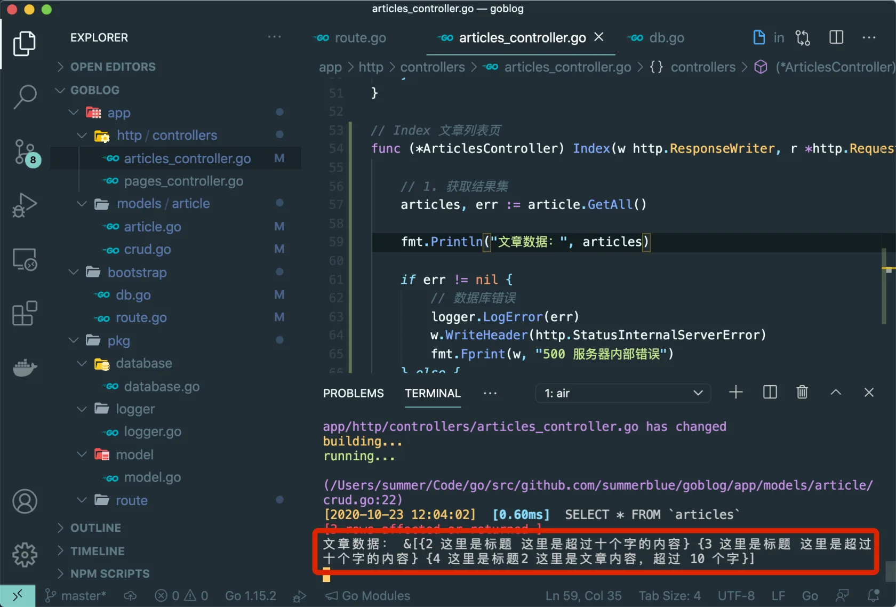
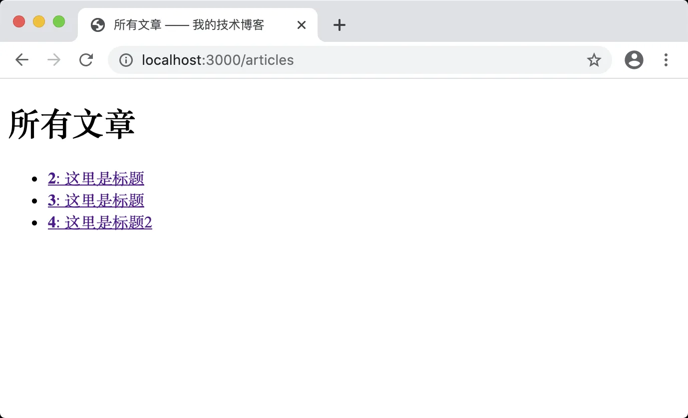

# 8.5. 重构文章列表

原文链接：https://learnku.com/courses/go-basic/1.22/refactoring-the-article-list/16518

## 说明

本节一起来将 main 中的文章列表逻辑挪到文章控制器里。

## 路由

先把 main.go 里的路由：

```
router.HandleFunc("/articles", articlesIndexHandler).Methods("GET").Name("articles.index")
```

剪切到 web.go 中，并稍作修改：

routes/web.go

```
.
.
.
func  RegisterWebRoutes(r *mux.Router) {
.
.
.
r.HandleFunc("/articles", ac.Index).Methods("GET").Name("articles.index")
}
```

## 控制器方法

接下来添加控制器方法，将 main.go 中 articlesIndexHandler 函数剪切并黏贴到控制器中：

app/http/controllers/articles_controller.go

```
// Index 文章列表页
func (*ArticlesController) Index(w http.ResponseWriter, r *http.Request) {

// 1. 获取结果集
articles, err := article.GetAll()

if err != nil {
// 数据库错误
logger.LogError(err)
w.WriteHeader(http.StatusInternalServerError)
fmt.Fprint(w, "500 服务器内部错误")
} else {
// 2. 加载模板
tmpl, err := template.ParseFiles("resources/views/articles/index.gohtml")
logger.LogError(err)

// 3. 渲染模板，将所有文章的数据传输进去
err = tmpl.Execute(w, articles)
logger.LogError(err)
}
}
```

获取文章列表那块我们封装到模型的 GetAll 方法里。接下来创建这个方法：

app/models/article/crud.go

```
// GetAll 获取全部文章
func GetAll() ([]Article, error) {
var articles []Article
if err := model.DB.Find(&articles).Error; err != nil {
return articles, err
}
return articles, nil
}
```

将 map 类型的 Article 对象传参到 `Find()` 方法内，即可获取到所有文章数据。以上等同于之前的：

```
// 1. 执行查询语句，返回一个结果集
rows, err := db.Query("SELECT * from articles")
logger.LogError(err)
defer rows.Close()

var articles []Article
//2. 循环读取结果
for rows.Next() {
var article Article
// 2.1 扫码每一行的结果并赋值到一个 article 对象中
err := rows.Scan(&article.ID, &article.Title, &article.Body)
logger.LogError(err)
// 2.2 将 article 追加到 articles 的这个数组中
articles = append(articles, article)
}
// 2.3 检测循环时是否发生错误
err = rows.Err()
logger.LogError(err)
```

可见，除了代码精简、可读性以外，不需要时刻记住关闭连接，也是使用 GORM 的优势之一。

## 测试一下

重构完成，接下来使用浏览器访问 [localhost:3000/articles](http://localhost:3000/articles) ：



没有数据。

## 调试程序

我们来调试一下，看看哪里出了问题。

首先我们重构了数据库读取的逻辑，很有可能是这块有问题。但是我们做了很多 err 的检测，有错误的话会在命令里显示，然而我们的命令行是正常的。

GORM 提供了一个调试功能，允许我们在命令行里查看请求的 SQL 信息，我们将其开启：

pkg/model/model.go

```
// Package model 应用模型数据层
package model

import (
"goblog/pkg/logger"

"gorm.io/gorm"
gormlogger "gorm.io/gorm/logger"

// GORM 的 MSYQL 数据库驱动导入
"gorm.io/driver/mysql"
)

// DB gorm.DB 对象
var DB *gorm.DB

// ConnectDB 初始化模型
func ConnectDB() *gorm.DB {

var err error

config := mysql.New(mysql.Config{
DSN: "root:secret@tcp(127.0.0.1:3306)/goblog?charset=utf8&parseTime=True&loc=Local",
})

// 准备数据库连接池
DB, err = gorm.Open(config, &gorm.Config{
Logger: gormlogger.Default.LogMode(gormlogger.Info),
})

logger.LogError(err)

return DB
}
```

注意顶部的 import 语句，导入 gorm/logger 时，因 goblog/pkg/logger 名称冲突，故为其指定名称：

```
gormlogger "gorm.io/gorm/logger"
```

gorm.Config 允许我们为设置初始化配置信息，其中 Logger 可用来指定和配置 GORM 的调试器，例如说命令行打印 SQL 语句等。

LogMode 里填写的是日志级别，分别如下：

- Silent ——  静默模式，不打印任何信息

- Error —— 发生错误了才打印

- Warn —— 发生警告级别以上的错误才打印

- Info —— 打印所有信息，包括 SQL 语句

默认使用的是 Warn ，我们将其改为 Info。

浏览器里刷新 [localhost:3000/articles](http://localhost:3000/articles) 页面，命令行可见：



```
[1.202ms] [rows:2] SELECT * FROM `articles`
```

`[rows:2]` 意味着从数据库了成功取出了两条数据。

我们试着在控制器里打印一下 articles 变量：

app/http/controllers/articles_controller.go

```
.
.
.
// Index 文章列表页
func (*ArticlesController) Index(w http.ResponseWriter, r *http.Request) {

// 1. 获取结果集
articles, err := article.GetAll()

fmt.Println("文章数据：", articles)

.
.
.
}
```

浏览器里刷新 [localhost:3000/articles](http://localhost:3000/articles) 页面，观察命令行：



数据没问题。我们再往下看，应该是模板里面有问题：

resources/views/articles/index.gohtml

```
<!DOCTYPE html>
<html lang="en">
<head>
<title>所有文章 —— 我的技术博客</title>
<style type="text/css">.error {color: red;}</style>
</head>
<body>
<h1>所有文章</h1>
<ul>
{{ range $key, $article := . }}
<li><a href="{{ $article.Link }}"><strong>{{ $article.ID }}</strong>: {{ $article.Title }}</a></li>
{{ end }}
</ul>
</body>
</html>
```

看到了 `$article.Link` 这是一个对象方法，我们还未创建，前往main 里，将以下方法：

```
// Link 方法用来生成文章链接
func (a Article) Link() string {
showURL, err := router.Get("articles.show").URL("id", strconv.FormatInt(a.ID, 10))
if err != nil {
logger.LogError(err)
return ""
}
return showURL.String()
}
```

剪切到模型中，并稍作修改:

app/models/article/article.go

```
.
.
.
// Link 方法用来生成文章链接
func (article Article) Link() string {
return route.Name2URL("articles.show", "id", strconv.FormatUint(article.ID, 10))
}
```

因为上面我们修改了 ID 类型为 Uint64 ，`strconv.FormatInt(article.ID, 10)` 代码已经不适用，改为 `strconv.FormatUint(article.ID, 10)`

浏览器里刷新 [localhost:3000/articles](http://localhost:3000/articles) 页面：



问题解决。

## 清理代码

### 1. 删除调试信息

请前往 app/http/controllers/articles_controller.go，删除一下这一行：

```
fmt.Println("文章数据：", articles)
```

### 2. 日志级别

日常开发，日志级别为 Warn 即可，否则命令太多信息会反而容易让我们错过重要的信息。请前往 pkg/model/model.go 将以下一行的 `gormlogger.Info` 改为 `gormlogger.Warn`：

```
Logger: gormlogger.Default.LogMode(gormlogger.Warn),
```

## 删除无用代码

打开 main.go，请确保 articlesIndexHandler 和 Link 这两个函数均已删除。

## 代码版本

开始下一节之前，我们先来为代码做下版本标记：

```
$ git add .
$ git commit -m "重构文章列表页面"
```
