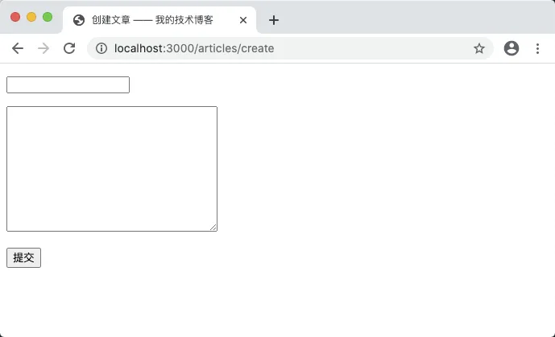
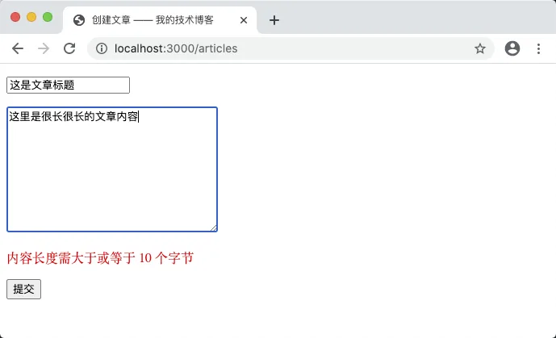
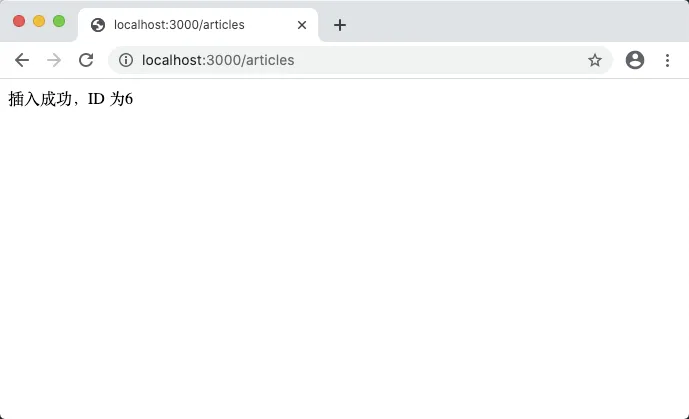

# 8.6. 重构创建文章

原文链接：https://learnku.com/courses/go-basic/1.22/refactoring-to-create-articles/16519

## 说明

上一节我们处理好文章显示相关的逻辑，本节我们来重构文章创建部分的功能。

## 路由

在 main.go 中，剪切以下两行代码：

```
router.HandleFunc("/articles", articlesStoreHandler).Methods("POST").Name("articles.store")
router.HandleFunc("/articles/create", articlesCreateHandler).Methods("GET").Name("articles.create")
```

加以修改并注册到我们的 web.go 文件中：

routes/web.go

```
.
.
.
// RegisterWebRoutes 注册网页相关路由
func  RegisterWebRoutes(r *mux.Router) {
.
.
.
r.HandleFunc("/articles/create", ac.Create).Methods("GET").Name("articles.create")
r.HandleFunc("/articles", ac.Store).Methods("POST").Name("articles.store")
}
```

VSCode 会提示 ac.Create 和 ac.Store 不存在，接下来我们逐个创建。

## 表单页面

app/http/controllers/articles_controller.go

```
.
.
.

// ArticlesFormData 创建博文表单数据
type ArticlesFormData struct {
Title, Body string
URL         string
Errors      map[string]string
}

// Create 文章创建页面
func (*ArticlesController) Create(w http.ResponseWriter, r *http.Request) {

storeURL := route.Name2URL("articles.store")
data := ArticlesFormData{
Title:  "",
Body:   "",
URL:    storeURL,
Errors: nil,
}
tmpl, err := template.ParseFiles("resources/views/articles/create.gohtml")
if err != nil {
panic(err)
}

err = tmpl.Execute(w, data)
if err != nil {
panic(err)
}
}

// Store 文章创建页面
func (*ArticlesController)  Store(w http.ResponseWriter, r *http.Request)  {
// 占位符，让 Go 编译器通过
}
```

新建文章的表单页面比较简单，把生成 storeURL 的调用改为 `route.Name2URL` 即可。

浏览器尝试访问 [localhost:3000/articles/create](http://localhost:3000/articles/create) ：



符合预期。接下来处理保存文章的逻辑。

## 保存文章

前往 main.go 中将 `articlesStoreHandler` 的声明复制到文章控制器中并稍加修改，替换掉上面创建的 `Store` 方法：

app/http/controllers/articles_controller.go

```
.
.
.

func validateArticleFormData(title string, body string) map[string]string {
errors := make(map[string]string)
// 验证标题
if title == "" {
errors["title"] = "标题不能为空"
} else if utf8.RuneCountInString(title) < 3 || utf8.RuneCountInString(title) > 40 {
errors["title"] = "标题长度需介于 3-40"
}

// 验证内容
if body == "" {
errors["body"] = "内容不能为空"
} else if utf8.RuneCountInString(body) < 10 {
errors["body"] = "内容长度需大于或等于 10 个字节"
}

return errors
}

// Store 文章创建页面
func (*ArticlesController) Store(w http.ResponseWriter, r *http.Request) {

title := r.PostFormValue("title")
body := r.PostFormValue("body")

errors := validateArticleFormData(title, body)

// 检查是否有错误
if len(errors) == 0 {
lastInsertID, err := saveArticleToDB(title, body)
if lastInsertID > 0 {
fmt.Fprint(w, "插入成功，ID 为"+strconv.FormatUint(lastInsertID, 10))
} else {
logger.LogError(err)
w.WriteHeader(http.StatusInternalServerError)
fmt.Fprint(w, "500 服务器内部错误")
}
} else {

storeURL := route.Name2URL("articles.store")

data := ArticlesFormData{
Title:  title,
Body:   body,
URL:    storeURL,
Errors: errors,
}
tmpl, err := template.ParseFiles("resources/views/articles/create.gohtml")

logger.LogError(err)

err = tmpl.Execute(w, data)
logger.LogError(err)
}
}
```

validateArticleFormData 我们先复制一份过来，后面再尝试对表单验证这块做修改，目前先专注于让程序可以正常运转上。

saveArticleToDB 提示不存在，我们需要在 Article 模型中创建。因为是属于 CRUD 一类的操作，我们放置于 crud.go 文件中：

app/models/article/crud.go

```
.
.
.

// Create 创建文章，通过 article.ID 来判断是否创建成功
func (article *Article) Create() (err error) {
result := model.DB.Create(&article)
if err = result.Error; err != nil {
logger.LogError(err)
return err
}

return nil
}
```

为了方便调用，我们将 Create 函数定义为 Article 的对象方法，这样就可以直接调用 GORM 的 `Create()` 直接传参当前对象指针执行创建操作。

GORM 的 `Create()` 有几个返回值可供判断：

```
article.ID             // 返回插入数据的主键
result.Error           // Create结果返回 error
result.RowsAffected    // 返回插入记录的条数
```

在创建拥有自增 ID 的数据模型时，我们常用 ID 的值来判断是否插入成功，这个判断可以放置于控制器中。所以模型的 Create 方法，我们使用链式调用，可以这么写：

app/models/article/crud.go

```
.
.
.

// Create 创建文章，通过 article.ID 来判断是否创建成功
func (article *Article) Create() (err error) {
if err = model.DB.Create(&article).Error; err != nil {
logger.LogError(err)
return err
}

return nil
}
```

接下来修改 Store 里的调用：

app/http/controllers/articles_controller.go

```
.
.
.
// Store 文章创建页面
func (*ArticlesController) Store(w http.ResponseWriter, r *http.Request) {
.
.
.
// 检查是否有错误
if len(errors) == 0 {
_article := article.Article{
Title: title,
Body:  body,
}
_article.Create()
if _article.ID > 0 {
fmt.Fprint(w, "插入成功，ID 为"+strconv.FormatUint(_article.ID, 10))
} else {
w.WriteHeader(http.StatusInternalServerError)
fmt.Fprint(w, "创建文章失败，请联系管理员")
}
} else {
.
.
.
}
```

## 浏览器测试一下

打开 [localhost:3000/articles/create](http://localhost:3000/articles/create) ，并写入内容，可以尝试填入不符合要求的内容：



填入符合要求的内容提交以后：



一切符合预期。

## 删除无用代码

最后请前往 main.go 中，删除 articlesCreateHandler 和 articlesStoreHandler 两个函数定义。

另外 main.go 中的 saveArticleToDB 函数，也不会用到，请删除。

## 代码版本

开始下一节之前，我们先来为代码做下版本标记：

```
$ git add .
$ git commit -m "重构创建文章"
```
