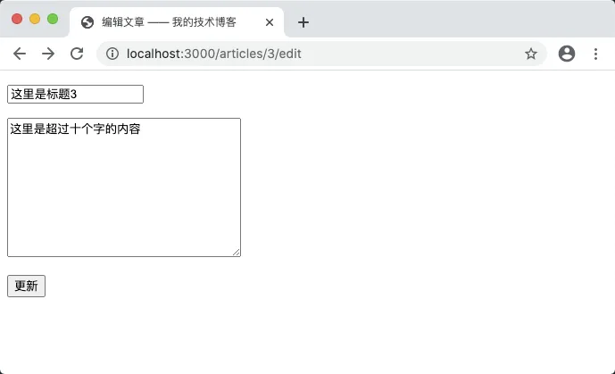
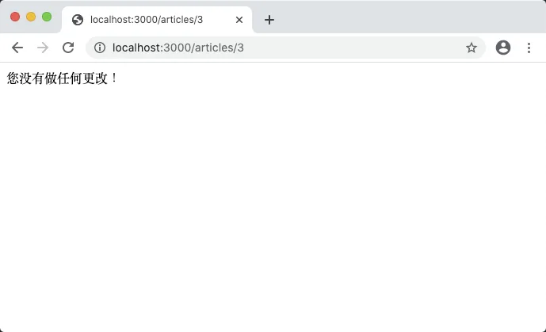

# 8.7. 重构更新文章

原文链接：https://learnku.com/courses/go-basic/1.22/refactoring-and-updating-articles/16520

## 说明

上节我们重构了创建文章，本节将重构更新文章功能。

## 路由

前往 main.go 中：

```
router.HandleFunc("/articles/{id:[0-9]+}/edit", articlesEditHandler).Methods("GET").Name("articles.edit")
router.HandleFunc("/articles/{id:[0-9]+}", articlesUpdateHandler).Methods("POST").Name("articles.update")
```

将以上两行代码剪切到 web.go 路由文件中：

routes/web.go

```go
.
.
.
// RegisterWebRoutes 注册网页相关路由
func RegisterWebRoutes(r *mux.Router) {
    .
    .
    .

    r.HandleFunc("/articles/{id:[0-9]+}/edit", ac.Edit).Methods("GET").Name("articles.edit")
    r.HandleFunc("/articles/{id:[0-9]+}", ac.Update).Methods("POST").Name("articles.update")
}
```

VSCode 编辑器会提示 Edit 和 Update 方法不存在，接下来创建他们。

## 更新文章表单

我们先来处理更新文章的表单页面。

前往 main.go 中，将 articlesEditHandler 剪切到文章控制器并稍加修改：

app/http/controllers/articles_controller.go

```go
.
.
.
// Edit 文章更新页面
func (*ArticlesController) Edit(w http.ResponseWriter, r *http.Request) {

	// 1. 获取 URL 参数
	id := route.GetRouteVariable("id", r)

	// 2. 读取对应的文章数据
	article, err := article.Get(id)

	// 3. 如果出现错误
	if err != nil {
		if err == gorm.ErrRecordNotFound {
			// 3.1 数据未找到
			w.WriteHeader(http.StatusNotFound)
			fmt.Fprint(w, "404 文章未找到")
		} else {
			// 3.2 数据库错误
			logger.LogError(err)
			w.WriteHeader(http.StatusInternalServerError)
			fmt.Fprint(w, "500 服务器内部错误")
		}
	} else {
		// 4. 读取成功，显示编辑文章表单
		updateURL := route.Name2URL("articles.update", "id", id)
		data := ArticlesFormData{
			Title:  article.Title,
			Body:   article.Body,
			URL:    updateURL,
			Errors: nil,
		}
		tmpl, err := template.ParseFiles("resources/views/articles/edit.gohtml")
		logger.LogError(err)

		err = tmpl.Execute(w, data)
		logger.LogError(err)
	}
}
```

VSCode 会提示 getRouteVariable 、getArticleByID 和 router 不存在，分别替换成我们现有的方案即可。

需要注意的是错误判断那里需要使用 `err == gorm.ErrRecordNotFound` 进行处理。

## 更新文章

接下来处理更新文章方法。

同样的，把 main.go 中的 articlesUpdateHandler 剪切到控制器中，然后跟着 VSCode 的错误提示一个个进行修改：

```go
// Update 更新文章
func (*ArticlesController) Update(w http.ResponseWriter, r *http.Request) {

	// 1. 获取 URL 参数
	id := route.GetRouteVariable("id", r)

	// 2. 读取对应的文章数据
	_article, err := article.Get(id)

	// 3. 如果出现错误
	if err != nil {
		if err == gorm.ErrRecordNotFound {
			// 3.1 数据未找到
			w.WriteHeader(http.StatusNotFound)
			fmt.Fprint(w, "404 文章未找到")
		} else {
			// 3.2 数据库错误
			logger.LogError(err)
			w.WriteHeader(http.StatusInternalServerError)
			fmt.Fprint(w, "500 服务器内部错误")
		}
	} else {
		// 4. 未出现错误

		// 4.1 表单验证
		title := r.PostFormValue("title")
		body := r.PostFormValue("body")

		errors := validateArticleFormData(title, body)

		if len(errors) == 0 {

			// 4.2 表单验证通过，更新数据
			_article.Title = title
			_article.Body = body

			rowsAffected, err := _article.Update()

			if err != nil {
				// 数据库错误
				w.WriteHeader(http.StatusInternalServerError)
				fmt.Fprint(w, "500 服务器内部错误")
				return
			}

			// √ 更新成功，跳转到文章详情页
			if rowsAffected > 0 {
				showURL := route.Name2URL("articles.show", "id", id)
				http.Redirect(w, r, showURL, http.StatusFound)
			} else {
				fmt.Fprint(w, "您没有做任何更改！")
			}
		} else {

			// 4.3 表单验证不通过，显示理由

			updateURL := route.Name2URL("articles.update", "id", id)
			data := ArticlesFormData{
				Title:  title,
				Body:   body,
				URL:    updateURL,
				Errors: errors,
			}
			tmpl, err := template.ParseFiles("resources/views/articles/edit.gohtml")
			logger.LogError(err)

			err = tmpl.Execute(w, data)
			logger.LogError(err)
		}
	}
}
```

需要注意的是 gorm.ErrRecordNotFound 的使用。

主要重点在注释 `4.2 表单验证通过，更新数据` 那块，我们调用了 `_article.Update()` 方法，此方法未定义，前往模型中创建：

app/models/article/crud.go

```go
.
.
.
// Update 更新文章
func (article *Article) Update() (rowsAffected int64, err error) {
	result := model.DB.Save(&article)
	if err = result.Error; err != nil {
		logger.LogError(err)
		return 0, err
	}

	return result.RowsAffected, nil
}
```

我们调用 GORM 的 `Save()` 方法进行更新处理，返回结果有两个元素可以判断：

```
result.RowsAffected // 更新的记录数
result.Error        // 更新的错误
```

我们返回的是 `result.RowsAffected`，文章控制器里接收到返回值后，即可对更新结果进行判断，如果 err 不为 nil 即数据库发生错误，如果 rowsAffected 大于零则更新成功：

```
if err != nil {
// 数据库错误
w.WriteHeader(http.StatusInternalServerError)
fmt.Fprint(w, "500 服务器内部错误")
return
}

// √ 更新成功，跳转到文章详情页
if rowsAffected > 0 {
showURL := route.Name2URL("articles.show", "id", id)
http.Redirect(w, r, showURL, http.StatusFound)
} else {
fmt.Fprint(w, "您没有做任何更改！")
}
```

## 测试一下

访问 [localhost:3000/articles/3/edit](http://localhost:3000/articles/3/edit) ，修改内容并提交，看看内容是否修改：



如果不修改内容进行提交，也会有相应的提示：



## 删除无用代码

前往 main.go 中，请确保 articlesEditHandler 、 articlesUpdateHandler、validateArticleFormData、ArticlesFormData struct  已删除。

## 代码版本

开始下一节之前，我们先来为代码做下版本标记：

```bash
$ git add .
$ git commit -m "重构更新文章"
```
