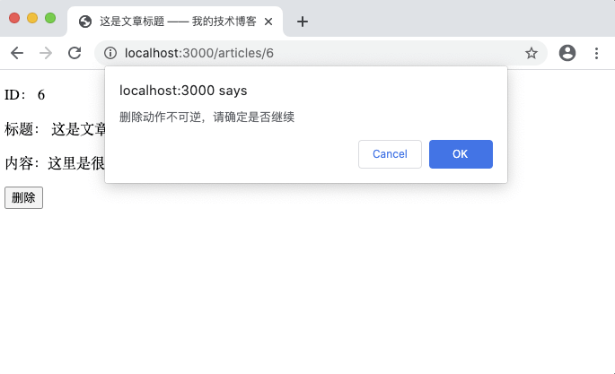

# 8.8. 重构删除文章

原文链接：https://learnku.com/courses/go-basic/1.22/refactoring-delete-article/16521

## 说明

上节我们处理了文章更新相关逻辑，本节我们将继续重构文章删除功能。

## 路由

前往 main.go 中，将以下这一行剪切：

```
router.HandleFunc("/articles/{id:[0-9]+}/delete", articlesDeleteHandler).Methods("POST").Name("articles.delete")
```

黏贴到 web.go 路由文件中并稍作修改：

routes/web.go

```
.
.
.
// RegisterWebRoutes 注册网页相关路由
func RegisterWebRoutes(r *mux.Router) {
.
.
.
r.HandleFunc("/articles/{id:[0-9]+}/delete", ac.Delete).Methods("POST").Name("articles.delete")
}
```

## 控制器

接下来将 main.go 中的 articlesDeleteHandler 复制到文章控制器中，并跟着 VSCode 的错误提示走，一步步进行修改：

app/http/controllers/articles_controller.go

```
.
.
.

// Delete 删除文章
func (*ArticlesController) Delete(w http.ResponseWriter, r *http.Request) {

// 1. 获取 URL 参数
id := route.GetRouteVariable("id", r)

// 2. 读取对应的文章数据
_article, err := article.Get(id)

// 3. 如果出现错误
if err != nil {
if err == gorm.ErrRecordNotFound {
// 3.1 数据未找到
w.WriteHeader(http.StatusNotFound)
fmt.Fprint(w, "404 文章未找到")
} else {
// 3.2 数据库错误
logger.LogError(err)
w.WriteHeader(http.StatusInternalServerError)
fmt.Fprint(w, "500 服务器内部错误")
}
} else {
// 4. 未出现错误，执行删除操作
rowsAffected, err := _article.Delete()

// 4.1 发生错误
if err != nil {
// 应该是 SQL 报错了
w.WriteHeader(http.StatusInternalServerError)
fmt.Fprint(w, "500 服务器内部错误")
} else {
// 4.2 未发生错误
if rowsAffected > 0 {
// 重定向到文章列表页
indexURL := route.Name2URL("articles.index")
http.Redirect(w, r, indexURL, http.StatusFound)
} else {
// Edge case
w.WriteHeader(http.StatusNotFound)
fmt.Fprint(w, "404 文章未找到")
}
}
}
}
```

`_article.Delete()` 还未创建，前往模型文件中：

app/models/article/crud.go

```
.
.
.
// Delete 删除文章
func (article *Article) Delete() (rowsAffected int64, err error) {
result := model.DB.Delete(&article)
if err = result.Error; err != nil {
logger.LogError(err)
return 0, err
}

return result.RowsAffected, nil
}
```

## 测试一下

打开 [localhost:3000/articles](http://localhost:3000/articles) ，点击任意一篇文章，注意看文章的 ID 是多少，点击删除按钮：



点击确定，成功的话会跳转到列表页，可以看到刚刚的文章已经被删除。

## 清理无用代码

前往 main.go 文件，确保 articlesDeleteHandler、getArticleByID、Delete 方法，Article struct，以及 getRouteVariable 均被删除。

## 代码版本

开始下一节之前，我们先来为代码做下版本标记：

```
$ git add .
$ git commit -m "重构删除文章"
```
