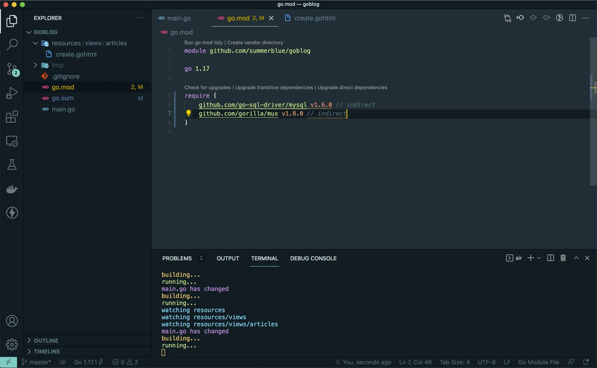

# 6.1. MySQL 驱动

原文链接：https://learnku.com/courses/go-basic/1.22/mysql-driver/16496

## 说明

目前为止，我们能接收到用户提交过来的数据，且对这些数据做验证。也已经开发完成验证错误的逻辑。

从这一节开始，我们将来开发验证成功后的逻辑，做数据持久化，或简单来讲 —— 把数据存到数据库里。

## 操作 MySQL 数据库

我们将使用 MySQL 来做主要存储数据库。

使用 Go 操作 MySQL 等数据库，一般有两种方式：

- 一是利用 database/sql 接口，直接在代码里硬编码 sql 语句；

- 二是使用 ORM，具体一点是 GORM，以对象关系映射的方式在抽象地操作数据库。

我们会先使用第一种方式来实现，让大家熟悉下 database/sql 接口，这是基本功，需要先练习一下。

随着项目开发的深入，需要大量数据查询时，我们会统一重构为使用 ORM 的方式。

## MySQL 驱动

Go 官方提供了`database/sql`包来给用户进行和数据库打交道的工作，`database/sql`库实际只提供了一套操作数据库的接口和规范，例如抽象好的 SQL 预处理（prepare），连接池管理，数据绑定，事务，错误处理等。官方并没有提供具体某种数据库驱动。

>

小提示： 维护标准接口的好处是 —— 将数据库操作抽象出来，相当于同一份代码可用于多种数据库中，只需要换个驱动而已。比较常见的场景 —— 生产环境使用 MySQL / PostgreSQL 等专业数据库，测试时可使用速度更快的内存 SQLite 数据库。

操作具体的数据库，例如说 MySQL，还需要再引入对应的数据库驱动。官方提供了 [这个 Wiki 页面](https://github.com/golang/go/wiki/SQLDrivers) 用以罗列第三方数据库驱动，我们常用的数据库基本上都有完整的第三方实现。

本课程中，我们将选用 [github.com/go-sql-driver/mysql](https://github.com/go-sql-driver/mysql) 项目作为我们的数据库驱动。此驱动是 Go 语言中最知名的 MySQL 驱动，存在时间长，同类中 GitHub 点赞最多，项目维护也很活跃，是一个比较可靠的选择。

## 安装驱动

使用以下命令下载驱动：

```
$ go get github.com/go-sql-driver/mysql
```

下载成功后，打开 go.mod 可以看到：



多出来这一行：

```
github.com/go-sql-driver/mysql v1.6.0 // indirect
```

因为现在代码中还未使用到，所以会有 `indirect` 这个标示。驱动开始使用时，此标示会消失（由 VSCode 插件自动管理）。

这就算下载完成，接下来是在项目中引用：

```
package main

import (
.
.
.

_ "github.com/go-sql-driver/mysql"
)
.
.
.
```

注意导入 mysql 驱动时，在包路径前我们添加 `_`，这里使用了匿名导入的方式来加载驱动。

### 为什么需要匿名导入？

因为引入的是驱动，操作数据库时我们使用的是 sql 库里的方法，而不会具体使用到 `go-sql-driver/mysql`包里的方法，当有未使用的包被引入时，Go 编译器会停止编译。为了让编译器能正常运行，需要使用 匿名导入 来加载。

当导入了一个数据库驱动后，此驱动会自行初始化（利用 `init()` 函数）并注册自己到 Golang 的 database/sql 上下文中，驱动里的 `init()` 代码如下：

mysql/driver.go（ 详见 [go-sql-driver/mysql 源码](https://github.com/go-sql-driver/mysql/blob/master/driver.go#L83-L85) ）

```
func init() {
sql.Register("mysql", &MySQLDriver{})
}
```

随后我们就可以通过 database/sql 包提供的方法来操作数据库了。

>

注意： 细心的你可以注意到了，上面我们并未对 `database/sql` 进行导入。对于标准库的 import 我们让 VSCode 来管理，后面在代码中使用 `sql.DB` 并保存时，VSCode 会自动为我们 import `database/sql` 库。

>

知识点： Go 语言中，为了使用导入的程序包，必须首先对其进行初始化。初始化始终在单个线程中执行，并且以程序包依赖关系的顺序执行。初始化每个包后，会优先自动执行 `init()` 函数，并且执行优先级高于主函数的执行优先级。—— 详见 [翻译：详解 Go 语言中的 init () 函数](https://learnku.com/go/t/47178)

## go mod tidy

此时我们再使用 tidy 命令：

```
$ go mod tidy
```

打开 go.mod 文件可以看到 `// indirect` 标志会被去除。

## 代码版本

开始下一节之前，我们先来为代码做下版本标记：

```
$ git add .
$ git commit -m "添加 MySQL 驱动"
```
