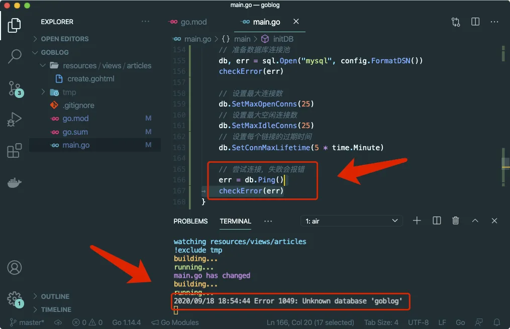
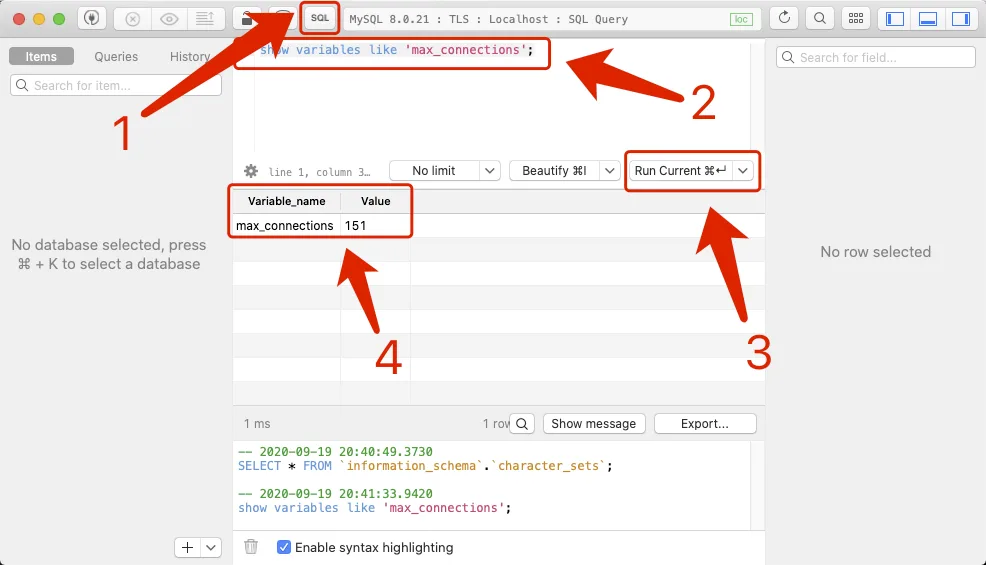

# 6.2. 连接数据库

原文链接：https://learnku.com/courses/go-basic/1.22/connect-to-database/16497

## 说明

上节我们安装了 MySQL 驱动，接下来我们将尝试连接数据库。

## 建立数据库连接

首先删除这一行：

```
_ "github.com/go-sql-driver/mysql"
```

修改代码：

main.go

```go
package main

import (
    "database/sql"
    "fmt"
    "log"
    "net/http"
    "net/url"
    "strings"
    "text/template"
    "time"
    "unicode/utf8"

    "github.com/go-sql-driver/mysql"
    "github.com/gorilla/mux"
)

var router = mux.NewRouter()
var db *sql.DB
.
.
.
func initDB() {

    var err error
    config := mysql.Config{
        User:                 "homestead",
        Passwd:               "secret",
        Addr:                 "127.0.0.1:3306",
        Net:                  "tcp",
        DBName:               "goblog",
        AllowNativePasswords: true,
    }

    // 准备数据库连接池
    db, err = sql.Open("mysql", config.FormatDSN())
    checkError(err)

    // 设置最大连接数
    db.SetMaxOpenConns(25)
    // 设置最大空闲连接数
    db.SetMaxIdleConns(25)
    // 设置每个链接的过期时间
    db.SetConnMaxLifetime(5 * time.Minute)

    // 尝试连接，失败会报错
    err = db.Ping()
    checkError(err)
}

func checkError(err error) {
    if err != nil {
        log.Fatal(err)
    }
}

func main() {
    initDB()

    .
    .
    .
}
```

### 代码概览

首先我们设置了变量：

```go
var db *sql.DB
```

变量范围是包层面的，主要是方便各个函数中访问。

`sql.DB` 结构体是 database/sql 包封装的一个数据库操作对象，包含了操作数据库的基本方法，通常情况下，我们把它理解为 连接池对象。

接下来在 main 函数中调用了 `initDB()` 函数，以对 `sql.DB` 进行初始化。此函数需在路由之前调用，将数据库连接准备就绪，以备后用。

### DSN 信息

接下来看下 `initDB()` 函数：

```
// 设置数据库连接信息
config := mysql.Config{
User:                 "homestead",
Passwd:               "secret",
Addr:                 "127.0.0.1:3306",
Net:                  "tcp",
DBName:               "goblog",
AllowNativePasswords: true,
}

// 准备数据库连接池
db, err = sql.Open("mysql", config.FormatDSN())
checkError(err)
```

>

注意： 请按你的实际情况修改以上的数据库连接信息。

为了方便阅读，我们利用 `mysql.Config` 来生成 DSN 信息。

#### 什么是 DSN 信息？

`DSN`全称为`Data Source Name`，表示 数据源信息，用于定义如何连接数据库。不同数据库的 DSN 格式是不同的，这取决于数据库驱动的实现，下面是 `go-sql-driver/sql` 的DSN格式，如下所示：

```
//[用户名[:密码]@][协议(数据库服务器地址)]]/数据库名称?参数列表
[username[:password]@][protocol[(address)]]/dbname[?param1=value1&...&paramN=valueN]
```

`FormatDSN()` 是 `mysql.Config` 提供的用来生成 DSN 信息的方法，我们可以尝试把其生成的信息打印出来：

```
fmt.Println(config.FormatDSN())
```

会输出：

```
homestead:secret@tcp(127.0.0.1:3306)/goblog?checkConnLiveness=false&maxAllowedPacket=0
```

### sql.DB 连接池

一般而言，我们使用 `sql.Open()` 函数便可初始化并返回一个 `*sql.DB` 结构体实例，使用 `sql.Open()` 函数只要传入驱动名称及对应的 DSN 便可，使用很简单，也很通用：

```go
// driverName  表示驱动名，如 mysql, dataSourceName 为上文介绍的 DSN
func Open(driverName, dataSourceName string) (*sql.DB, error)
```

当需要连接不同数据库时，只需修改驱动名与 DSN 即可。

需要特别注意的是，调用 `sql.Open()` 时，并未开始连接数据库，只是为连接数据库做好准备而已。所以一般我们都会跟着一个 `db.Ping()` 来检测连接状态。

你可以试着把 `initDB()` 里的这两行注释掉：

```
err = db.Ping()
checkError(err)
```

目前来讲，我们还未创建 `goblog` 数据库，如果尝试建立数据库连接，应会发生错误，命令行会打印报错信息。然而注释掉以后运行程序，我们并未看到报错信息：


去除以上两行的注释后再次运行，可见命令行里报未知数据库 `goblog` 的错误：



也就是说，当 `db.Ping()` 时再尝试建立连接。

### sql.DB 连接池的配置信息

接下来讲解下几个配置信息：

```
// 设置最大连接数
db.SetMaxOpenConns(100)

// 设置最大空闲连接数
db.SetMaxIdleConns(25)

// 设置每个链接的过期时间
db.SetConnMaxLifetime(5 * time.Minute)
```

#### SetMaxOpenConns 最大连接数

设置连接池最大打开数据库连接数，<= 0 表示无限制，默认为 0。

问：应该设置多大呢？

[实验表明](https://learnku.com/go/t/49809)，在高并发的情况下，将值设为大于 10，可以获得比设置为 1 接近六倍的性能提升。而设置为 10 跟设置为 0（也就是无限制），在高并发的情况下，性能差距不明显。

问：是否越大越好？

需要考虑的是不要超出数据库系统设置的最大连接数。MySQL 数据库可使用以下命令来查询：

```
show variables like 'max_connections';
```

MySQL 8 默认是 151：



设置时不应该超过这个值，否则会出现 MySQL 错误：

```
MySQL: ERROR 1040: Too many connections
```

另外，还需要注意这个值是整个系统的，如有其他应用程序也在共享这个数据库，这个可以合理地控制小一点。

#### SetMaxIdleConns 空闲连接数

设置连接池最大空闲数据库连接数，<= 0 表示不设置空闲连接数，默认为 2。

[实验表明](https://learnku.com/go/t/49809)，在高并发的情况下，将值设为大于 0，可以获得比设置为 0 超过 20 倍的性能提升。

这是因为设置为 0 的情况下，每一个 SQL 连接执行任务以后就销毁掉了，执行新任务时又需要重新建立连接。很明显，重新建立连接是很消耗资源的一个动作。

设置空闲连接数，当有新任务进来时，直接使用这些随时待命的连接传输数据，以此达到节约资源，提高执行效率的目的。

问：是不是数值越大越好？

首先此值不能大于 `SetMaxOpenConns` 的值，大于的情况下 mysql 驱动会自动将其纠正。

其次需要考虑的是，长时间打开大量的数据库连接需要占用系统的内存和 CPU 资源。

还有一个情况是 MySQL 会有一个 `wait_timeout` 的设置，连接超过这个时间就会被自动关闭，默认情况下是 8 个小时。当 MySQL 关闭连接时，sql.DB 请求到的就是一个坏的连接，虽然 sql 包里已经做了处理，当请求到坏连接时会自动重连。但是在这种情况下，单次请求相当于建立了两次连接，消耗比设置为 0 还大，得不偿失。

所以回答上面的问题，不是越大越好，应根据实际情况选择合理的值。

#### SetConnMaxLifetime 过期时间

设置连接池里每一个连接的过期时间，过期会自动关闭。理论上来讲，在并发的情况下，此值越小，连接就会越快被关闭，也意味着更多的连接会被创建。

设置的值不应该超过 MySQL 的 `wait_timeout` 设置项（默认情况下是 8 个小时）。

此值也不宜设置过短，关闭和创建都是极耗系统资源的操作。

设置此值时，需要特别注意 SetMaxIdleConns 空闲连接数的设置。假如设置了 100 个空闲连接，过期时间设置了 1 分钟，在没有任何应用的 SQL 操作情况下，数据库连接每 1.6 秒就销毁和新建一遍。

这里的推荐，比较保守的做法是设置五分钟：

```
db.SetConnMaxLifetime(5 * time.Minute)
```

SetConnMaxLifetime 要求传参的是一个 `time.Duration` 对象，所以这里使用了 `time.Minute`，这也是我们初次使用标准库里的关于处理时间的包 —— time 。

## 代码版本

开始下一节之前，我们先来为代码做下版本标记：

```bash
$ git add .
$ git commit -m "连接数据库"
```
