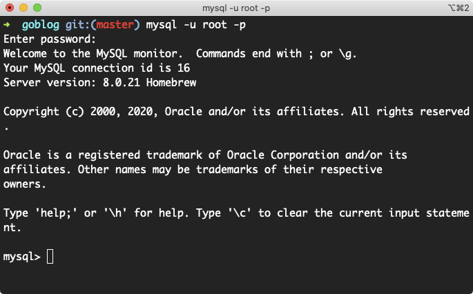
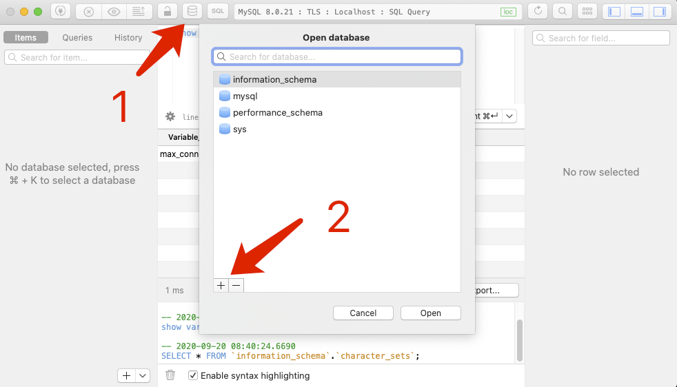
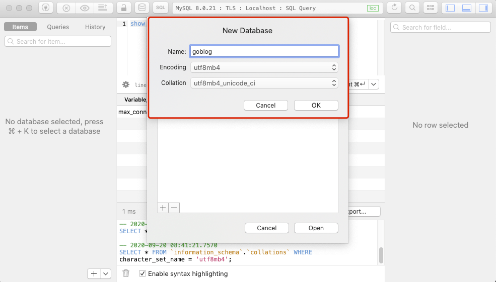

# 6.3. 数据库表结构

原文链接：https://learnku.com/courses/go-basic/1.22/database-table-structure/16498

## 说明

上一节我们已经已经建立好数据库连接，接下来将创建数据库与数据表。

## 新建数据库

有两个选项，接下来分别讲解。

### 选项 1. 命令行创建数据库

连接数据库通用格式:

```
mysql -P 端口号 -h 主机名或ip地址 -u 用户名 -p
```

端口默认是 `3306`，主机名默认为 `localhost`，如果你的 MySQL 连接信息的端口与主机名与默认值一致，可不传输，如以下：

```
$ mysql -u root -p
```

以上命令按回车键以后输入密码，认证成功即可进入：



接下来在 `mysql>` 的对话框里输入以下 SQL 语句以创建数据库：

```
CREATE DATABASE goblog CHARACTER SET utf8mb4 COLLATE utf8mb4_unicode_ci;
```

编码使用 `utf8mb4_unicode_ci` 是为了支持存储 Emoji，这在现代化的应用中是必要的。另外支持大小写不敏感（ci  是 Case Insensitive 的缩写）。

### 选项 2. 使用 TablePlus 图形工具

调用数据库窗口：



填入数据库名称以及编码：



至此数据库成功创建。

## 新建数据表

接下来我们将在代码中创建 articles 的数据表：

main.go

```
.
.
.

func createTables() {
createArticlesSQL := `CREATE TABLE IF NOT EXISTS articles(
id bigint(20) PRIMARY KEY AUTO_INCREMENT NOT NULL,
title varchar(255) COLLATE utf8mb4_unicode_ci NOT NULL,
body longtext COLLATE utf8mb4_unicode_ci
); `

_, err := db.Exec(createArticlesSQL)
checkError(err)
}

func main() {

initDB()
createTables()

.
.
.
}
```

我们创建一个函数 `createTables()` 来专门存放创建表结构的逻辑，调用时紧跟着 `initDB()`，我们希望数据库连接建立后开始这些操作。

>

小技巧： Go 语言中根据首字母的大小写来确定可以访问的权限。无论是函数名、方法名、常量、变量名还是结构体的名称，如果首字母大写，则可以被其他的包访问；如果首字母小写，则只能在本包中使用。可以简单的理解成，首字母大写是公有的，首字母小写是私有的。使用时，但凡不想作为公有方法提供，皆使用小写字母开头。

接下来看下 `createTables()` 方法：

```
func createTables() {
createArticlesSQL := `CREATE TABLE IF NOT EXISTS articles(
id bigint(20) PRIMARY KEY AUTO_INCREMENT NOT NULL,
title varchar(255) COLLATE utf8mb4_unicode_ci NOT NULL,
body longtext COLLATE utf8mb4_unicode_ci
); `

_, err := db.Exec(createArticlesSQL)
checkError(err)
}
```

首先使用了 SQL 的创建数据表语句：

```
CREATE TABLE IF NOT EXISTS articles(
...
```

加上 `IF NOT EXISTS` 允许我们多次执行，MySQL 不会报错。

### Exec 方法

```
_, err := db.Exec(createArticlesSQL)
```

我们使用 `Exec()` 来执行创建数据库表结构的语句。

一般使用 `sql.DB`中的`Exec()` 来执行没有返回结果集的 SQL 语句。例如 `INSERT`, `UPDATE`, `DELETE` 等语句。语法如下：

```
func (db *DB) Exec(query string, args ...interface{}) (Result, error)
```

`Exec()` 方法的第一个返回值为一个实现了`sql.Result`接口的类型，`sql.Result`的定义如下：

```
type Result interface {
LastInsertId() (int64, error)    // 使用 INSERT 向数据插入记录，数据表有自增 id 时，该函数有返回值
RowsAffected() (int64, error)    // 表示影响的数据表行数
}
```

我们可以用 `sql.Result` 中的 `LastInsertId()` 方法或 `RowsAffected()` 来判断 `SQL` 语句是否执行成功。

因为我们执行的是 `CREATE TABLE IF NOT EXISTS` 语句，会被重复执行，所以这里判断返回结果意义不大，主要判断返回的第二个参数 `err` 是否有问题。

后面课程中，下一节我们数据入库时也会用到此方法，届时再根据实例讲解多参数和返回结果的情况。

## 代码版本

开始下一节之前，我们先来为代码做下版本标记：

```
$ git add .
$ git commit -m "创建数据表"
```
