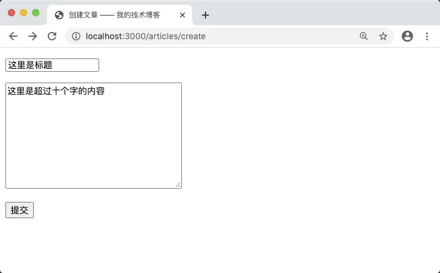
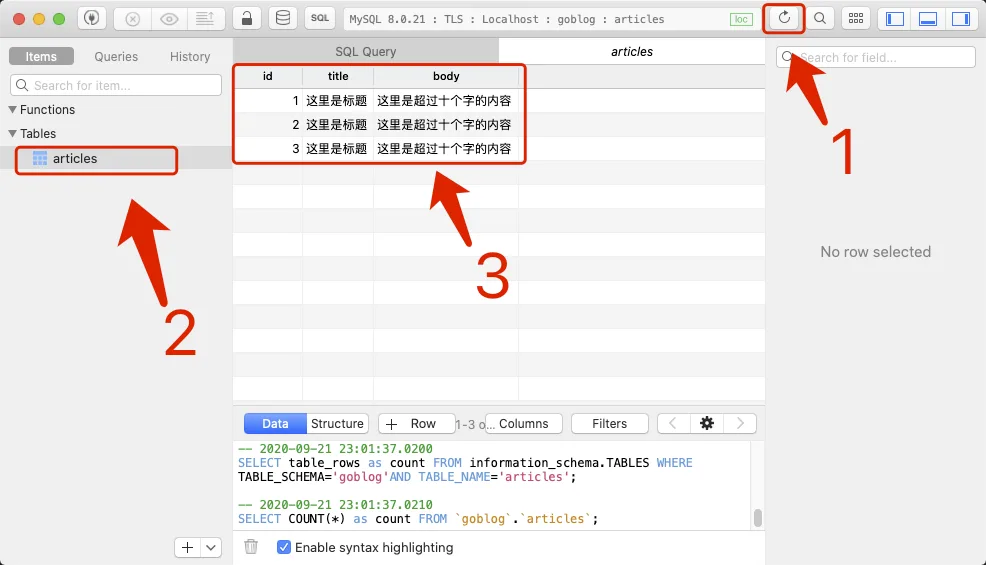

# 6.4. 插入数据

原文链接：https://learnku.com/courses/go-basic/1.22/insert-data/16499

## 说明

数据库连接和数据表皆准备就绪，接下来我们将继续 `articlesStoreHandler()` 函数里的逻辑，将验证成功的用户数据保存到数据库中。

## 插入数据

修改代码：

main.go

```go
.
.
.
func articlesStoreHandler(w http.ResponseWriter, r *http.Request) {
    .
    .
    .
    // 检查是否有错误
    if len(errors) == 0 {
        lastInsertID, err := saveArticleToDB(title, body)
        if lastInsertID > 0 {
            fmt.Fprint(w, "插入成功，ID 为"+strconv.FormatInt(lastInsertID, 10))
        } else {
            checkError(err)
            w.WriteHeader(http.StatusInternalServerError)
            fmt.Fprint(w,  "500 服务器内部错误")
        }
    } else {
        .
        .
        .
    }
}

func saveArticleToDB(title string, body string) (int64, error) {

    // 变量初始化
    var (
        id   int64
        err  error
        rs   sql.Result
        stmt *sql.Stmt
    )

    // 1. 获取一个 prepare 声明语句
    stmt, err = db.Prepare("INSERT INTO articles (title, body) VALUES(?,?)")
    // 例行的错误检测
    if err != nil {
        return 0, err
    }

    // 2. 在此函数运行结束后关闭此语句，防止占用 SQL 连接
    defer stmt.Close()

    // 3. 执行请求，传参进入绑定的内容
    rs, err = stmt.Exec(title, body)
    if err != nil {
        return 0, err
    }

    // 4. 插入成功的话，会返回自增 ID
    if id, err = rs.LastInsertId(); id > 0 {
        return id, nil
    }

    return 0, err
}
.
.
.
```

先看 `articlesStoreHandler()` 里的调用：

```
lastInsertID, err := saveArticleToDB(title, body)
if lastInsertID > 0 {
fmt.Fprint(w, "插入成功，ID 为"+strconv.FormatInt(lastInsertID, 10))
} else {
checkError(err)
w.WriteHeader(http.StatusInternalServerError)
fmt.Fprint(w,  "500 服务器内部错误")
}
```

为了方便阅读，我们将插入数据的操作封装到 `saveArticleToDB()`中，此方法接收标题和内容作为参数，返回插入成功 MySQL 返回的 `lastInsertID` 以及失败情况下的 `error` 信息。

在 SQL 没有执行错误的情况下，通常我们使用 `lastInsertID` 是否大于零来判断插入操作是否成功。

SQL 报错了提示用户内部错误。

## strconv 包的 FormatInt() 方法

```
fmt.Fprint(w, "插入成功，ID 为"+strconv.FormatInt(lastInsertID, 10))
```

需要注意的是，我们第一次使用 Go 标准库的 strconv 包。此包主要提供字符串和其他类型之间转换的函数。类型转换在脚本类语言例如说 PHP 或者 JS 中不需要太重视，但在 Go 强类型语言中是一个很重要的概念。

```
strconv.FormatInt(lastInsertID, 10)
```

这里我们使用到了 `FormatInt()` 方法来将类型为 `int64` 的 `lastInsertID` 转换为字符串。此方法的第二个参数 10 为十进制。

## saveArticleToDB() 函数

函数最顶端是变量声明：

```go
// 变量初始化
var (
	id   int64
	err  error
	rs   sql.Result
	stmt *sql.Stmt
)
```

多变量声明的方式与引入多个包使用 `import(...)` 同出一辙，都是 Go 语言为了让开发者少写代码而提供的简写方式。

### prepare 语句

接下来是真正将数据入库的操作：

```
// 1. 获取一个 prepare 声明语句
stmt, err = db.Prepare("INSERT INTO articles (title, body) VALUES(?,?)")
// 例行的错误检测
if err != nil {
return 0, err
}

// 2. 在此函数运行结束后关闭此语句，防止占用 SQL 连接
defer stmt.Close()

// 3. 执行请求，传参进入绑定的内容
rs, err = stmt.Exec(title, body)
if err != nil {
return 0, err
}
```

对于 Prepare 语句，常常会联想到以下：

>

永远不要相信用户提交过来数据。

这是 Web 工程师最需要铭记的箴言警句，为最糟糕的情况来做计划。从安全角度出发，把所有用户都当成是不怀好意的用户，他们时刻准备入侵你的系统，你必须保证他们提交的数据都得到完备的处理。

在数据库安全方面，Prepare 语句是防范 SQL 注入攻击有效且必备的手段。SQL 注入的例子请见 —— [翻译：Golang MySQL 驱动中的 Prepare 语句（防 SQL 注入）](https://learnku.com/go/t/49692#0e50ee) 。

#### sql.Stmt

当我们执行：

```
stmt, err = db.Prepare("INSERT INTO articles (title, body) VALUES(?,?)")
```

会使用 SQL 连接向 MySQL 服务器发送一次请求，此方法返回一个 `*sql.Stmt` 指针对象，我们将其赋值到 `stmt` 变量里。`stmt` 是 `statement` 的简写，是声明、陈述的意思。可以理解为将包含变量占位符 `?` 的语句先告知 MySQL 服务器端。

此时的 stmt 是一个指针变量，会占用 SQL 连接，我们需要对其进行关闭以释放 SQL 连接：

```
defer stmt.Close()
```

及时关闭 SQL 连接是很有必要的，否则很快就会遇到 `ERROR 1040: Too many connections` 的错误。

`defer` 延迟执行语句，Go 语言的 defer 语句会将其后面跟随的语句进行延迟处理，在 defer 归属的函数即将返回时，执行被延迟的语句。

#### stmt.Exec()

Prepare 只会生产 stmt ，真正执行请求的需要调用 `stmt.Exec()`：

```
rs, err = stmt.Exec(title, body)
```

`stmt.Exec()` 的参数依次对应 `db.Prepare()` 参数中 SQL 变量占位符 `?`：

```
INSERT INTO articles (title, body) VALUES(?,?)
```

返回值是一个 `sql.Result` 对象，定义如下：

```go
type Result interface {
	// 使用 INSERT 向数据插入记录，数据表有自增 ID 时，该函数有返回值
	LastInsertId() (int64, error)
	// 表示影响的数据表行数，常用于 UPDATE/DELETE 等 SQL 语句中
	RowsAffected() (int64, error)
}
```

因为我们的 articles 表里有设置 `id` 字段为自增 ID，故在我们的代码中，使用 `rs.LastInsertId()` 来判断是否执行成功，成功的话就返回这条新创建数据的 ID：

```
// 4. 插入成功的话，会返回自增 ID
if id, err = rs.LastInsertId(); id > 0 {
return id, nil
}
```

## 测试一下

代码分解得差不多了，接下来浏览器打开 [localhost:3000/articles/create](http://localhost:3000/articles/create) 填入一些测试数据：



点击提交，可以看到提示：


多刷新几次，可以看到自增 ID 在增加。此时查看数据表里的内容：



可看到成功插入的数据。

## 代码版本

开始下一节之前，我们先来为代码做下版本标记：

```bash
$ git add .
$ git commit -m "保存博文到数据库"
```
