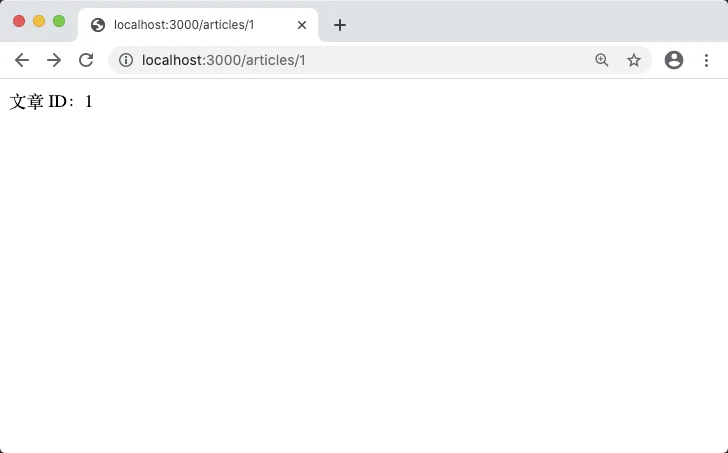
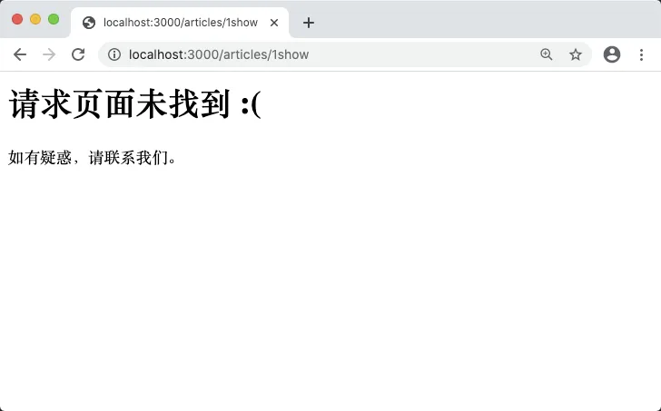
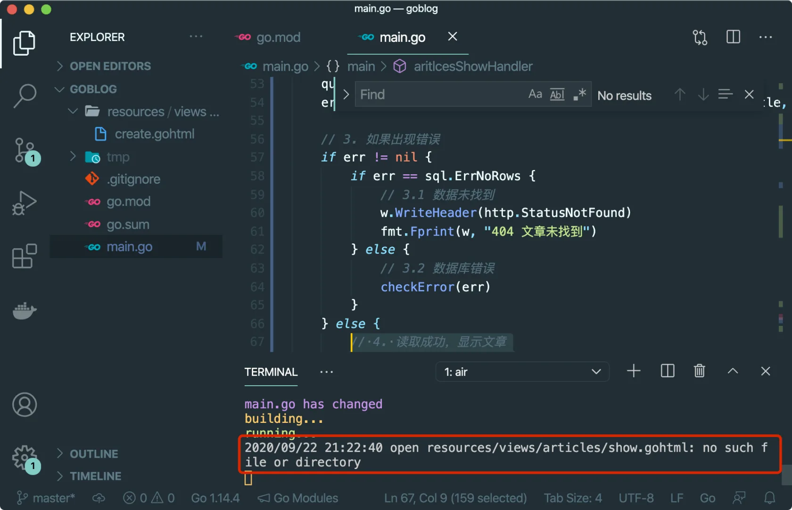
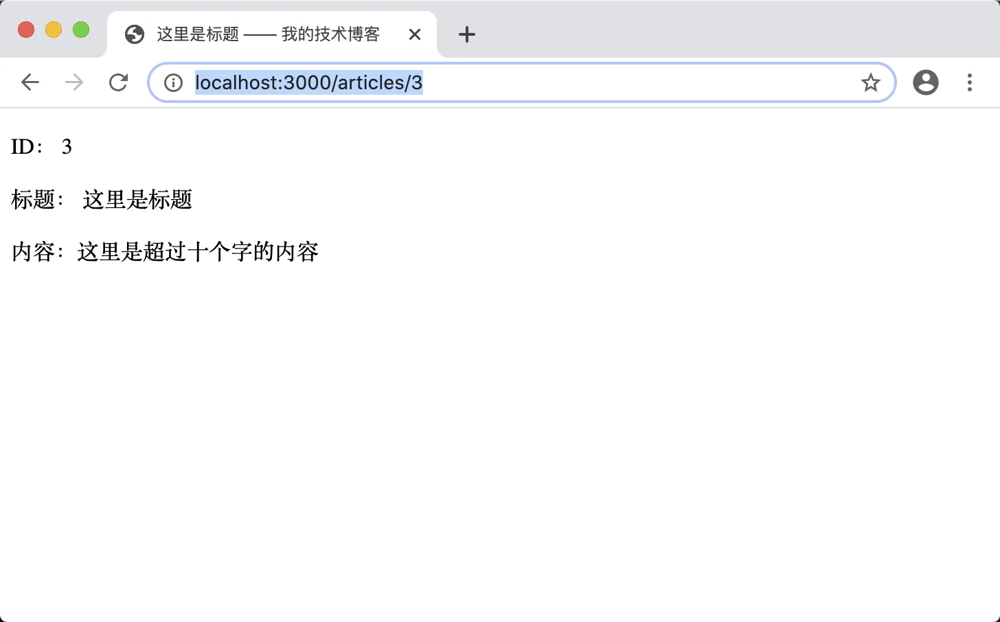

# 6.5. 显示文章

原文链接：https://learnku.com/courses/go-basic/1.22/show-article/16500

## 说明

上一节我们成功将表单数据存入到数据库中，接下来一起来看下如何显示文章。

显示文章分两个步骤：

1. 读取数据

2. 渲染模板

接下来我们各自说明。

## articles.show 路由

前面章节我们已在 `main()` 函数里设定 `articles.show` 路由，将其指定到 `articlesShowHandler()` 函数上：

```
router.HandleFunc("/articles/{id:[0-9]+}", articlesShowHandler).Methods("GET").Name("articles.show")
```

目前函数 `articlesShowHandler()` 里的代码：

```go
func articlesShowHandler(w http.ResponseWriter, r *http.Request) {
	vars := mux.Vars(r)
	id := vars["id"]
	fmt.Fprint(w, "文章 ID："+id)
}
```

获取并打印出来请求 ID，为确保此路由能正常工作，访问 [localhost:3000/articles/1](http://localhost:3000/articles/1) ，可见：



路由的规则是 `/articles/{id:[0-9]+}` 后面 id 部分是正则表达式限定了只能是数字，作为测试随意修改 id 部分的内容，访问 [localhost:3000/articles/1show](http://localhost:3000/articles/1show) ，可见：



与预期一致。

## 读取数据

接下来我们修改 `articlesShowHandler()` 函数：

main.go

```go
.
.
.
// Article  对应一条文章数据
type Article struct {
    Title, Body string
    ID          int64
}

func articlesShowHandler(w http.ResponseWriter, r *http.Request) {

    // 1. 获取 URL 参数
    vars := mux.Vars(r)
    id := vars["id"]

    // 2. 读取对应的文章数据
    article := Article{}
    query := "SELECT * FROM articles WHERE id = ?"
    err := db.QueryRow(query, id).Scan(&article.ID, &article.Title, &article.Body)

    // 3. 如果出现错误
    if err != nil {
        if err == sql.ErrNoRows {
            // 3.1 数据未找到
            w.WriteHeader(http.StatusNotFound)
            fmt.Fprint(w, "404 文章未找到")
        } else {
            // 3.2 数据库错误
            checkError(err)
            w.WriteHeader(http.StatusInternalServerError)
            fmt.Fprint(w, "500 服务器内部错误")
        }
    } else {
        // 4. 读取成功
        fmt.Fprint(w, "读取成功，文章标题 —— "+article.Title)
    }
}
.
.
.
```

### 代码解析

首先我们声明了一个 Article 的 struct，用以存储从数据库里读出来的文章数据：

```go
type Article struct {
	Title, Body string
	ID          int64
}
```

函数顶部是获取 URL 参数 `id` 的值：

```
// 1. 获取 URL 参数
vars := mux.Vars(r)
id := vars["id"]
```

接下来是根据 id 从数据库里读取对应的文章数据：

```
// 2. 读取对应的文章数据
article := Article{}
query := "SELECT * FROM articles WHERE id = ?"
err := db.QueryRow(query, id).Scan(&article.ID, &article.Title, &article.Body)
```

一般情况下，我们使用 `QueryRow()` 来读取单条数据。

### Prepare 模式

`QueryRow()` 是可变参数的方法，语法如下：

```go
func (db *DB) QueryRow(query string, args ...interface{}) *Row
```

它的参数可以为一个或者多个。参数只有一个的情况下，我们称之为纯文本模式，多个参数的情况下称之为 Prepare 模式。

之所以称之为 Prepare 模式是因为当多个参数的情况下，`QueryRow()` 封装了 Prepare 方法的调用，也就是说，下面这段代码：

```
err := db.QueryRow(query, id).Scan(&article.ID, &article.Title, &article.Body)
```

等同于：

```
stmt, err := db.Prepare(query)
checkError(err)
defer stmt.Close()
err = stmt.QueryRow(id).Scan(&article.ID, &article.Title, &article.Body)
```

你可以将以上代码做下替换，然后打开 [localhost:3000/articles/3](http://localhost:3000/articles/3) 试验一下。

使用 `QueryRow()` 的 Prepare 模式不仅保证了安全性，更能提升可读性。

关于 Prepare 模式和纯文本模式，这里还需提两点：

1. 使用 Prepare 模式会发送两个 SQL  请求到 MySQL 服务器上，而纯文本模式只有一个；

2. 在使用路由参数过滤只允许数字的情况下，可以放心使用纯文本模式无需担心 SQL 注入，这里有意使用 Prepare 模式是为了课程的需要。

### Scan() 方法

`QueryRow()` 会返回一个 `sql.Row` struct，紧接着我们使用链式调用的方式调用了 `sql.Row.Scan()` 方法：

```
db.QueryRow(query, id).Scan(&article.ID, &article.Title, &article.Body)
```

`Scan()` 将查询结果赋值到我们的 article struct 中，传参应与数据表字段的顺序保持一致。

需要注意的是，返回的 `sql.Row` 是个指针变量，保存有 SQL 连接。当调用 `Scan()` 时，就会将连接释放。所以在每次 QueryRow 后使用 Scan 是必须的。

我们极力推荐这种链式调用的方式，养成好习惯以避免掉进 SQL 连接不够用的坑。

### sql.ErrNoRows

当 `Scan()` 发现没有返回数据的话，会返回 `sql.ErrNoRows` 类型的错误，所以在做错误检查时需要区分到底是未找到数据或是 SQL 报错：

```
// 3. 如果出现错误
if err != nil {
if err == sql.ErrNoRows {
// 3.1 数据未找到
w.WriteHeader(http.StatusNotFound)
fmt.Fprint(w, "404 文章未找到")
} else {
// 3.2 数据库错误
checkError(err)
w.WriteHeader(http.StatusInternalServerError)
fmt.Fprint(w, "500 服务器内部错误")
}
} else {
// 4. 读取成功
fmt.Fprint(w, "读取成功，文章标题 —— "+article.Title)
}
```

当文章未找到的情况下，我们给响应 404 提示用户。而当数据库请求出错时，通常做法是记录错误日志，并响应 500 状态码给浏览器，且提示用户服务器发生错误。

日志记录我们先统一调用 `checkError()` 方法，教程后部分章节会系统性讲解日志记录相关知识。

至此数据读取的逻辑我们已经写完，接下来做数据展示。

## 渲染模板

首先我们在读取成功的逻辑部分加载模板：

main.go

```go
.
.
.
func articlesShowHandler(w http.ResponseWriter, r *http.Request) {

    .
    .
    .

    // 3. 如果出现错误
    if err != nil {
        .
        .
        .
    } else {
        // 4. 读取成功，显示文章
        tmpl, err := template.ParseFiles("resources/views/articles/show.gohtml")
        checkError(err)

        err = tmpl.Execute(w, article)
        checkError(err)
    }
}
.
.
.
```

保存成功后打开 [localhost:3000/articles/3](http://localhost:3000/articles/3) 刷新会出现无法访问的情况，应该是有错误发生，我们有使用 `checkError()` 函数进行错误记录，此时查看 VSCode 的终端：



报文件未找到的错误，接下来我们添加此文件：

resources/views/articles/show.gohtml

```
<!DOCTYPE html>
<html lang="en">
<head>
<title>{{ .Title }} —— 我的技术博客</title>
<style type="text/css">.error {color: red;}</style>
</head>
<body>
<p>ID： {{ .ID }}</p>
<p>标题： {{ .Title }}</p>
<p>内容：{{ .Body }}</p>
</body>
</html>
```

>

注意：如若不能访问，请重启 air 。

因为我们传参 Article struct 作为模板的绑定数据，模板中可使用 `{{ . }}` 直接访问属性。

保存成功后访问 [localhost:3000/articles/3](http://localhost:3000/articles/3) ：



可以看到成功显示文章内容。

## 代码版本

开始下一节之前，我们先来为代码做下版本标记：

```bash
$ git add .
$ git commit -m "显示文章"
```
