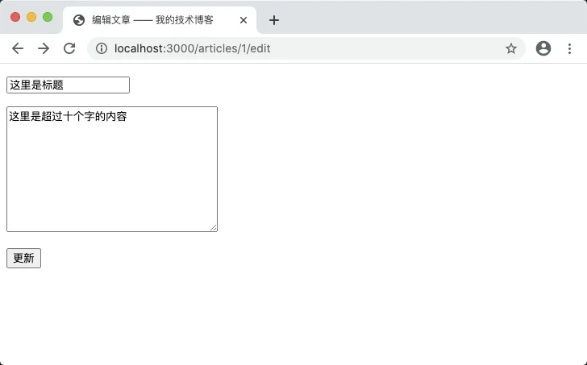
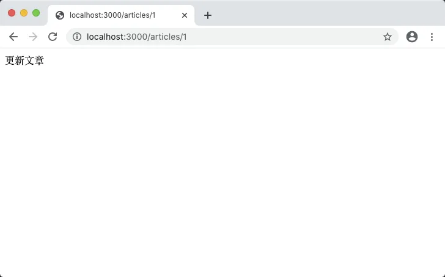
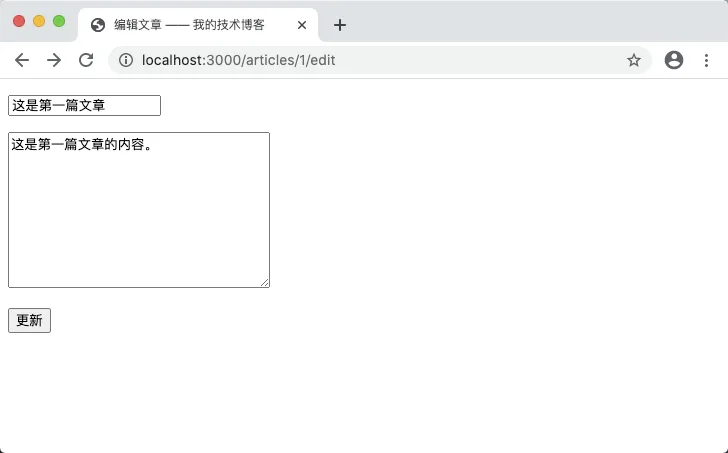
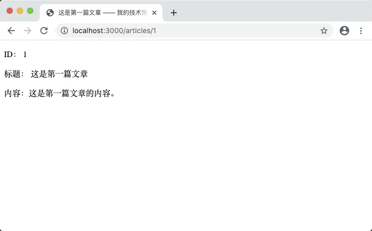
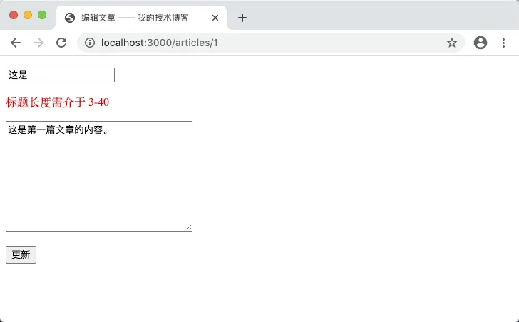

# 6.6. 编辑文章

原文链接：https://learnku.com/courses/go-basic/1.22/editing-articles/16501

## 说明

这一节我们来完成编辑文章的功能。

## 1. 添加路由

我们需要两个路由，一个显示编辑文章的表单，另一个处理提交过来的表单数据。

首先在 `articles.create` 路由后面加上它们：

```go
.
.
.
func  main() {
    .
    .
    .
    router.HandleFunc("/articles/create", articlesCreateHandler).Methods("GET").Name("articles.create")
    router.HandleFunc("/articles/{id:[0-9]+}/edit", articlesEditHandler).Methods("GET").Name("articles.edit")
    router.HandleFunc("/articles/{id:[0-9]+}", articlesUpdateHandler).Methods("POST").Name("articles.update")

    .
    .
    .
}
```

## 2. articlesEditHandler()

接下来我们先创建显示编辑表单的 `articlesEditHandler()` 函数，因 Go 会报错 `articlesUpdateHandler()` 未定义，所以我们都一并创建，而后者只书写简单的调试信息：

main.go

```go
.
.
.
func articlesEditHandler(w http.ResponseWriter, r *http.Request) {

    // 1. 获取 URL 参数
    vars := mux.Vars(r)
    id := vars["id"]

    // 2. 读取对应的文章数据
    article := Article{}
    query := "SELECT * FROM articles WHERE id = ?"
    err := db.QueryRow(query, id).Scan(&article.ID, &article.Title, &article.Body)

    // 3. 如果出现错误
    if err != nil {
        if err == sql.ErrNoRows {
            // 3.1 数据未找到
            w.WriteHeader(http.StatusNotFound)
            fmt.Fprint(w, "404 文章未找到")
        } else {
            // 3.2 数据库错误
            checkError(err)
            w.WriteHeader(http.StatusInternalServerError)
            fmt.Fprint(w, "500 服务器内部错误")
        }
    } else {
        // 4. 读取成功，显示表单
        updateURL, _ := router.Get("articles.update").URL("id", id)
        data := ArticlesFormData{
            Title:  article.Title,
            Body:   article.Body,
            URL:    updateURL,
            Errors: nil,
        }
        tmpl, err := template.ParseFiles("resources/views/articles/edit.gohtml")
        checkError(err)

        err = tmpl.Execute(w, data)
        checkError(err)
    }
}

func articlesUpdateHandler(w http.ResponseWriter, r *http.Request) {
    fmt.Fprint(w, "更新文章")
}

func articlesIndexHandler(w http.ResponseWriter, r *http.Request) {
    .
    .
    .
```

注释 1、2、3 部分的代码与 `articlesShowHandler()` 一致，我们不作讲解。

注释 4 部分，使用路由命名功能获取到 URL ：

```
updateURL, _ := router.Get("articles.update").URL("id", id)
```

并将其赋值到 `ArticlesFormData` 表单数据里。

## 3. 新建 edit 模板

接下来创建 edit 模板来显示编辑文章表单：

resources/views/articles/edit.gohtml

```
<!DOCTYPE html>
<html lang="en">
<head>
<title>编辑文章 —— 我的技术博客</title>
<style type="text/css">.error {color: red;}</style>
</head>
<body>
<form action="{{ .URL }}" method="post">
<p><input type="text" name="title" value="{{ .Title }}"></p>
{{ with .Errors.title }}
<p class="error">{{ . }}</p>
{{ end }}
<p><textarea name="body" cols="30" rows="10">{{ .Body }}</textarea></p>
{{ with .Errors.body }}
<p class="error">{{ . }}</p>
{{ end }}
<p><button type="submit">更新</button></p>
</form>
</body>
</html>
```

内容与 craete.gohtml 大同小异，修改了 HTML 的 title 标签，修改了提交按钮的文字。

## 4. 测试一下

访问链接 [localhost:3000/articles/1/edit](http://localhost:3000/articles/1/edit) ，显示：



修改下标题和内容：


点击提交按钮：



表单数据提交到服务器，显示了我们的测试信息。

## 5. 代码重构

我们的 `articlesEditHandler()` 代码中，有 Bad Smell —— 获取 URL 中 id 的值，与从数据库中读取 id 对应的文章，这两部分的代码与 `articlesShowHandler()` 一致。

编码时，要养成习惯，一旦发现有重复的代码，就必须将其提取出来封装成函数。这样做不止可以让你少写代码，也会提高代码的可维护性。

main.go

```go
.
.
.
func getRouteVariable(parameterName string, r *http.Request) string {
    vars := mux.Vars(r)
    return vars[parameterName]
}

func getArticleByID(id string) (Article, error) {
    article := Article{}
    query := "SELECT * FROM articles WHERE id = ?"
    err := db.QueryRow(query, id).Scan(&article.ID, &article.Title, &article.Body)
    return article, err
}

func articlesEditHandler(w http.ResponseWriter, r *http.Request) {

    // 1. 获取 URL 参数
    id := getRouteVariable("id", r)

    // 2. 读取对应的文章数据
    article, err := getArticleByID(id)

    .
    .
    .
```

提取出来的函数为：

- `getRouteVariable()` —— 通过传参 URL 路由参数名称获取值

- `getArticleByID()` —— 通过传参 id 获取博文

再看 `articlesEditHandler()` ，非常干净清爽。

一般我们不需要封装会影响返回结果的逻辑处理，所以注释 3 中的错误处理与模板渲染部分我们保持不变。

### 重构 articlesShowHandler() 函数

重构文章显示代码以使用我们封装的两个函数：

```go
.
.
.
func articlesShowHandler(w http.ResponseWriter, r *http.Request) {

    // 1. 获取 URL 参数
    id := getRouteVariable("id", r)

    // 2. 读取对应的文章数据
    article, err := getArticleByID(id)

    .
    .
    .
```

修改完成后，访问 [localhost:3000/articles/1](http://localhost:3000/articles/1) 以确保正确。

## 6. 更新数据

接下来我们书写 `articlesUpdateHandler()` 函数里的逻辑：

```go
.
.
.
func articlesUpdateHandler(w http.ResponseWriter, r *http.Request) {

    // 1. 获取 URL 参数
    id := getRouteVariable("id", r)

    // 2. 读取对应的文章数据
    _, err := getArticleByID(id)

    // 3. 如果出现错误
    if err != nil {
        if err == sql.ErrNoRows {
            // 3.1 数据未找到
            w.WriteHeader(http.StatusNotFound)
            fmt.Fprint(w, "404 文章未找到")
        } else {
            // 3.2 数据库错误
            checkError(err)
            w.WriteHeader(http.StatusInternalServerError)
            fmt.Fprint(w, "500 服务器内部错误")
        }
    } else {
        // 4. 未出现错误

        // 4.1 表单验证
        title := r.PostFormValue("title")
        body := r.PostFormValue("body")

        errors := make(map[string]string)

        // 验证标题
        if title == "" {
            errors["title"] = "标题不能为空"
        } else if utf8.RuneCountInString(title) < 3 || utf8.RuneCountInString(title) > 40 {
            errors["title"] = "标题长度需介于 3-40"
        }

        // 验证内容
        if body == "" {
            errors["body"] = "内容不能为空"
        } else if utf8.RuneCountInString(body) < 10 {
            errors["body"] = "内容长度需大于或等于 10 个字节"
        }

        if len(errors) == 0 {

            // 4.2 表单验证通过，更新数据

            query := "UPDATE articles SET title = ?, body = ? WHERE id = ?"
            rs, err := db.Exec(query, title, body, id)

            if err != nil {
                checkError(err)
                w.WriteHeader(http.StatusInternalServerError)
                fmt.Fprint(w, "500 服务器内部错误")
            }

            // √ 更新成功，跳转到文章详情页
            if n, _ := rs.RowsAffected(); n > 0 {
                showURL, _ := router.Get("articles.show").URL("id", id)
                http.Redirect(w, r, showURL.String(), http.StatusFound)
            } else {
                fmt.Fprint(w, "您没有做任何更改！")
            }
        } else {

            // 4.3 表单验证不通过，显示理由

            updateURL, _ := router.Get("articles.update").URL("id", id)
            data := ArticlesFormData{
                Title:  title,
                Body:   body,
                URL:    updateURL,
                Errors: errors,
            }
            tmpl, err := template.ParseFiles("resources/views/articles/edit.gohtml")
            checkError(err)

            err = tmpl.Execute(w, data)
            checkError(err)
        }
    }
}
.
.
.
```

代码注释中 1、2、3、4.1、4.3 之前章节都学习过，我们不再赘述。这里我们主要看 4.2 的逻辑：

```
// 4.2 表单验证通过，更新数据

query := "UPDATE articles SET title = ?, body = ? WHERE id = ?"
rs, err := db.Exec(query, title, body, id)

if err != nil {
checkError(err)
w.WriteHeader(http.StatusInternalServerError)
fmt.Fprint(w, "500 服务器内部错误")
}

// √ 更新成功，跳转到文章详情页
if n, _ := rs.RowsAffected(); n > 0 {
showURL, _ := router.Get("articles.show").URL("id", id)
http.Redirect(w, r, showURL.String(), http.StatusFound)
} else {
fmt.Fprint(w, "您没有做任何更改！")
}
```

### Exec() 方法

执行数据更新的是 `Exec()` 方法，此方法与我们之前学习 Prepare 方法时搭配使用  `stmt.Exec()` 不一样，`stmt.Exec()` 是 `sql.Stmt` 的方法，而这里的 `Exec()` 是 `sql.DB` 提供的方法。

一般情况下，我们使用此方法来处理 `CREATE`、`UPDATE`、`DELETE` 类型的 SQL。

与 `createTables()` 方法中使用的 `Exec()` 一致：

```go
func createTables() {
	createArticlesSQL := `CREATE TABLE IF NOT EXISTS articles(
id bigint(20) PRIMARY KEY AUTO_INCREMENT NOT NULL,
title varchar(255) COLLATE utf8mb4_unicode_ci NOT NULL,
body longtext COLLATE utf8mb4_unicode_ci
); `

	_, err := db.Exec(createArticlesSQL)
	checkError(err)
}
```

你应该知道了，他们传参的数量不一致。

`Exec()` 的用法与 `QueryRow()` 类似，支持单独参数的纯文本模式 与 多个参数的 Prepare 模式，语法如下；

```go
func (db *DB) Exec(query string, args ...interface{}) (Result, error)
```

同样的，在 Prepare 模式 下会向 MySQL 发送两个 SQL 请求。

还有再强调都不为多的：

>

永远不要相信用户提交过来数据。

善用 `Exec()` 的 Prepare 模式 来防范 SQL 注入攻击。

## 7. 测试更新

### 测试正常修改

访问 [localhost:3000/articles/1/edit](http://localhost:3000/articles/1/edit) ，修改内容：



提交可见跳转到文章详情页面：



### 测试过短的标题

再次访问 [localhost:3000/articles/1/edit](http://localhost:3000/articles/1/edit) ，将标题修改到只有两个字，点击更新按钮：



至此我们的更新功能开发完毕。

## 8. 封装表单验证

大家应该注意到了 `articlesUpdateHandler()` 中的表单验证与 `articlesStoreHandler()` 使用同一套代码，我们将其抽出来作为单独的函数：

main.go

```go
.
.
.
func validateArticleFormData(title string, body string) map[string]string {
    errors := make(map[string]string)
    // 验证标题
    if title == "" {
        errors["title"] = "标题不能为空"
    } else if utf8.RuneCountInString(title) < 3 || utf8.RuneCountInString(title) > 40 {
        errors["title"] = "标题长度需介于 3-40"
    }

    // 验证内容
    if body == "" {
        errors["body"] = "内容不能为空"
    } else if utf8.RuneCountInString(body) < 10 {
        errors["body"] = "内容长度需大于或等于 10 个字节"
    }

    return errors
}

func  articlesStoreHandler(w http.ResponseWriter, r *http.Request) {
    .
    .
    .
```

接下来将 `validateArticleFormData()` 函数应用到上文提到的两个函数中：

main.go

```go
.
.
.
func articlesStoreHandler(w http.ResponseWriter, r *http.Request) {

    title := r.PostFormValue("title")
    body := r.PostFormValue("body")

    errors := validateArticleFormData(title, body)
    .
    .
    .
```

main.go

```go
.
.
.
func  articlesUpdateHandler(w http.ResponseWriter, r *http.Request) {
    .
    .
    .

    // 4.1 表单验证
    title := r.PostFormValue("title")
    body := r.PostFormValue("body")

    errors := validateArticleFormData(title, body)
    .
    .
    .
```

进入 [localhost:3000/articles/1/edit](http://localhost:3000/articles/1/edit) 尝试测试正确和错误的数据。

## 代码版本

开始下一节之前，我们先来为代码做下版本标记：

```bash
$ git add .
$ git commit -m "更新文章"
```
