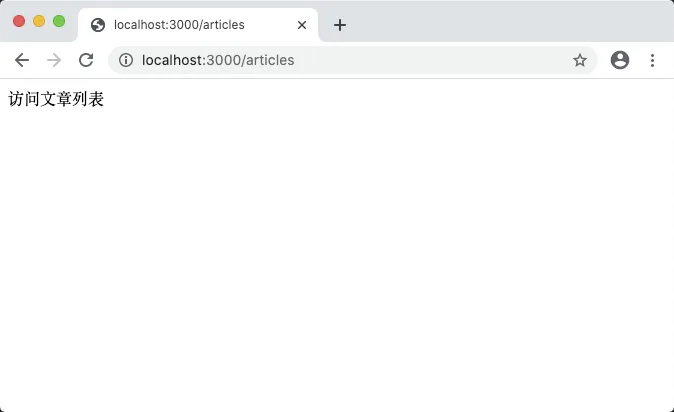
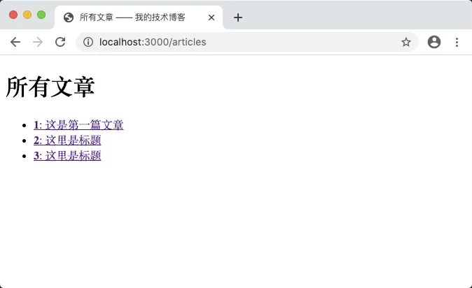
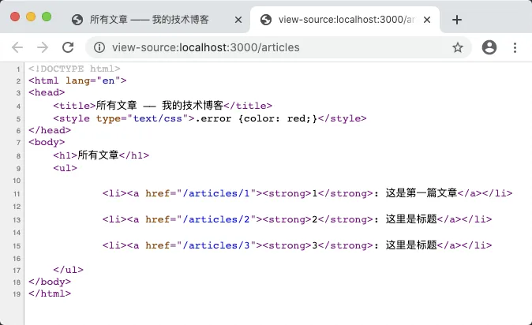

# 6.7. 文章列表

原文链接：https://learnku.com/courses/go-basic/1.22/article-list/16502

## 说明

现在我们数据库已经有一些文章了，否则请前往 [localhost:3000/articles/create](http://localhost:3000/articles/create) 创建几篇文章以供测试。

接下来我们开发文章列表页面，以罗列我们所有的文章。

>

提示： 本节我们主要讲解 `Query()` 方法的使用，为保持专注，暂不实现分页功能，后续章节会有涉及。

## 路由

我们已经在前面章节中注册了 `articles.index` 路由，如下：

```
router.HandleFunc("/articles", articlesIndexHandler).Methods("GET").Name("articles.index")
```

接下来查看 `articlesIndexHandler()` 函数：

```
func articlesIndexHandler(w http.ResponseWriter, r *http.Request) {
fmt.Fprint(w, "访问文章列表")
}
```

访问 [localhost:3000/articles](http://localhost:3000/articles) 以确保正确：



## 读取数据

main.go

```
.
.
.
func articlesIndexHandler(w http.ResponseWriter, r *http.Request) {
// 1. 执行查询语句，返回一个结果集
rows, err := db.Query("SELECT * from articles")
checkError(err)
defer rows.Close()

var articles []Article
//2. 循环读取结果
for rows.Next() {
var article Article
// 2.1 扫描每一行的结果并赋值到一个 article 对象中
err := rows.Scan(&article.ID, &article.Title, &article.Body)
checkError(err)
// 2.2 将 article 追加到 articles 的这个数组中
articles = append(articles, article)
}

// 2.3 检测遍历时是否发生错误
err = rows.Err()
checkError(err)

// 3. 加载模板
tmpl, err := template.ParseFiles("resources/views/articles/index.gohtml")
checkError(err)

// 4. 渲染模板，将所有文章的数据传输进去
err = tmpl.Execute(w, articles)
checkError(err)
}
.
.
.
```

### Query() 读取结果集

一般情况下，我们使用 `Query()` 从数据库中读取多条数据，而之前学到 `QueryRow()` 是读取单条的数据。语法如下：

```
func (db *DB) Query(query string, args ...interface{}) (*Rows, error)
```

调用方式与 `QueryRow()` 和 `Exec()` 一致，支持单一参数的纯文本模式，以及多个参数的 Prepare 模式。

这里因为我们查询时候没有使用来自用户的数据，所以只是使用 纯文本模式。

作为回顾 —— 纯文本模式 只会发送一次 SQL 请求，而 Prepare 模式 会发送两次。

### Rows 对象

`Query()` 返回结果集 `Rows` ，包含从数据库里读取出来的数据和 SQL 连接。

### Query() 与 Rows 时需要注意的点

1. 在每一次 `for rows.Next()` 后，都记得要检测下是否有错误发生，调用 `rows.Err()` 可获取到错误；

2. 使用 `rows.Next()` 遍历数据，遍历到最后内部遇到 EOF 错误，会自动调用 `rows.Close()` 将 SQL 连接关闭；

3. 使用 `rows.Next()` 遍历时，如遇错误，SQL 连接也会自动关闭；

4. `rows.Close()` 可调用多次，使用 `rows.Close()` 可保证 SQL 连接永远是关闭的。

5. `defer rows.Close()` 需在检测 err 以后调用，否则会让运行时 panic ；

6. 牢记在获取到结果集后，必须执行 `defer rows.Close()`。这样做能防止有时你在函数里过早 return ，或者其他操作忘记关闭资源，这是一个值得培养的良好习惯；

7. 如果你在循环中执行  `Query()` 并获取 `Rows` 结果集，请不要使用 `defer` ，而是直接调用 `rows.Close()`，因为 `defer` 不会立刻执行，而是在函数执行结束后执行。

## 创建模板

数据已经读取出来了，接下来创建模板：

resources/views/articles/index.gohtml

```
<!DOCTYPE html>
<html lang="en">
<head>
<title>所有文章 —— 我的技术博客</title>
<style type="text/css">.error {color: red;}</style>
</head>
<body>
<h1>所有文章</h1>
<ul>
{{ range $key, $article := . }}
<li><a href=""><strong>{{ $article.ID }}</strong>: {{ $article.Title }}</a></li>
{{ end }}
</ul>
</body>
</html>
```

我们直接将类型为 Map 的 articles 数据传参给模板，模板中可直接使用 `{{ . }}` 来获取到。

接下来就是使用 Go 模板库的循环语法 `{{range …}}{{end}}` 来遍历数据，此语法的使用与 Go 语言的遍历语句 `range` 类似。

接下来打开浏览器 [localhost:3000/articles](http://localhost:3000/articles) ：



## 模板中调用函数

文章已经能正确展示，接下来我们为列表里的文章加上链接。

先为 Article 对象新增 `Link()` 方法：

main.go

```
.
.
'
// Article  对应一条文章数据
type Article struct {
.
.
.
}

// Link 方法用来生成文章链接
func (a Article) Link() string {
showURL, err := router.Get("articles.show").URL("id", strconv.FormatInt(a.ID, 10))
if err != nil {
checkError(err)
return ""
}
return showURL.String()
}
.
.
.
```

生成 `articles.show` URL 的代码我们之前已经学习过，这里主要注意 Go 中方法的使用。

为了更直观地区分，以下是他们声明时的对比：

```
type Object struct {
...
}
// Object 的方法
func (obj *Object) method() {
...
}

// 只是一个函数
func function() {
...
}
```

以下是调用时的对比：

```
// 调用方法：
o := new(Object)
o.method()

// 调用函数
function()
```

### 生成链接

生成文章链接的方法定义好了，接下来我们在模板中调用他，只需要修改 HTML 里 a 标签的 href 属性即可：

resources/views/articles/index.gohtml

```
.
.
.
<li><a  href="{{ $article.Link }}"><strong>{{ $article.ID }}</strong>: {{ $article.Title }}</a></li>
.
.
.
```

Go 模板里调用函数语法如下：

```
{{ Function arg... }}
```

这里我们调用 Article 的 `Link()` 方法：

```
{{ $article.Link }}
```

加入参数的话，就是：

```
{{ $article.Link  参数1 参数2 }}
```

保存后刷新页面并查看页面源码：



至此文章列表开发完成。

需要提一句，目前来讲，我们读取了所有数据，在后面章节当讲到 GORM  时,我们会为其开发分页功能。

## 代码版本

开始下一节之前，我们先来为代码做下版本标记：

```
$ git add .
$ git commit -m "文章列表"
```
