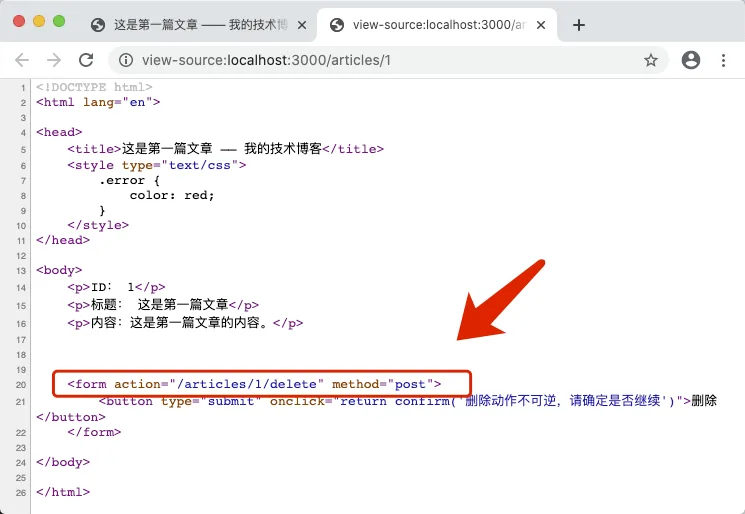
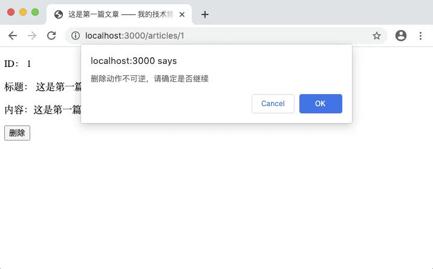
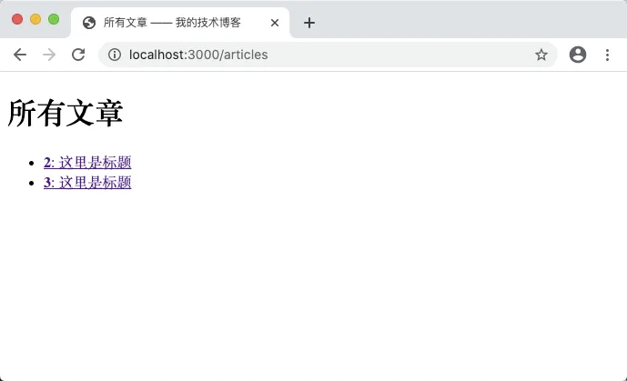

# 6.8. 删除文章

原文链接：https://learnku.com/courses/go-basic/1.22/delete-article/16503

## 说明

接下来开发文章的删除功能。

删除功能开发清单如下：

- 文章详细页面显示删除按钮

- 删除表单提交后后台处理

我们先开发后台处理的逻辑，再在文章详情页里显示删除按钮。

## 删除的逻辑

在我们的 `articles.update` 后注册 `articles.delete` 路由：

main.go

```
.
.
.

func main(){
.
.
.
router.HandleFunc("/articles/{id:[0-9]+}", articlesUpdateHandler).Methods("POST").Name("articles.update")
router.HandleFunc("/articles/{id:[0-9]+}/delete", articlesDeleteHandler).Methods("POST").Name("articles.delete")

.
.
.
}
```

接下来是 `articlesDeleteHandler()`:

main.go

```
.
.
.
func articlesDeleteHandler(w http.ResponseWriter, r *http.Request) {

// 1. 获取 URL 参数
id := getRouteVariable("id", r)

// 2. 读取对应的文章数据
article, err := getArticleByID(id)

// 3. 如果出现错误
if err != nil {
if err == sql.ErrNoRows {
// 3.1 数据未找到
w.WriteHeader(http.StatusNotFound)
fmt.Fprint(w, "404 文章未找到")
} else {
// 3.2 数据库错误
checkError(err)
w.WriteHeader(http.StatusInternalServerError)
fmt.Fprint(w, "500 服务器内部错误")
}
} else {
// 4. 未出现错误，执行删除操作
rowsAffected, err := article.Delete()

// 4.1 发生错误
if err != nil {
// 应该是 SQL 报错了
checkError(err)
w.WriteHeader(http.StatusInternalServerError)
fmt.Fprint(w, "500 服务器内部错误")
} else {
// 4.2 未发生错误
if rowsAffected > 0 {
// 重定向到文章列表页
indexURL, _ := router.Get("articles.index").URL()
http.Redirect(w, r, indexURL.String(), http.StatusFound)
} else {
// Edge case
w.WriteHeader(http.StatusNotFound)
fmt.Fprint(w, "404 文章未找到")
}
}
}
}

func  main()  {
.
.
.
```

删除的执行逻辑如下：

1. 读取对应的文章数据，看看是否存在；

2. 是的话执行删除；

3. 否的话提示用户 404；

4. 过程中如果发生 SQL 查询错误，就提示用户 500 内部错误。

以上的逻辑在代码里一一对应，请注意看代码注释。都是之前学过的代码，想必大家应该很熟悉，这里就不再浪费篇幅。

删除的逻辑，我们封装到 Article 的  `Delete()` 方法内，我们创建此方法；

main.go

```
.
.
.
// Delete 方法用以从数据库中删除单条记录
func (a Article) Delete() (rowsAffected int64, err error) {
rs, err := db.Exec("DELETE FROM articles WHERE id = " + strconv.FormatInt(a.ID, 10))

if err != nil {
return 0, err
}

// √ 删除成功
if n, _ := rs.RowsAffected(); n > 0 {
return n, nil
}

return 0, nil
}

func main() {
.
.
.
```

这里我们用的是 `Exec()`，一般在 CREATE/UPDATE/DELETE 时使用。这里使用的是纯文本模式的查询模式，因为 ID 我们是从数据库里拿出来的，是自增 ID ，无需担心 SQL 注入，这样可以少发送一次 SQL 请求。

## 创建入口

删除的逻辑有了，接下来我们在文章详情页面添加删除按钮。

开始之前，我们需要修改模板的加载方式。我们将使用 Go template 的自定义函数功能，在模板中生成提交删除表单的链接。

main.go

```
.
.
.
func  articlesShowHandler(w http.ResponseWriter, r *http.Request) {
.
.
.
// 3. 如果出现错误
if err !=  nil {
.
.
.
} else {
// 4. 读取成功，显示文章
tmpl, err := template.New("show.gohtml").
Funcs(template.FuncMap{
"RouteName2URL": RouteName2URL,
"Int64ToString": Int64ToString,
}).
ParseFiles("resources/views/articles/show.gohtml")
checkError(err)
err = tmpl.Execute(w, article)
checkError(err)
}
}
```

对比之前直接调用 `template.ParseFiles`：

```
tmpl, err := template.ParseFiles("resources/views/articles/show.gohtml")
```

这一次是使用 `template.New()` 先初始化，然后使用 `Funcs()` 注册函数，再使用 `ParseFiles ()`，需要注意的是 `New()` 的参数是模板名称，需要对应 `ParseFiles()` 中的文件名，否则会无法正确读取到模板，最终显示空白页面。

`Funcs()` 方法的传参是 `template.FuncMap` 类型的 Map 对象。键为模板里调用的函数名称，值为当前上下文的函数名称:

```
Funcs(template.FuncMap{
"RouteName2URL": RouteName2URL,
"Int64ToString": Int64ToString,
}).
```

RouteName2URL 和 Int64ToString 两个函数还未存在，我们需要创建：

main.go

```
.
.
.
// RouteName2URL 通过路由名称来获取 URL
func RouteName2URL(routeName string, pairs ...string) string {
url, err := router.Get(routeName).URL(pairs...)
if err != nil {
checkError(err)
return ""
}

return url.String()
}

// Int64ToString 将 int64 转换为 string
func Int64ToString(num int64) string {
return strconv.FormatInt(num, 10)
}

func (a Article) Delete() (rowsAffected int64, err error) {
.
.
.
```

两个函数的代码我们之前都介绍过，且每个函数上都有注释，请仔细阅读几遍即可。接下来我们修改 `show.gohtml` ：

resources/views/articles/show.gohtml

```
<!DOCTYPE html>
<html lang="en">

<head>
<title>{{ .Title }} —— 我的技术博客</title>
<style type="text/css">
.error {
color: red;
}
</style>
</head>

<body>
<p>ID： {{ .ID }}</p>
<p>标题： {{ .Title }}</p>
<p>内容：{{ .Body }}</p>

{{/* 构建删除按钮  */}}
{{ $idString := Int64ToString .ID  }}
<form action="{{ RouteName2URL "articles.delete" "id" $idString }}" method="post">
<button type="submit" onclick="return confirm('删除动作不可逆，请确定是否继续')">删除</button>
</form>

</body>

</html>
```

首先这是模板注释，请注意 `{{/*` 之间没有空格，同理注释关闭符：

```
{{/* 构建删除按钮  */}}
```

接下来是模板里设置变量，以及对自定义函数的调用，`.ID` 作为 `Int64ToString` 参数而存在：

```
{{ $idString := Int64ToString .ID  }}
```

接下来生成表单请求的链接：

```
<form action="{{ RouteName2URL "articles.delete" "id" $idString }}" method="post">
```

函数调用 `RouteName2URL` 后面跟着的三个用空格隔开的元素，皆为参数。打开文章详情页 [localhost:3000/articles/1](http://localhost:3000/articles/1) 并查看源码：



可以看到模板注释和变量赋值不会被显示出来，表单的提交链接也是正确的。

## 测试一下

接下来访问 [localhost:3000/articles/1](http://localhost:3000/articles/1) 点击删除按钮，会有类似的弹出层：



点击 OK 以后会删除数据，并跳转到列表，可以看到 ID 为 1 的文章已被删除：



至此文章删除功能开发完成。

## 代码版本

开始下一节之前，我们先来为代码做下版本标记：

```
$ git add .
$ git commit -m "删除文章"
```
