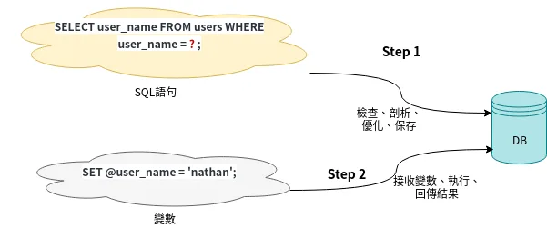

# 6.9. sql 知识总结

原文链接：https://learnku.com/courses/go-basic/1.22/database-knowledge-summary/16504

## 说明

本章零零散散学习了 Go 标准库里 sql 包使用方法，这里做一个总结，把知识点罗列下，方便大家复习。

## 1. sql 驱动

Go 的 sql 包里只包含接口，各个数据库系统的驱动可以在官方维护的 Wiki 里找到 [github.com/golang/go/wiki/SQLDrive...](https://github.com/golang/go/wiki/SQLDrivers) 。

知名数据库各自都有几个驱动可供选择，推荐以下驱动：

- MySQL/MariaDB  —— [github.com/go-sql-driver/mysql/](https://github.com/go-sql-driver/mysql/)

- Postgres SQL —— [github.com/lib/pq](https://github.com/lib/pq)

- SQLite3 —— [github.com/mattn/go-sqlite3](https://github.com/mattn/go-sqlite3)

- Oracle  —— [github.com/mattn/go-oci8](https://github.com/mattn/go-oci8)

- SQL Server —— [github.com/denisenkom/go-mssqldb](https://github.com/denisenkom/go-mssqldb)

选择时需要考虑的因素有以下几个：

- star 数越多越好

- issue 数越低越好

- 项目维护活跃，最后更新日期越接近越好

- 有清楚的版本区分（查看项目的 Releases 标签）

以上选择方法同样适用于选择其他 Go 第三方开源库。

## 2. sql.DB

`sql.DB`结构是`database/sql`包封装的一个数据库操作对象，包含了操作数据库的基本方法。大部分时间我们操作数据库都使用它。

可以把 `sql.DB` 当做是连接池，它内部会自动维护 SQL 连接的关闭和创建。

## 3. 连接池设置

我们可以通过以下方法来干预连接池，推荐以下设置：

```
// 设置最大连接数
db.SetMaxOpenConns(100)

// 设置最大空闲连接数
db.SetMaxIdleConns(25)

// 设置每个链接的过期时间
db.SetConnMaxLifetime(5 * time.Minute)
```

## 4. DSN

`DSN`全称为`Data Source Name`，表示数据库连接源，用于定义数据库的连接信息，不同数据库的DSN 格式不同，MySQL 的 DSN 格式如下：

```
// [用户名[:密码]@][协议(数据库服务器地址)]]/数据库名称?参数列表
[username[:password]@][protocol[(address)]]/dbname[?param1=value1&...&paramN=valueN]
```

上面的一大串字串对人的眼睛不够友好，为了更加直观，我们可以使用 `mysql.Config` 来创建连接信息：

```
// 设置数据库连接信息
config := mysql.Config{
User:                 "homestead",
Passwd:               "secret",
Addr:                 "127.0.0.1:3306",
Net:                  "tcp",
DBName:               "goblog",
AllowNativePasswords: true,
}

// fmt.Println("conn: ", config.FormatDSN())
```

## 5. 初始化 sql.DB

一般而言，我们使用 `Open()` 方法便可初始化并返回一个`*sql.DB`实例，如下：

```
func Open(driverName, dataSourceName string) (*DB, error)
```

使用 `Open()` 方法只要传入驱动名称及对应的 DSN 便可，使用很简单，也很通用，当需要连接不同数据库时，只需要修改驱动名与 DSN 即可。配合 mysql.Config 使用：

```
db, err = sql.Open("mysql", config.FormatDSN())
```

使用 `Open()` 时需要知道的是 —— 我们只是做好连接的准备，并未真是连接到数据库上。因未发生连接，所以即使配置信息有误，也不会报错。所以一般我们在使用的时候，会搭配 `Ping()` 进行测试：

```
err = db.Ping()
checkError(err)
```

`Ping()` 会与数据库服务器发生连接，如果连接信息有错误，err 就会有值，否为 nil。

DB 的连线都是被设计来当作长连接使用的，所以不该频繁的 Open、Close。Open 取得的 db 实例，要重複利用，不应该去重复生成。

## 5. Prepare 和 Stmt

`sql.DB.Prepare()` 方法会返回一個 `sql.Stmt` 对象，与 Stmt 相关的方法如下：

```
stmt.Exec()
stmt.Query()
stmt.QueryRow()
stmt.Close()
```

>

请注意与 sql.DB 下的方法区分。

做单独的语句查询时，谨记调用 `defer stmt.Close()` 来关闭 SQL 连接。

使用 Prepare 语句会发送两次请求到数据库服务器上，第一次是调用 `Prepare()` 语句时，第二次是调用以上提到的四个 Stmt 方法时：



Prepare 语句可有效防范 SQL 注入攻击。

以下常见的 DB 查询方法中，调用在传参一个以上时，底层皆会使用 Prepare 来发送请求：

```
func (db *DB) Exec(query string, args ...interface{}) (Result, error)
func (db *DB) Query(query string, args ...interface{}) (*Rows, error)
func (db *DB) QueryRow(query string, args ...interface{}) *Row
```

另外，还有 [翻译：Go 数据库技巧：重复利用 Prepare 后的 stmt 来提高 MySQL 的执行效...](https://learnku.com/go/t/49736) 。

## 6. Exec()

一般增加、删除、更新，或者修改表结构，都使用 `sql.DB`中的`Exec()` 方法来处理。

语法如下：

```
func (db *DB) Exec(query string, args ...interface{}) (Result, error)
```

单参数为纯文本模式，不使用 Prepare，只发送一条 SQL 查询：

```
db.Exec("DELETE FROM articles WHERE id = " + strconv.FormatInt(a.ID, 10))
```

多参数为 Prepare 模式，底层使用 Prepare 语句，会发送两条 SQL 查询：

```
query := "UPDATE articles SET title = ?, body = ? WHERE id = ?"
rs, err := db.Exec(query, title, body, id)
```

第二个及以上的参数为 SQL 占位符对应的数据。

`Exec()` 方法会返回一个 `sql.Result` 类型的实例。

## 7. sql.Result

Result 的定义如下，包含两个方法：

```
type Result interface {
LastInsertId() (int64, error)
RowsAffected() (int64, error)
}
```

`LastInsertId()` 方法只用在 `INSERT` 语句且数据表有自增 ID 时才有返回自增 ID 值，否则返回 0。

`RowsAffected()` 表示影响的数据表行数，我们以此来判断`SQL`语句是否执行成功。

SQL 语法正确的情况下 `RowsAffected()` 为 0 ，则表示 SQL 执行成功了，但是数据库里的数据没有任何变更。例如说我们的数据库中并没有 ID 为 6 的数据，这时候执行以下语句：

```
DELETE FROM articles WHERE id=6
```

就会出现 SQL 执行成功了，但是数据未更改的情况。

## 8. Query()

一般使用 `sql.DB` 中的 `Query()` 来查询得到多条数据。语法如下：

```
func (db *DB) Query(query string, args ...interface{}) (*Rows, error)
```

如下获取所有文章的例子：：

```
rows, err := db.Query("SELECT * from articles")
```

`Query()` 方法返回一个`sql.Rows`结构体，代表一个查询结果集。

你可能发现了，Query 和 Exec 都可以执行 SQL 语句，那他们的区别是什么呢？

Exec 只会返回最后插入 ID 和影响行数，而 Query 会返回数据表里的内容（结果集）。

或者可以这么记：

>

Query 中文译为 查询，而 Exec 译为 执行。想查询数据，使用 Query。想执行命令，使用 Exec。

## 9. sql.Rows

`sql.Rows`所包含的方法如下：

```
func (rs *Rows) Close() error                            //关闭结果集
func (rs *Rows) ColumnTypes() ([]*ColumnType, error)    //返回数据表的列类型
func (rs *Rows) Columns() ([]string, error)             //返回数据表列的名称
func (rs *Rows) Err() error                      // 错误集
func (rs *Rows) Next() bool                      // 游标，下一行
func (rs *Rows) Scan(dest ...interface{}) error  // 扫描结构体
func (rs *Rows) NextResultSet() bool
```

结果集在检出完 err 以后，遍历数据之前，应调用 `defer rows.Close()` 来关闭 SQL 连接。

一般我们会使用 `rows.Next()` 来遍历数据，如：

```
var articles []Article
//2. 循环读取结果
for rows.Next() {
var article Article
// 2.1 扫描每一行的结果并赋值到一个 article 对象中
err := rows.Scan(&article.ID, &article.Title, &article.Body)
checkError(err)
// 2.2 将 article 追加到 articles 的这个数组中
articles = append(articles, article)
}
// 2.3 检测循环时是否发生错误
err = rows.Err()
checkError(err)
```

循环完毕需检测是否发生错误。

`rows.Scan()` 参数的顺序很重要, 需要和查询的结果的 column 对应。

```
SELECT * from articles
```

而我们的 articles 的表结构为：

```
CREATE TABLE `articles` (
`id` bigint NOT NULL AUTO_INCREMENT,
`title` varchar(255) CHARACTER SET utf8mb4 COLLATE utf8mb4_unicode_ci NOT NULL,
`body` longtext CHARACTER SET utf8mb4 COLLATE utf8mb4_unicode_ci,
PRIMARY KEY (`id`)
) ENGINE=InnoDB AUTO_INCREMENT=4 DEFAULT CHARSET=utf8mb4 COLLATE=utf8mb4_unicode_ci;
```

查询到的每一行的 column 顺序是 `id, title, body`，因此 rows.Scan 也需要按照此顺序不然会造成数据读取的错位。

## 10. QueryRow()

如果是读取一行数据，可以使用 `QueryRow()`，语法定义如下：

```
func (db *DB) QueryRow(query string, args ...interface{}) *Row
```

返回的是一个 `sql.Row` 对象，与其相关的调用有：

```
func (r *Row) Scan(dest ...interface{}) error
```

`sql.Row` 没有 `Close` 方法，当我们调用 `Scan()` 时就会自动关闭 SQL 连接。所以为了防止忘记关闭而浪费资源，一般需要养成连着调用 `Scan()` 习惯：

```
article := Article{}
query := "SELECT * FROM articles WHERE id = ?"
err := db.QueryRow(query, id).Scan(&article.ID, &article.Title, &article.Body)
```

以上我们从数据库中读取对应 ID 的一条数据，并立刻调用 `Scan()` 读取数据到 article 变量里。

当出现请求结果不止一条数据的情况，`QueryRow()` 会只使用第一条数据。

## 11. Context 上下文

三个常用的 SQL 请求方法都有其支持上下文的版本，如下：

```
func (db *DB) Exec(query string, args ...interface{}) (Result, error)
func (db *DB) ExecContext(ctx context.Context, query string, args ...interface{}) (Result, error)
func (db *DB) Query(query string, args ...interface{}) (*Rows, error)
func (db *DB) QueryContext(ctx context.Context, query string, args ...interface{}) (*Rows, error)
func (db *DB) QueryRow(query string, args ...interface{}) *Row
func (db *DB) QueryRowContext(ctx context.Context, query string, args ...interface{}) *Row
```

支持 Context 上下文的方法传参标准库 context 里的 context.Context 对象实例。

在一些特殊场景里，我们需要 SQL 请求在执行还未完成时，我们可以取消他们（cancel），或者为请求设置最长执行时间（timeout），就会用到这些方法。

在这里你只需要记住有这些方法即可，手动管理上下文 SQL  请求使用场景较少，篇幅考虑这里不做赘述。

另外需要知道的是，所有的请求方法底层都是用其上下文版本的方法调用，且传入默认的上下文，例如 `Exec()` 的源码：

```
func (db *DB) Exec(query string, args ...interface{}) (Result, error) {
return db.ExecContext(context.Background(), query, args...)
}
```

底层调用的是 `ExecContext()` 方法。`context.Background()` 是默认的上下文，这是一个空的 `context` ，我们无法对其进行取消、赋值、设置 deadline 等操作。

## 12. 事务处理 sql.Tx

在前面课程的 SQL 操作中，我们都没有开启事务，如果没有开启事务，当其中某个语句执行错误，则前面已经执行的 SQL 语句无法回滚。

对于一些要求比较严格的业务逻辑来说，如付款、转账等，应该在同一个事务中提交多条 SQL 语句，避免发生执行出错无法回滚事务的情况。

使用以下可以开启事务：

```
func (db *DB) Begin() (*Tx, error)
func (db *DB) BeginTx(ctx context.Context, opts *TxOptions) (*Tx, error)
```

`Begin()` 和 `BeginTx()`方法返回一个`sql.Tx` 结构体，他支持以上我们提到过的几种查询方法：

```
func (tx *Tx) Exec(query string, args ...interface{}) (Result, error)
func (tx *Tx) ExecContext(ctx context.Context, query string, args ...interface{}) (Result, error)
func (tx *Tx) Query(query string, args ...interface{}) (*Rows, error)
func (tx *Tx) QueryContext(ctx context.Context, query string, args ...interface{}) (*Rows, error)
func (tx *Tx) QueryRow(query string, args ...interface{}) *Row
func (tx *Tx) QueryRowContext(ctx context.Context, query string, args ...interface{}) *Row

// 预编译 Prepare
func (tx *Tx) Stmt(stmt *Stmt) *Stmt
func (tx *Tx) StmtContext(ctx context.Context, stmt *Stmt) *Stmt
func (tx *Tx) Prepare(query string) (*Stmt, error)
func (tx *Tx) PrepareContext(ctx context.Context, query string) (*Stmt, error)
```

使用这同一个 `sql.Tx` 对数据库进行操作，就会在同一个事务中提交。

当使用`sql.Tx`的操作方式操作数据后，需要使用 `sql.Tx` 的 `Commit()` 方法提交事务，如果出错，则可以使用 `sql.Tx` 中的 `Rollback()` 方法回滚事务，保持数据的一致性，下面是这两个方法的定义：

```
func (tx *Tx) Commit() error
func (tx *Tx) Rollback() error
```

下面是个简单的示例：

```
func (s Service) DoSomething() (err error) {
// 1. 创建事务
tx, err := s.db.Begin()
if err != nil {
return
}
// 2. 如果请求失败，就回滚所有 SQL 操作，否则提交
//    defer 会在当前方法的最后执行
defer func() {
if err != nil {
tx.Rollback()
return err
}
err = tx.Commit()
}()

// 3. 执行各种请求
if _, err = tx.Exec(...); err != nil {
return err
}
if _, err = tx.Exec(...); err != nil {
return err
}
// ...
return nil
}
```

需要注意的是，所有 SQL 操作都必须使用 `tx` 来操作，才能支持事务，如果中间使用 `db.Exec()` 那这条语句是无法回滚的。

## 结语

以上基本上覆盖了大部分 database/sql 标准库的日常使用知识。

这些是 Go 开发者需要掌握的基础知识，是以后使用 ORM 或者其他高级 SQL 工具的基石。
